# 2023/4/9(日)の志賀高原スキー場の写真追加！…そして本日4月10日の志賀高原特派員情報

📅 投稿日時: 2023-04-11 05:19:59

🏷️ カテゴリ: [2023スキー滑走日記](cd943df30cfcc3d0896469e2ff98720cd.md)

今週は，どうやら水曜日は午後に雨になり．

さらに悲しいことに，また週末を狙ったかの

ように，土曜にかなり高温の雨が降りそうな

今日この頃，皆様いかがお過ごしでしょうか（時候の挨拶）

あぁ…

せっかく日曜にいい感じで冷え冷え雪が

降ってくれたのに．

また雨で一気に雪が解けそう…

おそらく，志賀がまともに滑れるのは

今週末で終わりの予感…

いつものおこみん特派員によると，

とりあえず今日も天気が良くて．

あさイチは冷えて締まったシマシマで

結構良かったみたいですが…

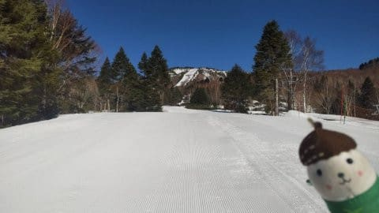

残念ながら，こんな感じで冷えた

締まったシマシマだったのはわずかな時間．

朝から気温は-1℃程度と高く，昼間にもっと

上がったし，日も射したので，雪は

すぐに緩んじゃって，滑りも悪くなって

行ったみたいです…(涙)

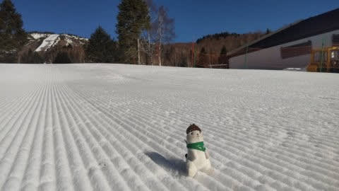

しかし，冷え冷えのラッキーデーが

今回はちょうど週末に当たってくれて

良かった…

逆に，特派員から冷え冷え雪の写真が

送られてきて．

週末にザブザブだったら，私は間違いなくキレてた．

暴れてた…

ってなことで，今日の本題は．

最高の冷え冷えラッキーデーだった昨日の

日曜の写真を追加でお送りします！！

まず…

昨日の記事に書いたように，朝は6時

開始の早朝から参戦したわけですが…

早朝に来る人はかなり多くて．

トップシーズンの通常営業の前に

待ってる人より多いですね…！

ちなみに，8時前には第1ゴンドラ駐車場が

満車だったらしく…

トップシーズンでも，第1ゴンドラ駐車場が

満車になることは無いんですけどねぇ…

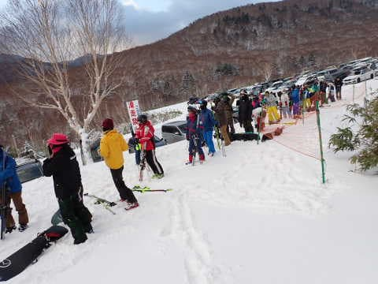

そして．

昨晩からの積雪は，駐車場でも10cm以上

あって．

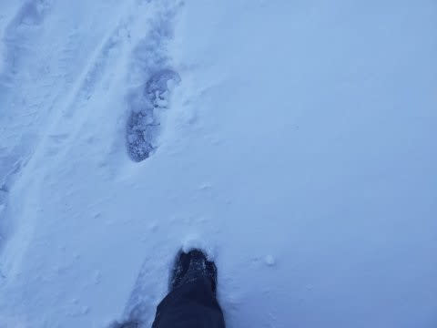

スキー場までやってくる道路も，除雪車が

入るほどの本格積雪！！

ところどころツルツルの場所もあり，

危ない感じの道路状況だったくらいなので…

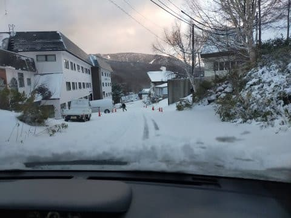

夕方圧雪のゲレンデは，圧雪の上に

昨晩積もった雪がそのまま全部乗ってる，

コース全面新雪状態！！

そして，朝は雲が多かったけど，早朝営業

開始とほぼ同時に晴れてきましたよ…！！

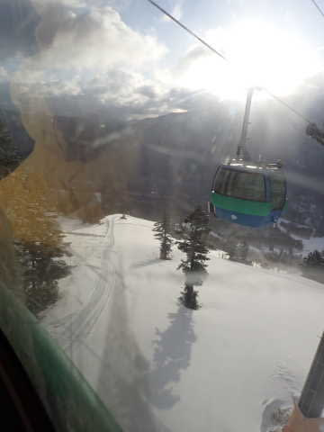

で．

山頂は…

うほーーーーー！！

新雪！！！！

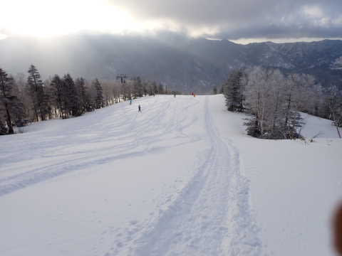

あさイチの気温が-10℃と冷えてたのもあり…

これ，4月としてはかなりいい雪ですよ！！！

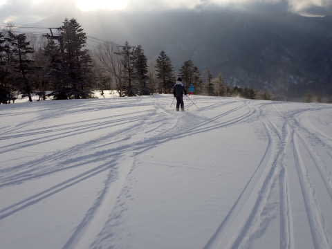

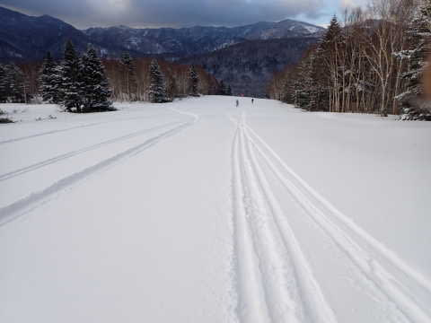

まさか今シーズン．

4月の第2週で，こんないい雪で滑れるとは

思わなかったよ！！！！

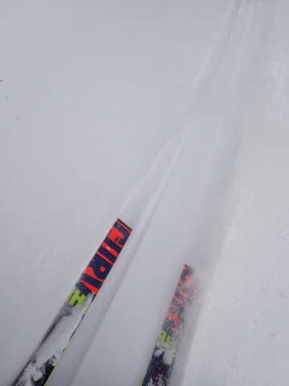

朝の気温が-10℃と，雪質が結構いいので，

新雪が踏まれていくと…

ボコボコにはならず，かなりいい雪が

きれいに踏まれた圧雪バーンになって．

いや…これはいい！！

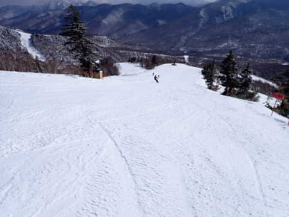

で，6時からの早朝ではGSコースのみが滑れて，

8時からはパノラマコースもオープンするので…

8時になると，またパノラマコースの新雪が

滑れます！

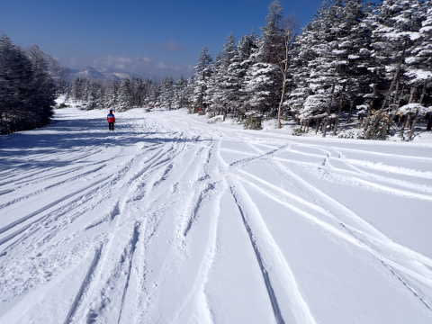

この時期，こんな晴天でこんないい雪で

滑れるとは…（感動）

でも，この日動いていたのは第1ゴンドラと

第2ゴンドラの2本のみで，滑れるコースは

GSコースとパノラマ・サウスコースの

2コースだけだったのが惜しい…

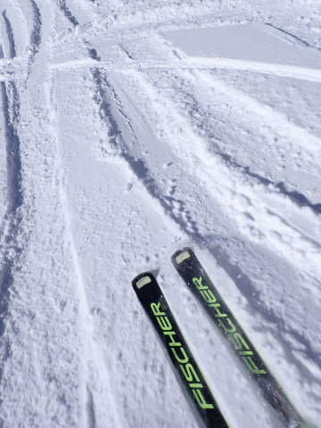

9時ごろになると，新雪はあらかた踏まれて

全面きれいな圧雪になって…

いや．

4月上旬でこの雪はGoodコンディション！！

雪がダメダメだった今シーズン，4月に

こんなボーナスがあろうとは…！！

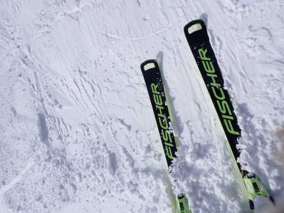

で．

気温は午前10時ごろになっても，-5℃と

低かったので…

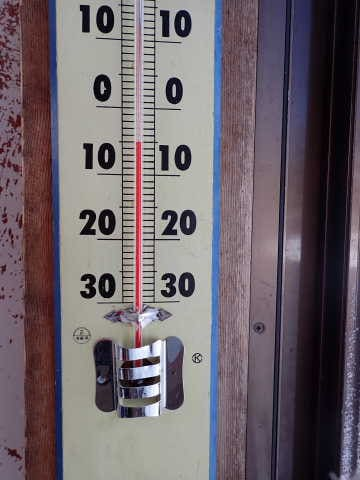

すっきり晴天なのに，雪は緩む気配はなく．

この時期にこんなに良い雪の圧雪バーンを，

晴れの中滑れるとは思わなかったよ…！！

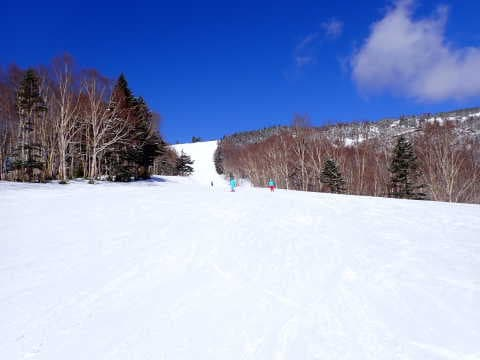

で．

11時ごろに試乗のために一の瀬に移動しますが…

一の瀬ファミリーは，昼になっても

正面バーン上部はしっかり締まった

かなりい感じの圧雪バーン！！

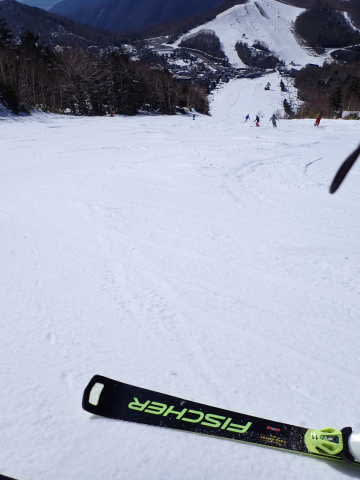

ファミリー下部は昼になると，

積もった雪が緩んでちょっと滑りが

悪めのモサモサ雪になって，

表の雪がはがれた小回りレーンも

できてきたりしたけど…

小回りレーンは硬いままで，

ザブザブ雪にはならず，4月とは

思えないコンディション！

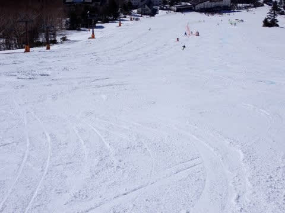

山頂付近は，営業終了時でもまだ

こんな感じで…

全然雪は緩まず！！

山頂はラストまで硬く締まったまま

でした…

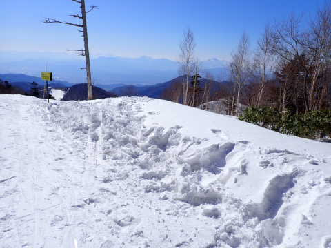

ただ，昼を過ぎると，正面バーンの中盤以降は

バーンが荒れ始め，ザラメが固まったのと

下地の硬い斜面が入り混じった難しい

コンディションになっていったけど…

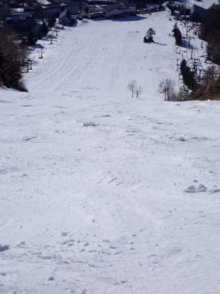

でも，4月というのに．

午後4時過ぎの最後までザブザブにならずに

晴天の中滑れたので，かなり恵まれた

一日でした！！

…とはいえ．

一の瀬正面バーンも，ところどころ

ブッシュが出始めていたので…

今日は良かったけど．

このまま元の高温に戻ると，

やっぱりもうすぐバーンは終わっちゃい

そうな予感…

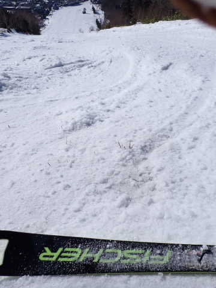

とりあえず．

この冷え冷えがずっと続いて，

GWまで雪がもってくれると嬉しいんだけど，

12日の水曜は夜にちょっと雨が降りそうだし．

…さらに，今週末の土曜夜に超高温の雨が降って，

とどめが射されそうな天気図（涙）

この週末は冷え冷えの最高天気だったのに，

また週末を狙ってひどい天気になりそうとは…

残念．

残念すぎる…(泣)

## 💬 コメント一覧

### 💬 コメント by (副院長)
**タイトル**: Unknown
**投稿日**: 2023-04-11 08:48:58

4月にこのようなボーナスがあると、志賀には行ってしまうんですよねー。昔は5月にもボーナスあったんですが、今年はなさそうですね（遠い目）。

### 💬 コメント by (おばちゃんスキーヤー)
**タイトル**: Unknown
**投稿日**: 2023-04-11 09:26:58

S様　家族を送り出してから　ブログを読むのを楽しみにしてます。

表題が３月になってますが〜。

もう一度3月に戻って欲しい！

ゴールデンウィークに志賀高原に行く予定ですが　そろそろキャンセル料金が発生しそうで悩みます。

### 💬 コメント by (Skier_S)
**タイトル**: Unknown
**投稿日**: 2023-04-12 13:34:41

コメント回答遅れました

>副院長さま

いやー。

この週末はホントにボーナス感満載でした.

志賀は4月やGWでもこういうことがあるからいいんですよね…

でもさすがに今シーズンはこれでもうこんなチャンスはないかな…

もしかすると来週月曜、ちょっと冷えて積もるかもしれませんが.

>おばちゃんスキーヤーさま

コメントありがとうございます～！！

直しました！助かります…

今後もご愛読のほど、よろしくお願いします…！

