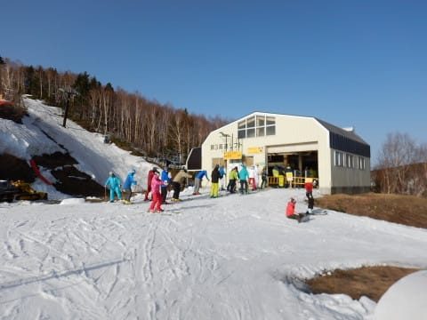
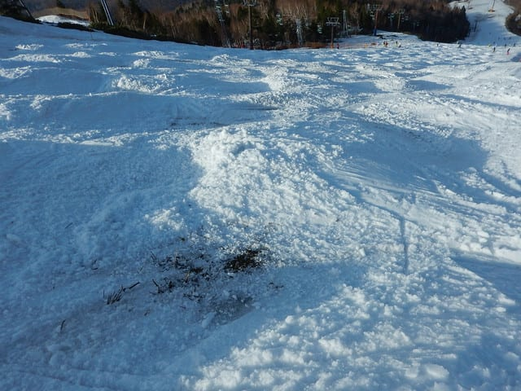
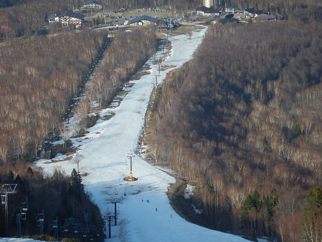

# 4月29日(日)GW前半3連休の中日の志賀高原は…今日も暑くて雪が解けたよ（涙）

📅 投稿日時: 2018-04-29 22:13:26

ということで．

GW前半の3連休の中日の本日．

…本日の志賀高原も暑かったです（涙）

ってなことで．

本日の志賀高原レポートをば…

まず．

今日も早朝から参戦なわけですが．

朝6時前の気温は，+4℃と，

異常に気温が高かったここ数日では，

まだ割と冷えた方かな…？

とりあえず．

昨日で焼額の早朝が終わっちゃったので．

今日は6時スタートの，奥志賀早朝に参戦っ！

…焼額の早朝が終わって，ここに人が

集中したからか．

かなりの列ですね…

そして．

早朝営業開始後のリフトに乗ると…

うほー！

いい感じ！

…と，思ったら．

なに？エキスパート，この右半分…

圧雪かかってない？？

上から見ると…

この写真の左側は，全く圧雪かかってません（涙）

しっかり冷えていて，雪は締まっているんですが．

右側の圧雪がかかっている部分も幅が狭く，

ちょいと圧雪が荒めで…ちと残念．

一応，下のフラットな部分はシマシマで．

雪も硬く，板も走って気持ちいいんですが．

ちょっと緩すぎるのが惜しい．

そして．

リフト乗り場近辺，コースが細くなってきましたね…

だもんで．

エキスパートの上，第3へ行ってみますが…

やっぱり第3のほうがマシだと考える人が

多いのか．

待ち時間なしの第2リフトに比べ，

こちらはちょっとリフト待ちが…

でも．

コースはいい感じ！！

朝イチはフラットで締まっていて…

やっぱり早朝はいいなぁ…

でも．

早朝が終了するころ，8時近くになると…

気温も上がり，強い日差しで雪も緩みだし．

早くも雪の滑りが悪くなってきました（涙）

その頃は，エキスパートの圧雪側ももうかなり

荒れてきてます（泣）

うーむ．

やっぱりこの時期，気持ちいいのは

早朝の期間だけですか…

だもんで．

気持ちいい早朝が終わったら．

人が減って，奥志賀第3ペアも

待ち時間0になりました

で．

早朝タイムが終わったので．

営業が始まった焼額へ行ってみますが．

昨日，GSコースが終わった焼額．

滑れるのは，ついにパノラマコースだけに

なっちゃいました…（泣）

しかし，焼額．

そこそこ人がいた奥志賀に比べると…

ガラガラですね．

誰も滑ってませんね…

人が滑ってないから，雪が汚れてます…

そして．

コース幅も狭くなった，この部分の先．

昨日，人力で雪を入れていたところは…

朝から雪が薄くなってます（涙）

下から見ると，一見真っ白に見えるんです

けどね～．

ここ以外にも，コースがかなり狭い

ところが出てきたので．

やっぱり，コンディションがいい奥志賀と比べると．

全然人がいませんね…

で．

今日は午前中に気温が+13℃を超えるほどで．

午前のうちから暑いくらいになって来たので…

コース上の雪が薄くなってやばかったところ，

雪が解けてコースが切れないように．

また，人海戦術での雪投入！！

…すごい．

明日まで何とか営業を続けるために．

ここまで人出をかけてコース維持するとは…

すごい…

でも．

今日は気温も高く．

日差しも強かったので…

雪を入れるスピードより，融けるスピードが早く．

うーむ．

必死の雪入れ作業にも関わらず．

コース状況は回復せず…

さらに．

Tシャツで十分なほど暑かったこの日．

ここ以外もいろいろヤバい感じに…

うーむ．

焼額．

確かに，明日までの営業がぎりぎりな感じですね…（涙）

だもんで．

焼額をホームゲレンデとする私が．

今日の夕方はまた奥志賀へ戻ってきました…

焼額から戻ってくると．

奥志賀第3が，コース幅いっぱい滑れるのが奇跡のようですね…

で．

エキスパートコースへ降りてみますが…

ありゃ？？

やっぱり昨日と同じく．

コブ溝に土が…（泣）

一見まともに見えるコースですが．

もう，コブ溝のそこかしこに土が（涙）

急斜面の終わった部分もかなり

土が出てきほじめてますし…

これは．

奥志賀も，GW最後までもつかどうか

ヤバい感じ…

うーん．

何とかGW最後までもってほしいところ…（懇願）

と，必死に祈りながら．

今日も日が暮れる，リフトストップまで

滑り続けたのでした…

しかし．

最後の頼みの奥志賀も，

GW最後までもつか微妙な感じになってきました…

3日に降る雨が，致命傷にならなきゃいいん

ですが…

とりあえず．

明日以降もまた奥志賀で滑ってます～！

## 💬 コメント一覧

### 💬 コメント by (いか)
**タイトル**: Unknown
**投稿日**: 2018-04-29 23:05:45

すごい勢いで溶けていますね、、、 都会も大変気温が高く、衣替え日和でした、、、

焼額山は残念ながら今日で終わってしまったみたいですね。今年の春の高温恐るべしです。後半はかぐらに”瞬間移動"でしょうか？

### 💬 コメント by (しんちゃん)
**タイトル**: シーズン締めくくり
**投稿日**: 2018-04-29 23:12:52

シーズンしめくくりと思って参戦した奥志賀で、Ｓ様はじめ２００００ｍ倶楽部の大御所様達とお会い出来て、とても楽しく、ビシッとシーズン締まりました。

Ｓ様、今シーズン志賀高原でお会いした皆様、大変お世話になりました。そして来シーズンもよろしくお願いします。

### 💬 コメント by (ほっぽ)
**タイトル**: Unknown
**投稿日**: 2018-04-29 23:28:00

ヤケビ、今日でシーズン終了しちゃいましたね。

明日はゴンドラ無料営業で抽選会だけ開催するそうです。

最後にヤケビで終えたのは結果としてよかったのかもしれません。

そして、ウェアが違うので誰も分かりませんでした。(^^;

### 💬 コメント by (もりや)
**タイトル**: ヤケビラスト
**投稿日**: 2018-04-30 02:51:56

ヤケビ通常スタートしまいたが、朝一ゴンドラ前に並んでいた方は12人程度でした。今日も半日子供達と滑って頂きありがとうございました。お昼休憩後からは娘も加わり、ラストまで楽しいと言いながら滑りきりました。午後からパノラマコース第2ゴンドラ下の斜面の雪解けが進みラストゴンドラからの滑走時は幅2.2メートルまで狭くなっていました。パノラマコースのスタッフによる雪出し作業も朝からラストまで続けられていました。ホントに感謝です。次は3日早朝奧志賀、4日早朝熊の湯、5日早朝奧志賀スタートします。

### 💬 コメント by (Skier_S)
**タイトル**: 奥志賀もヤバくなってきました…（涙）
**投稿日**: 2018-04-30 21:08:03

＞いかさま

いや．

この4月，ダメです（涙）

暑すぎます…

GWもまだ前半，4月というのに．

例年なら，雪が降ることもあるというのに．

今年の4月は，夏が続いてます(泣）．

かぐらは混みそうなので，志賀が滑れる限り

GWは志賀にはりつこうと思ってます

＞しんちゃんさま

日曜はお世話になりました~！！

お土産もありがとうございました！

昨日同宿だった20000mゴールドな方々に

おすそ分けさせていただきました．

また来シーズンもよろしくお願いします～！！

＞ほっぽさま

ウェアが違ってましたが，今日は無事お会いきましたね(笑)．

そして，ヤケビでもまた再会でしたね（^^;

しかし，今シーズンは残念なGWですね…

ホントなら今頃，毎日焼額のGSコースの

早朝をかっ飛ばしているつもりだったのに…

＞もりやさま

昨日はお世話になりました～！！

久しぶりにご一緒できて楽しかったです．

娘さん，あれからラストまで滑り続けたんですね…（驚愕）

すばらしい！！

次は5日ですね．

奥志賀がそれまでもつか微妙な感じに

なってきましたが…

うちの娘も楽しみにしていますので，

雪があればまたお会いしましょう！

