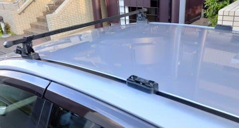
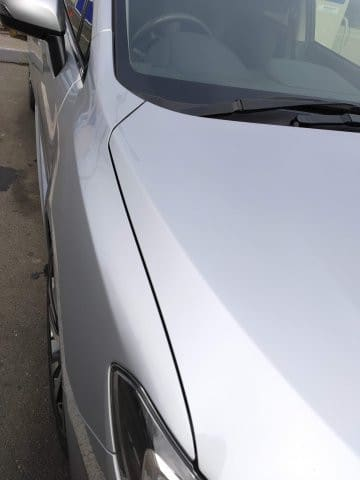
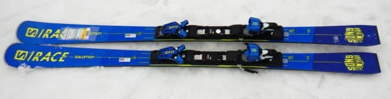
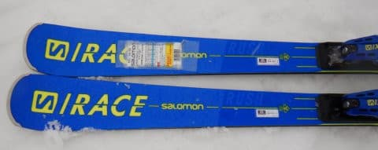
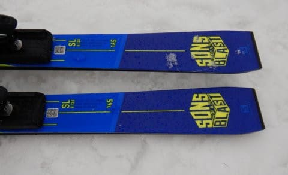
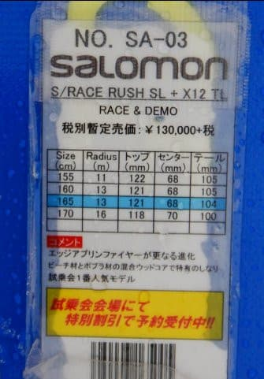
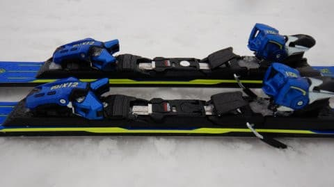

# 2021シーズンモデルのスキー板，試乗レポート…SALOMON S/RACE RUSH SL X12 TLビンディング版

📅 投稿日時: 2020-05-05 04:05:20

🏷️ カテゴリ: [スキー板試乗](c0bd8048615710cee890e403a36cc9a2b.md)

えー．

昨日，Blogが更新されず．

「GWにスキーに行けないストレスで，

　ついにSkier_Sは死んだか…」

と思った方が，もしかしたら何人か

いらっしゃるんじゃないかと思いますが．

…まだ，生きてます．

いや，毎週のスキー場レポートが無くなったので．

夏モードの時と同じく，ちょっと日曜の記事更新を

休ませてもらいました…

昨日は朝から車内掃除をして，

それから車のルーフボックスを外して…

普段は洗えないルーフボックスに隠れる

屋根まで徹底的洗車をして．

夕方までひたすら冬の間の汚れを洗車したり，

細かい傷をコンパウンドで磨いて

目立たなくしたりしてました…

とりあえず．

冬のシーズンの汚れは．

これで足回りも室内も外も，

みんなきれいになったな！！

ってなことで．

本日の本題．

2021シーズンモデルのスキー板の試乗レポート，

今回は，サロモン編．

今日，明日で同じ板のビンディング違いの記事が

2本続きます…

では，どうぞ～！

○SALOMON S/RACE RUSH SL + X12 TL 165cm

基礎小回り，SL競技用セカンドモデル

SL競技用のトップモデルとして，

S/RACE PRO SLってのがあるので，

このS/RACE RUSH SLは競技用セカンド

モデル＆基礎小回り用という感じの位置づけに

なります…

ちなみに，RUSH SLは，

・P80プレート+X12LABビンディング（ATOMICでいうところのVARビンディング）

　がついた強いモデルと，

・TLビンディングがついた優し目のモデル

の2種類がありますが…

こちらはTLビンディングが着いた，優し目の

モデルです．

で．

サイドウォール部分の黄色く見えるのが，

サロモン独自のテクノロジーの，

「エッジアンプリファイヤー」なんですが．

2020モデルまでは，トゥピースとヒールピースまで

同じ高さのまま繋がっていたけど，

2021モデルから，トゥピースと

ヒールピースの間が一段下がった形になり，

これでコントロール性が上がったという

ことらしいのですが…

履いてみたところ．

それほどスピードを出さなくても，低速のうちから

ターン始動時に幅広のトップが捉えて回り始める感じ．

いい感じでたわんで，小回りの弧を描いてくれますが，

スピードを上げていくと，ちょっと板が叩かれて，

グリップが抜けていく感じ…

試乗したのがフラットバーンではなく，ザブザブした

春雪だったってのもあるけど，

トップスピードでは荒れた雪にちょっと板が叩かれて，

板のたわみが抜けてしまい，ラインが流されて

いくのが，ちょっと惜しい…

ただ，ターンの始動性はよく，硬めのアイスバーンっ

ぽいところでは，板をしっかり動かしての小回りも

できたので，板のコントロール性は高いです．

板自体には重さがあるのですが，結構動かしやすい

感じ．

荒れ荒れ雪で叩かれるほどのトップスピードを

出さなければ，中回り程度の回転弧で

気持ちよく板が回ってきてくれるし，

そこから板を動かして行って小回りを

作ることもできるので．

雪が荒れて無ければ本領を発揮したかも…

…で．

このあと，X12LABビンディングをつけたモデルを

履いてみたところ．

かなり違う印象だったので．

この板を買おうとしている人は，どちらの

ビンディングをつけるか真剣に悩んだ方がいいです…

X12LABビンディング付きのモデルは，

明日のレポートをお楽しみに！

## 💬 コメント一覧

### 💬 コメント by (しんちゃん)
**タイトル**: Unknown
**投稿日**: 2020-05-05 10:16:48

ブログ更新されなくて、死んだかと思いました😅

冬の間のお掃除されてたんですね。

いつも試乗レポート楽しく拝見しています。

明日も楽しみにしていま～す(^^)/

### 💬 コメント by (Skier_S)
**タイトル**: ＞しんちゃんさま
**投稿日**: 2020-05-06 01:22:03

生きてますよ～！

ってか，のんびりするのも悪くない…と思いつつある今日この頃．

試乗レポート，楽しんでください～！

