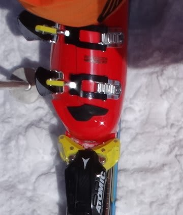

# ニューブーツのインプレッションその２…ATOMIC Redster PRO 130で滑ってみた

📅 投稿日時: 2014-04-11 01:32:15

うーむ．

この夜から金曜にかけて，志賀高原は

結構冷え込みそうなんですが．

残念ながら，木曜夜に積雪はなかったようで…

金曜朝はアイスバーンかな…（残念）．

＃と，Soraさんにメッセージを送ってみる

…となると，だ．

土曜朝も．朝イチはアイスバーンの可能性が…

うーむ．

積もってほしかった（涙）．

とりあえず．

本題．

…新しく仲間入りした，赤いブーツ．

ATOMIC Redster PRO 130で実際に滑ってみた

インプレッションを…

…

…はっきり言って．

これは．

過激なブーツです．

ブーツに合わせた滑りが求められますが．

この，ブーツの特性に合わせた滑りをすると．

…これは．過激です．

凶器です．

強烈です．

…特に，アトミックの[フレックス強化版](ef429e6264e79c420fc0cb4dc41634d6c.md)bluester DEMO SXと

組み合わせると．

「なんじゃこりゃ～っ！！」

状態です．

…SALOMONのブーツとの組み合わせでは，

この板の半分くらいの性能しか使えてなかったかも？？？

…って，気になります．

えー．

まず．

このブーツ．

足首を起こしていくと．

くるぶしのヒンジを部分を軸として，

かかと部分がぐっと下に押し込まれる

ように動きます．

つまり．

足を延ばしていく動き…足首を伸ばしていく

動きだけで．

ブーツのテールサポート部の激烈な硬さで．

「板を押し付けよう」と考えなくても，

板のテール部分を強烈に押し付けていきます．

で．

ATOMICのBluester DEMO SXという板．

この板は，テールの張りが強く．

くるぶし部分から後ろ，かかと部分を押し込むと，

強烈に板がグリップして回るようになってます．

ってことで．

このブーツ＆Bluester DEMO SXの組み合わせでは．

足首を伸ばしていくだけで．

もう，ありえないくらいオートマチックに，

この板の一番おいしい部分…板のかかと付近が

がっつり雪面に押し付けられ，

SALMONのブーツを履いていた時の数倍強烈なグリップ力で．

過激に旋回していきます．

元々，グリップ強めの板が．

ATOMICのブーツを履くと，さら～に強烈に

グリップが強まり，

1mmのずれも許容しない過激なグリップで．

強烈な旋回力を発生していく…という．

これは，すごい．

これは，危険なほど，過激だ．

しかし．

このブーツ．

足を延ばしていく方向には，むちゃくちゃ硬く．

テールサポートの硬さで，足首を伸ばしていくと

過激なグリップを発生するけど．

逆に，これまでのようにタングを押していっても．

前屈はかなり柔らかい感じ．

前方向には，フレックス130って感じよりは，

柔らかく感じますね～．

じっさい，板を履いてタングを抑えても．

SALOMONのブーツのように，板のトップ側のエッジに

ダイレクトにぐぐっと力が伝わる感じではないです．

ATOMICの板は，テールに比べてトップ側が柔らかく．

あまりトップを抑えて回る板ではないので．

…このブーツ，やっぱりATOMICの板と合わせるように

作られてるんだな～．

逆に．

なんだか，このブーツ．

VOLKLの板とはそんなに相性が良くない感じ

なんですよね…

足首を起こしてていくと，かかとの下に圧が集中

しすぎて．

板が耐え切れずにずれていく感じ…

テール部分が強い板じゃないと，ブーツに比べて

板が負けていくように感じちゃいます．

…VOLKL Platinum CDって，こんなに柔らかい板

だったっけ？

ブーツの押さえに耐え切れず，グリップを失っていく

板だったっけ？…って感じます．

…ってことで．

このブーツ．

はっきり言って．

板を選びますね

　・テールが強い板．

　・グリップが強い板．

　・トップを抑えなくてもいい板．

…こーゆー板との組み合わせは，最高です．

過激です．

うひょー！！！！

って感じです．

この逆に，

　・テールが柔らかい板

　・ずらしでコントロールする板

　・トップ側荷重でコントロールする板

…こーゆー板と組み合わせると．

ちょっとイマイチ，性能が出し切れない感じ…

ってことで．

ここ2-3年で出てきた，かかと荷重コントロールを

求める，ロッカー系の板．

そーゆー板を履いている人は．

板の性能を，数倍に高めてくれるブーツですな．

＃こーゆー板を持っていない人にはお勧めできませんが…

ってことで．

万人には薦められませんが．

ATOMIC Bluester DEMO SXとの組み合わせでは．

無敵なほど過激な滑りができるブーツですね～…

## 💬 コメント一覧

### 💬 コメント by (Sora)
**タイトル**: おはようございます
**投稿日**: 2014-04-11 06:27:43

うーん、雪がふらない？

いやーかまいません（笑）。春スキーは、晴れることのほうが・・♪

私はそれで満足です。

では行ってまいります。＠横川SA

### 💬 コメント by (れお)
**タイトル**: 欲しくなりますね～
**投稿日**: 2014-04-11 15:11:59

>ATOMIC Bluester DEMO SXとの組み合わせでは．

>無敵なほど過激な滑りができるブーツですね～…

この二行、SX使いには、響いちゃいますね...。

欲しいな～、欲しいな～。でも、スキー用の予算は、ほとんど滑って使っちゃたからなぁ...。

私、以前は、サロモン２４（S5）使ってたんですが、SXとは相性が良かったのか、SX買ってからは、もっとスキーが楽しくなっちゃって、ゲレンデに行く回数が、倍増しちゃったんですよね...。

これで、ブーツを買うことで、さらにスキーが楽しくなったりしたら、どうなっちゃうんでしょう...。

あー、スキーって楽しいけど、ちょっと怖いとこもあるなぁ、と思い始めた今日この頃です。

### 💬 コメント by (いか)
**タイトル**: Unknown
**投稿日**: 2014-04-11 22:15:55

シーズン最終でSXを買ってしまった私ですが、実はブーツは去年のATOMIC PRO 110だったので、相性最高です！

大回り用もVolkl Code178ということでマテリアルがほとんどかぶっているような…（笑）

SXと合わせて、かかとメインで外にすーっと出して行けて、手が雪面に当たるくらい傾いていけるのは、半ば麻薬のようです（笑）兎平新コースのフラット斜面であんなに飛ばせるとは思いませんでした。

ただ、ロングを履いた感覚はそんな弱いという感覚はなかったのですが…、この辺が110と130の違いでしょうか？

あと、ファットだとなにがなんだかわかりません(^^;

### 💬 コメント by (Skier_S)
**タイトル**: 過激なブーツです
**投稿日**: 2014-04-11 23:23:35

＞Soraさま

ブログ見せていただきました～

やっぱり，朝のうちは固いゲレンデだったのか．

10時頃になって，表面は緩んできた感じでしょうか…

明日も今日と似た感じで．

ただ，雪が緩み始める時間は，今日より

もっと早いと思います…

晴天のスキーを楽しんでください！

＞れおさま

PRO130は，ちょっと過激すぎるので．

110くらいがいいかも…

SALOMONブーツから履き替えると．

バファリンの優しい半分がなくなって．

過激な半分が残った感じ…

気を抜いて滑ろうと思っても，

ちょっとでも足を延ばすと，

ガッツリエッジが食い込んで，

キューンと切れていきます…

…ホントに優しくないので，

ちょっと疲れるかも（笑）．

＞いかさま

いやー！ホントに．

ATOMICの板って，ATOMICブーツと合わせるように

作ってあるんだなぁ，って思いました！

まさに，麻薬的組み合わせ．

…しかし，確かに．

かなりマテリアルかぶってますね．

でも．私としては，「ブーツ，110でよかったかも…」

と思ってるので．

ベストな組み合わせではないでしょうか．

おそらく，110にすれば．VOLKLも

そんなに負けないんじゃないかな～，

と，思ってます．

### 💬 コメント by (ひろりん)
**タイトル**: Unknown
**投稿日**: 2014-04-13 23:49:42

いいですねぇ～！

メーカー揃えると脳内麻薬倍増ですね♪

オガには合わなさそうです。。。

で、、

もしかして・・・

ひょっとして・・・

ＶＯＬＫＬ・・・

マイルド化なのでは。。。（汗）

ブーツのせいでは・・・

### 💬 コメント by (Skier_S)
**タイトル**: ひろりんさま
**投稿日**: 2014-04-14 01:28:38

ATOMICブーツ＆板の組み合わせで

滑ると，

「なるほど！そういうことか！」

って思います．

でも…

VOLKL．

…あえて，触れなかったんですが．

あえて，触れなかったんです．

その可能性には…

いや．

ありえない．

あってはいけない…（見ないふり）

