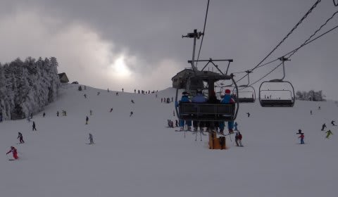

# 12月24，25日　クリスマスの菅平・太郎山のゲレンデ状態と混雑具合は

📅 投稿日時: 2011-12-27 02:29:01

しかし…

この3連休．

22日深夜に忘年会が終わった後．

23日朝3時に出発で往復700km走って日帰り志賀．

24日朝4時半発で1泊2日菅平…と．

当初予定では無謀と思った3連休でしたが．

なんとか無事全日程を完了．

しかし．

一部では大雪警報が出ていたにもかかわらず．

信州は雪がそれほど積もらなかったなぁ…

ということで．

クリスマスの菅平の詳細報告をば．

まずは24日の朝．

新潟の大雪にかかわらず，菅平は超晴天．

…しかし．

おかげで雪が少ないよ．

滑れるのは人工雪をつけてある部分だけなんですが…

前日までの焼額とはえらい違いだ…

この写真で滑れるのはコースの右半分だけです（残念)．

天狗メインコースはこんな感じで上半分はコース幅が狭め．

固い人工雪で，ところどころにブッシュあり．

下半分はほぼコース全幅に雪が着いてますが…

うーむ．リフト待ちはなくてガラガラなのはいいけど．

端的に言って楽しくないぞ．

ということで，ファミリーへ移動．

表・裏太郎は滑れませんが，天狗⇒ファミリーはスキーを履いて

移動可能．

ファミリーは，コース幅いっぱいにたっぷり雪がつけてあります．

人工雪の上に天然雪が乗っているので結構滑りやすい…

＃ところどころ下地のアイスバーンが出てますが

でも．

ここが唯一まともなコンディションなので，結構人が集中して，

リフト待ちは最大5分程度．

ゲレンデも，準指の養成講習会が入っているので，

ちょいと人口密度高め．

うーん．

先日のがらがら焼額ゴンドラぐるぐるのシアワセからは

ちょっと程遠い…

でも．

今日は娘を連れてきていて，そんながんがん滑るわけじゃないから

まぁ，いいかな．

…って感じで．

天狗の迂回コースとファミリーで子供を滑らせてました．

で．夜．

6時ごろから結構雪が降り出しました．

日の出のナイターゲレンデは降りたての

雪に圧雪がかかったベストコンディション！

こ，これは最高だわ～っ！！

がらがらで柔らかい雪のゲレンデ．

昼間のフラストレーションが吹き飛んだぁ～．

このまま…

このまま朝までこのペースで積もってくれれば，明日は

裏太郎も滑れるようになるかも？

…って思ったけど．

次の朝は晴天．

朝までには，20cmも積もってなかった…(涙)

結局，土曜と滑れるゲレンデは変わらず．

新たにオープンしたコースもなし．

…裏太郎は滑れるようになるまでまだまだかかりそうですね．

ちょっと残念だけど．

滑れる部分は，10cmちょいの軽い新雪が乗っていて，

人工雪の固さを隠してくれて，滑りやすくなってます．

朝のゲレンデはプチ新雪状態．

うひょひょひょ，

これは面白い…

と思っていたら．

しばらく経つと，荒らされてちょいとでこぼこになってきましたな…

昼を過ぎると，でこぼこ＆一部下地のアイスバーンが出てきたけど．

でこぼこはそれほどひどくないので，ハイスピードロングターン可能．

んだけど，

このスキー場．

養成講習会をやっているってのもあるけど…

なんか，谷回りの練習をやっている人多数．

ファミリーは準指導員検定A単位の谷回りを

練習している人に覆いつくされている…

あと，オガサカを履いている人が異常に多いんですが．

ちょいと特殊なスキー場ではなかろうか？？

とりあえず．

残念ながら雪が少なかったってのもあるけど．

あんまり広いゲレンデを滑ることも出来なかったし．

周りは必死に検定の練習をしている人たちが多かったし．

レジャースキーヤーが行ってはいけないスキー場（というか，修行場）

だという気がするんですが…

