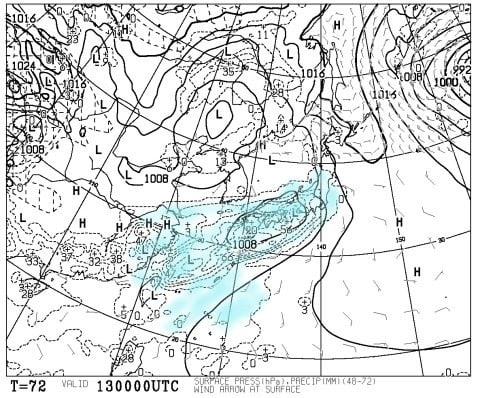
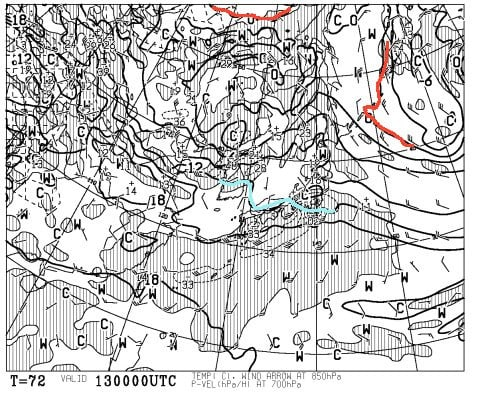
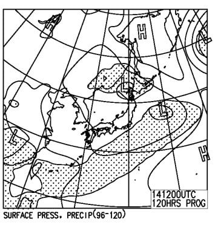
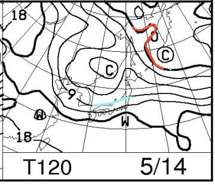

# まだ終わらない！今週末の志賀高原の天気は？…土曜は終日雨．日曜は晴れて気温は高め

📅 投稿日時: 2017-05-11 04:51:01

🏷️ カテゴリ: [スキー天気予想](c6554f5c3c106093b511a8daae23757e8.md)

というわけで．

今週末も，まだ志賀高原は

奥志賀第2，第3高速ペア

熊の湯第2ペア

横手山第2，第3

渋峠

が動くようで…

はい．

だもんで．

続きます，

水曜深夜恒例，←もう，木曜朝のような気が…

週末の志賀高原スキー場天気予想です！

まず，土曜13日の地上天気図ですが．

降水域が本州のほぼ全域を覆っており．

思いっきり志賀高原にもかかってます．

…これは．

志賀高原もかぐらも，朝から雨ですね（涙）．

それも，かなりの雨が降りそうな感じ…

この時期，雪になることはありえないので．

降れば間違いなく雨なんですが．

念のため850hpa気温図も見ておくと…

赤い0℃線はもう図からはみ出すほど北だし．

…絶対雪になることは無いですね．

志賀高原には，水色の+12℃線がかかるくらい

なので．

気温自体は高く，志賀高原でも

+15℃近くまで上がりそう…

あぁ…気温の高い雨で．

雪はかなり融けちゃいそうな感じ…

で．

日曜14日の地上天気図は．

ふむ．網掛けの降水域は，本州にかかってませんね．

まぁ，晴れそうな感じでしょうか．

そして．

この時期，ほとんど見る必要がない気がする

850hpa気温図は…

この日は水色の+9℃線が志賀高原に掛かるくらい．

昼間の最高気温は，志賀高原でも+10℃を

超える，平年並みの気温ですか…

ということで．

まとめると．

13日土曜：朝から雨．それもかなり本格的な雨…（涙）．

　気温は高く，風も時折強くなるか．

　午後まで雨が降り続きそうで，夕方に止むかどうか…

　当然，雪質は朝から雨を吸った重いザブザブ雪．

　かなり残念な感じの一日…

14日日曜：朝は多少雲が多いかもしれないけど…

　晴れの一日．運よく朝からすっきり晴れれば，

　放射冷却が入って，志賀高原は早朝の最初だけ，

　わずかに硬くなりかけの雪質かも…

　ただ，すぐに緩んで朝からザブザブした

　春雪になっていき，午後は雪が荒れていく．

　気温はこの時期の平均的な感じで，

　昼間は+10℃以上まで上がる．

という感じでしょうか…

あぁ．

土曜日の雨が，惜しい…（涙）．

## 💬 コメント一覧

### 💬 コメント by (yama)
**タイトル**: 土曜日の雨
**投稿日**: 2017-05-12 18:17:26

残念なことに土曜日は雨になりそうですね。日曜日まで雪が残っていることを期待しています。土曜日は大人の事情で行けません。日曜日にチャオに日帰りしようと思っています。S様も無事に日曜日日帰りできるように祈っています。

### 💬 コメント by (Skier_S)
**タイトル**: yamaさま
**投稿日**: 2017-05-12 22:59:57

私は天気の関係上，土曜日帰りになりました…

雨の中，奥志賀滑っています（涙）

日曜のチャオ楽しんできてください．

