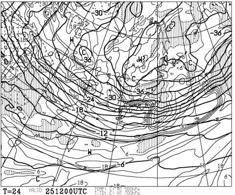
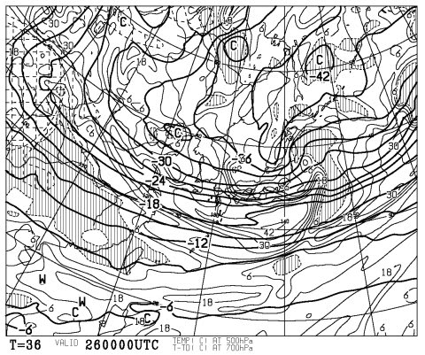
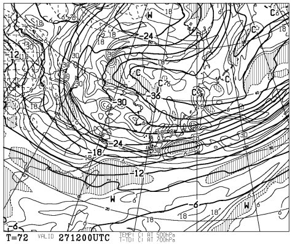
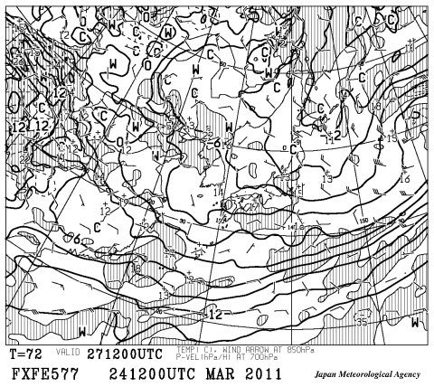
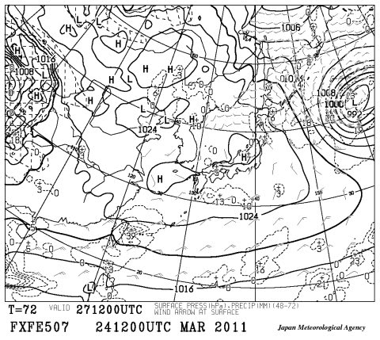
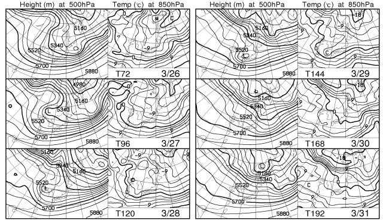

# この週末は…冷えるよっ！

📅 投稿日時: 2011-03-25 02:08:51

🏷️ カテゴリ: [スキー天気予想](c6554f5c3c106093b511a8daae23757e8.md)

ええええ！！！

なんだこりゃ？？

25日夜9時の500hpa予想図ですが…

すごい…

真冬でもそうそう来ることが無い，マイナス36度の寒気がやってきている！

これは，26日まで続きますね…

26日朝9時の500hpa予想図です．

マイナス36℃…

日本海側が超大雪になるひとつの目安ですね…

日曜，27日夜9時になっても．

マイナス30℃の寒気が居座っています．

で，850hpaではマイナス6℃の空気が信州より北をすっぽり覆ってます．

すなわち，標高1500mのスキー場では，マイナス6度．寒いです．

さらに…

信州は高気圧が覆うので，雲の切れ間から日が射しそう．

土曜はこの時期にはありえないパウダー，

日曜は昨晩まで降った雪が積もり，冷えて時折日が射すいいコンディションに

なりそう…

この冷え込みはいつまで続くのかというと…

30日まで，850hpaの0度線が北日本を覆っているので，

30日くらいまで続きそうです…

スキー場が冷えるのは嬉しいんですが．

被災地が寒いのはちょっとまずいかも．

…計画停電中，我が家も寒くなりそうです．
