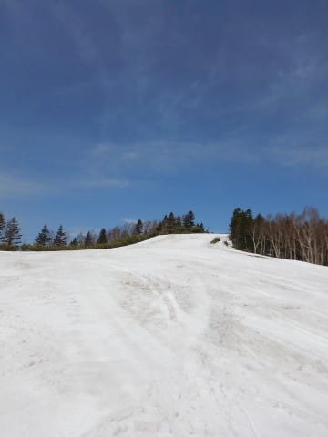
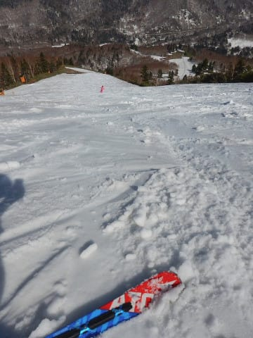

# 4月22日(日)の志賀高原速報モード…暑い，暑いよ！雪もすごい勢いで解けるし（涙）

📅 投稿日時: 2018-04-23 01:45:07

🏷️ カテゴリ: [2018スキー滑走日記](c11b88dc181f34079ab41db74a3587646.md)

えー．

冬季通行止め期間が終了し．

金曜にオープンしたばかりの志賀草津道ですが．

…なんということか．

本日朝，今度は火山活動のため，

万座～草津間が通行止めになったようです…

わずか2日間のオープンでした（涙）

横手～万座には抜けられるようですが．

草津方面から志賀へはアプローチできませんので，

ご注意を…

ってことで．

本日は中野経由で帰ってきたわけですが．

当面の間通行止めということですので．

GWも草津経由で志賀にはアプローチできないと

思います…

ちょっと残念．

ってなわけで．

本日も帰宅がこんな時間になってしまったので．

本日の志賀高原．

日曜深夜恒例の速報モードにて，レポートです！

えー．

本日も，朝6:30営業開始の，

焼額早朝からのスタート！

早朝から気温が高かったけど．

でも，朝の1時間はかなりしっかり締まった

いい感じのシマシマっ！！！

うおおおおおお～！！

昨日は滑り初めからラストまで，

かなり重いザブザブ雪しか滑れなかったので．

固いシマシマを滑れることに感動～っ！！

人も少ないし，最高だよ…

と，早朝の2時間はかなりシアワセでしたが．

すっきり晴天＆朝から高温の本日．

通常営業が始まるころになると．

雪はかなり緩んでしまいました…（涙）

気持ちいいのは早朝だけだったか…

そして．

GSコースの真ん中に，土が出ている部分も，

だんだん広がってきました…（泣）

昼間は，昨日と同じく．

4月下旬とは思えないほどの，半そでTシャツで

普通に過ごせる高温になってしまい（涙）

雪も滑りがあまり良くない感じで，

汚れも浮いてきちゃいました…

でも．

コースはガラガラ．

わが家族貸し切り状態かっ！？？？

って感じで．

コースはあまり荒れなかったので．

意外と焼額，楽しめたかも…

夕方になって荒れてきたものの，

それほどひどい凸凹にはならず．

雪は減ってきたものの，

まだ楽しめた，今日一日でした…

しかし．

高温のおかげで．

昨日，今日の2日間で

ありえないほど雪が消えちゃったん

ですが…（涙）

サウスコースの真ん中に，今日の

昼間にいきなり穴が開きましたが．

これ，昨日は完全真っ白だったところで．

今朝も穴が開きそうな気配はなかったのに．

午後になって，ちょっとブッシュが出始めたか？？

と思うと．

2-3時間でこんな巨大な穴になっちゃいました（泣）．

いや，この2日間．

志賀山頂でも20度を超えるという，

月山の7月より暑いかも？？

…という感じだったので．

雪もそりゃ解けますわな…（涙）

うーむ．

5年前の[この奇跡](ed87ecc584671a2c396ada52e71fdf5a5.md)，また

起きてくれないかな…

この年は，[GW後半もこんな感じ](e55eaee1b2e2ac9d3c0b49e053fccf5d2.md)だったんですよね…

あぁ…

この奇跡よ，再びっ！！！（懇願）

とりあえず．

明日，現在の志賀の雪の状況を

さらに詳細レポートします！

## 💬 コメント一覧

### 💬 コメント by (Goku)
**タイトル**: 奇跡よ今一度
**投稿日**: 2018-04-23 23:07:49

昨日はお疲れ様でした～♪

早朝の焼額山、午後のあの状態からは想像もできないほど良さげですね。

私も奇跡のＧＷ思い出しました！

確か悲しい黄砂で始まった３月のあと、４月が冷え冷えでトドメはＧＷに雪が降りあのコンディション！

今シーズンはこのまま終わってしまうのでしょうか・・・

### 💬 コメント by (ほっぽ)
**タイトル**: Unknown
**投稿日**: 2018-04-24 00:54:27

Ｓさん

私も日曜日は試乗会をパスして通常営業からヤケビ参戦しましたが、お見かけしませんでした。

昼前に奥志賀に移動したらゴンドラ山麓休憩所でyamaさんにお会いしてそのままランチ。

午後はエキスパでコブ祭りでした。

昨日は朝と夕方でコンディションというかゲレンデの雪が激変して、最後のパノラマは滑らなくて辛かったです。

今週末、シーズンラストの志賀高原にたどり着けたらよろしくお願いします。

### 💬 コメント by (Skier_S)
**タイトル**: 雨がひどくならないことを祈りましょう…
**投稿日**: 2018-04-24 06:56:32

＞Gokuさま

日曜は娘とすべってくださり，

ありがとうございました～！

娘も喜んでました．

いや，やっぱり早朝ヤケビはいいですよ．

ってか，この時期は早朝だけのために

来てもいいくらいです．

…でも，やっぱりあの奇跡がもう一度来て，

昼間も最高のコンディションが続いて

欲しいです…

＞ほぽさま

あらら？

日曜ヤケビにいらっしゃったんですか？

全然お会いしませんでしたね…

私は完全に一日焼額に張り付きだったのですが．

おそらく，春用の格好でいつものウェアじゃ

無かったので気づかなかったのかも…

奥志賀は良かったみたいですね．

またGWにいらっしゃるならお会いしましょう！

### 💬 コメント by (ほっぽ)
**タイトル**: ウェア
**投稿日**: 2018-04-25 07:04:11

Ｓさん

あの気温で真冬と同じウェアでは熱中症になってしまいますよね。

土曜日は何時ものウェアだったので直ぐに見つけられましたが、ウェアが違うと分からないかもしれません。ゲレンデで滑っている姿を見れば、何となく発見することは出来るのですが。。。

奥志賀、ダウンヒルはコブにまでは成長していない不整地で疲れましたが、エキスパはほぼ全面コブだったので、かえって滑り易かったです。リズムが取り易いというか。

今週末、雨でゲレンデが壊滅的な状況になっていないことを祈るばかりです。

### 💬 コメント by (Skier_S)
**タイトル**: ほっぽさま
**投稿日**: 2018-04-26 02:01:04

日曜はTシャツで十分でしたよね…

だもんで，今週はみなさんウェアがいつもと違って

声をかけられても誰だか一瞬分からないことが

多かったです（笑）

奥志賀，エキスパはまだ全然いけたのですね．

今週末滑れるかなぁ…

