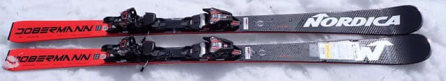
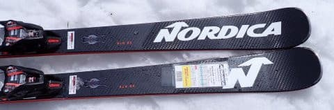
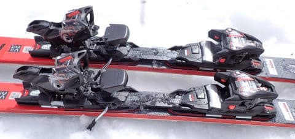
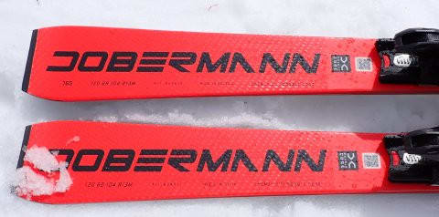
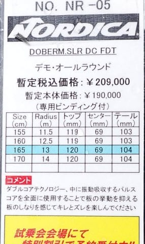

# 2025シーズンモデルのスキー板，試乗レポートその30…NORDICA DOBERMANN SLR DC FDT

📅 投稿日時: 2024-07-17 01:51:23

🏷️ カテゴリ: [スキー板試乗](c0bd8048615710cee890e403a36cc9a2b.md)

この3連休ですが．

娘も試験期間が終わったうえ，

久しぶりに娘も3日間学校も何も

予定がない3連休だったので…

もう，仕事をせずに久しぶりに家族

1泊2日で出かけてきました…！！

…ただ．

初日はいつものパターンで，

睡眠2時間弱で出発，

トータル運転時間10時間で，

夜中11時過ぎまで活動して．

その後2日とも朝から夜まで

ずっといろいろ盛りだくさんの

3日間で，最終日の昨日も8時間

運転して，夜10時過ぎの帰宅だった

ので…

結局，この3連休はいつもの平日より

睡眠時間が短いくらいで，せっかくの

3連休というのに，睡眠不足を全く

解消できませんでした…（涙）

でも．

もう娘も高校生になると，家族で

出かけられる機会も減ってしまうので．

実に久しぶりに家族3人で旅行に

出かけられた今回，

睡眠時間が短かろうが，満足な

3連休でした…

いや～．盛りだくさんの3日間だった…

しかし．

そのおかげで今日は会社で眠かった…（泣）

そして．

いつも通り今日も帰宅は0時近く．

もう寝ないと死ぬ…

それでもいつも通り，Blogは書く！！

ってなことで．

今日も2025シーズンモデルのスキー板の

試乗レポート．

今回は，ノルディカ編です！！

〇NORDICA DOBERMANN SLR DC FDT　165cm

基礎小回り

Nordicaの基礎系の小回り板，SLRですが．

基本的に一見去年から大きくは変わってない

ように見えますね…

ちなみにこの板．朝イチのバーンが

ガチガチに硬い状況で試乗したのですが…

あれ？？

もしかしたらエッジが丸まってる…？

板そのものの性格がエッジグリップが

弱めの板というわけじゃなく．

明らかにエッジが丸まってズルズル

気味って感じで，朝イチのガチガチ

一ノ瀬正面バーンでは，残念ながら

板が流されてしまってまともに

滑れませんでした…（涙）

ただ，下の緩斜面は表面の雪が緩み

始めていて，ここでは何とか滑る

ことができたので．

緩斜面でのインプレッションを述べると…

サイドカーブが13mと小回り用の

サイドカーブになっていることもあり．

旋回性は結構強く，小回りで良く回って

来ます．

板の張りもそこそこ強めで，

板自体のスピード耐性は強そうな

感じはあります．

張りがあるのでスピードを出していっても

板がたわみ切ってどうしようもない

小回りになってしまうことはなく．

張りは強くて返りもそこそこあるけど，

返り自体はそこまで早くなくて，割と

ゆったり返ってくる感じがあるので．

速い返りで小回り強制マシンになることは

なく，縦目に落としていけば長めのミドルターン，

しっかり踏んでいけばショートターンまで

いける，弧の自由度の高さがあり，

小回りオンリーじゃなく小回りベースの

オールラウンド板として行けそうな感じ．

惜しい…これでエッジさえしっかりして

いれば…

あ，そうそう．

この板はずらしのコントロール性は高く，

ずらしの小回りも結構きれいに回れます．

でも，板自体の重さがちょっとあるし．

返りもそこまで早くないので．

軽快な小回りというより，安定感高めの

小回りベースのオールラウンド板という

感じでしょうか．

うーん．

でも，この板のエッジ状態では

やはりこの板の本当の性能を

見切れなかった気がするので…

ちょっとこの試乗レポートは，参考程度

に読み流してくれた方がいいかも．

今度はエッジがしっかりしている状態で

試乗してみたいな…
