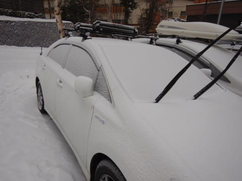
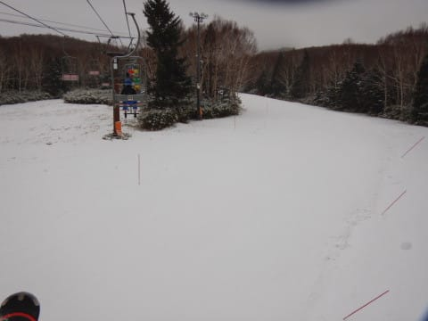
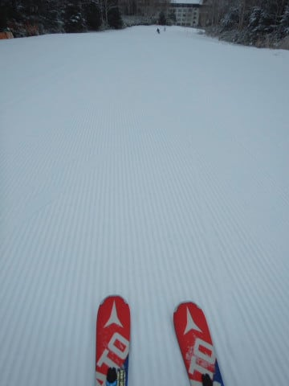
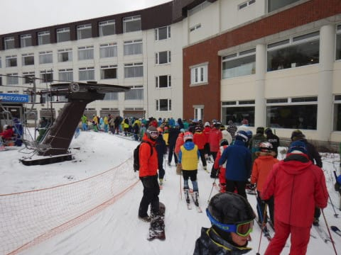
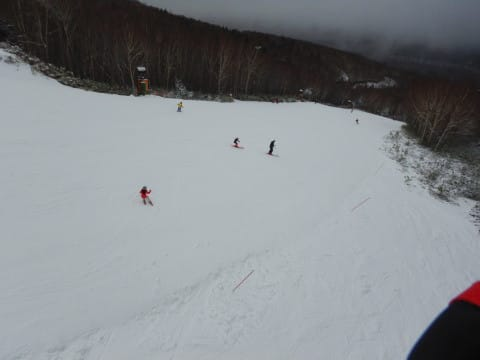
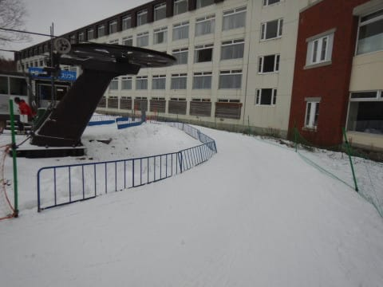
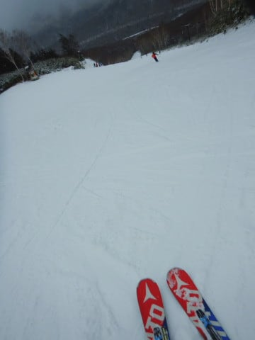
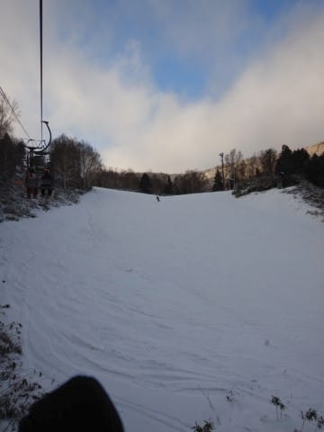

# 2019/12/8(日)の志賀高原，焼額山スキー場レポート，速報モード…今日はちょっと混んだよ(涙)．そして天然雪ほぼ0，バーンは硬め

📅 投稿日時: 2019-12-09 01:58:38

えー．

今日も，ラストリフトまでしっかり滑り．

帰宅後に洗車＆板のワクシングといった，

義務を果たしていると．

今日もすでに，深夜1時過ぎ…（涙）

だもんで．

本日の焼額山スキー場の状況を，

日曜深夜定番，速報モードにて

お送りします！

まず．

土曜の夜．

「もしかしたら，志賀も積雪が

　あるかも…」

と書きましたが．

見事に予想通り，積雪がありましたっ！！

ありました…

…あったんですが．

わずか2～3cm（激涙）

これは…

降ってないも同じですね（泣）

でも．

[金曜に予想](e5bf4207cdfdd824c3bce711e8d5e58b5.md)した，

8日日曜：朝は小雪が舞っているか？もしかすると夜中に

　2-3cm程度のうっすら積雪．

というのが，見事に当たった感じ．

うーん．

こういう予想は完全に外れて，

どっさり1mほど積もってくれても

いいんですが…

ってなわけで．

ゲレンデに出てみると．

当然，ゲレンデの状況は昨日から

変わらず．

ほとんど100％人工雪バーン．

人工雪をつけてないところは，

まだまだブッシュだらけです（涙）

あぁ…

積雪が…

積雪が欲しい…（切実なる願い）

でも．

あさイチのゲレンデは，

人工雪に圧雪がかかった，

見事なシマシマバーン！

　朝は-7～8℃と冷え込み，締まった

　人工雪のシマシマが楽しめる．

と予想した通りの，

完全人工雪の，結構締まった

固めで板が走るシマシマバーンっ！！

これはこれで楽しいよっ！！！

…と，しばらく楽しんでいると．

昨日はガラガラだった焼額．

9時半ごろから，にわかに混みだし…

なぜか，10時過ぎには，

5～7分ほどの待ちに（涙）

うぎゃー！！

昨日は待ち0だったのに！

なぜ，今日はこんなに混むのっ！？？

とはいえ．

ゲレンデの人口密度は，講習等の

団体さんが多かったせいか，

団体さんがいないところはそれほど

ひどい混雑でもなく．

リフト待ちがあったのも，9:30から

11時過ぎまでの，せいぜい1時間半程度．

12時ごろには，またいつもの焼額の

ガラガラ状態に戻って．

このあと，リフトストップまで

ほぼ飛び乗り状態が続きました…

…うむ．

焼額の営業的にはマズそうな気も

するけど．

待ち時間0はストレスフリー！

ただ．

人工雪ほぼ100％のゲレンデで，

気温も終日低め，

太陽が射すこともなく，

終日気温は氷点下をキープ…

とくれば．

昼頃には，

急斜面の一部は，研いでないエッジだと

厳しいくらいの硬さになって

しまい…

　気温が上がらないので，午後は

　ちょっと雪が硬くカリカリに

　なっていくか…

という，金曜夜の予想通りの

雪質になって行きました…（ちょい涙）

うーーーむ．

金曜夜の段階での予想．

かなりの精度で当てている

わけだけども．

あまりうれしくないのは

なぜだろう…（涙）

ってなことで．

ちょいと固いバーンに手こずりながらも．

人がいなくなった午後のゲレンデを

リフトストップまでひたすらグルグル

滑り続けたのでした…

とりあえず．

明日，詳細レポートをやりますので．

お楽しみに…！！

…あ．

そうそう．

最後に一言．

11日の雨の危機ですが．

最新の予想天気図では，

11日の雨は降らなさそうな予想に

なってきてます…！！

ただ．

12日に冷え込んで雪になる予想

だったのが．

その積雪もなくなっちゃう

予想ですが（涙）

うーむ．

次の週末も，人工雪100％なのかな…（涙）

## 💬 コメント一覧

### 💬 コメント by (若杉勲72)
**タイトル**: Unknown
**投稿日**: 2019-12-09 20:01:14

熊の湯は上から滑れるので、今日は初めて太ももに来る喜びを感じました。蓮池すぐ上のヘアピンカーブが危ないのですが、今日の帰路、対向車がハンドルを切りすぎて雪に乗り上げて、ガードケーブル？で止まる一部始終をしかと目撃しました。

コメリの車でした。当然助けてあげたんですが、全力を出しすぎたので、むち打ちの首がひどく痛い、可愛そうな私です。明日もヤケビを裏切って熊の湯です。

### 💬 コメント by (Skier_S)
**タイトル**: ＞若杉さま
**投稿日**: 2019-12-10 01:18:18

あら．

事故目撃しちゃいましたか．

救出活動，お疲れ様です…

私も志賀高原の下りで，目の前で軽トラが横転した

ことがありました…

幸い運転手にけがはなく，通りかかった大人3人で

車を起こそうとしたけど，足場がツルツルして

起こせなかったので，

「JAF呼んでください～」

と立ち去った思い出があります．

むち打ちの首，いたわってください…

PS.今週の宿は確保しました．

お会いできるのを楽しみにしています！

