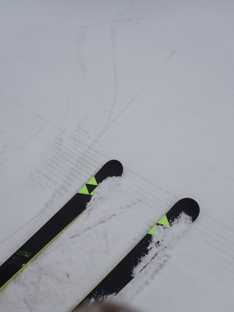
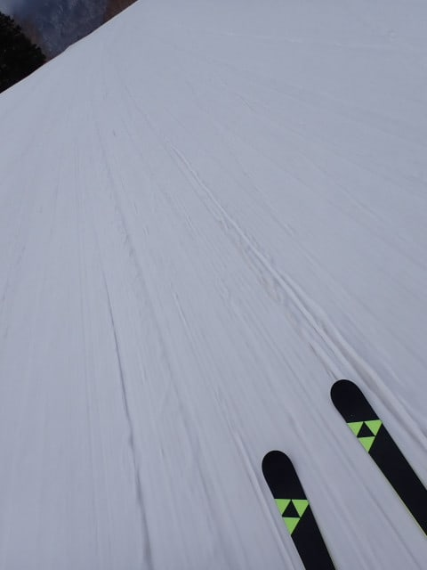
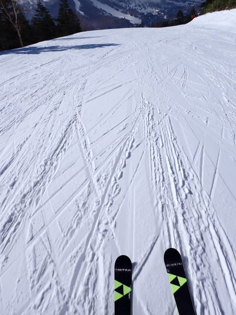

# 2025/4/29(火・祝)の志賀高原焼額山スキー場滑走レポート…朝は雪！積雪1cm．その後晴れて朝は最高！午後は雪は荒れたけど気温が低くて良かったよ

📅 投稿日時: 2025-04-29 21:00:18

🏷️ カテゴリ: [2025スキー滑走日記](cacd3fbf84d4a679ee61a5894c3f95e14.md)

ということで．

GWの合間の祭日だった本日も，

志賀高原を滑ってました～！！

なんと…今日は早朝に雪がつもって，

その後晴れたのに気温がそこまで上がらず，

さらにガラガラという，

4月末としては，すごい恵まれたコンディション

でした…

これ，あと2日で5月になるという，

4月末とは思えない写真なんですが…！！

標高が高い志賀高原，やっぱりすごい…

ってなことで．

今朝は早朝スタートに合わせ，5時過ぎに

志賀高原の上り坂を走っていたわけですが．

朝のこの時間はすごい雨が降っていたので…

これは予想外して志賀も雨かな…？（泣）

早朝をやめて帰ろうかな？？

…と，半ば思っていたところ．

スキー場に近づいたあたりで雪になり．

路面積雪とまでは行かなかったけど，

ぬれた雪がうっすら路面を覆い始める

くらいになってて．

昨晩から止まっている車には雪が

うっすら積もってますよ…！

で．

ブーツを履くのに手間取り，6時の

ゴンドラスタートの3分後にゴンドラへ！

ちなみに，ふもとの雨であきらめた人が

多かったのか，祭日なのに早朝オープン

待ちは20人ほどしかいませんでした…

そして．

朝イチゴンドラに乗ると…

うほーーー！！

ゴンドラ下，うっすら雪が積もってますね…！

山頂に着くと…

気温は-2℃！！

驚くほど低くはないけど，降れば十分に

雪の気温！

朝6時過ぎの山頂は雪が降り積もっていて…

硬めだけど表面までガリガリに固まっている

わけではない，表面がわずかにしっとり

している下地の上に，雪が1cmほど積もって

ますよ！！

いや，これ…

4月下旬にしてはいい感じじゃない？？

大体の天気予報では，今日の志賀は雨だったのに，

数mmの積雪という私の予想，当たったな！

ふはははは！！！

そして，6時過ぎの時点では，まだ雪は

かなりの勢いで降ってます！！

で．この時期の新雪はヘタすると湿ってて

滑りが悪いけど…

今日の雪は滑る！！！

うほーーーーー！！！！

これはいい…っ！！！

とても4月末と思えないGoodコンディションっ！！

朝の2－3本は，この時期としては特別

ボーナスとしか思えない，冷え冷えの

快楽コンディションで滑れて…

こんな幸せでいいのか？？

この1時間だけでも志賀高原に来る価値は

あったぞ…！？？

というラッキーコンディションだと

思っていたのに…

ん？

早朝開始から1時間ちょい．4－5本滑ったあたりで

雪が止んで，だんだん空が明るくなって

来ましたよ…？？？

バーンがかなり見やすくなり，

この時期としては雪がいいだけでシアワセ

なのに，さらに滑りやすくなってきたん

ですけど…？？

人が少ないので，7時を過ぎてもまだ

誰にも踏まれてない新雪部分が残っていて…

明るくなってきたから，かなり最高な感じ

なんですけど…？？

…と思ったら．

なんと…

7時半過ぎには，すっきり晴れてきました…！！

え？

これ…

4月末の景色だよね？？

こんなに晴れてて新雪が積もってる

景色って…

GWでこんな景色が見られるとは…っ！！

ええ．

もう，見てくださいよ．

この雪を…！

GWにこんな感じで滑れるんだから，

やっぱり志賀高原はスゴい…！！

ってな感じで．

午前8時過ぎくらいまでは，晴れたのに

気温が低めで，板も滑るしバーンもいいし，

最高のボーナスタイムでしたが…

やはり，もうすぐ5月になろうとしている

強い日差しが降り注ぐと．

さすがに気温は低めとはいえ…

午前9時ごろには雪も緩んで荒れ始めてきて，

ボーナスタイムは終わりな感じ（泣）

昼前，11時くらいまでは，山頂でせいぜい

+2℃くらいと低めの気温だったのに…

やはり，この春の強い日差しが降り注ぐ

晴天だったので．

10時ごろにはいつもの春雪の重い

ザラメになって，緩斜面は汚れも浮いて

すべりが悪い感じになってきました（泣）

そして，11時にはスキー場全面で，

荒れ荒れバーンの春の大バーゲンセール

状態になっちゃいました（涙）

あぁ…

ボーナスタイムは早朝からの３時間だけ

だったか…

でも，早朝から3時間，ゴンドラ15本以上，

かなりのシアワセバーンを滑れたし．

昼間荒れてるといっても，まだ雪は

たっぷりあるし…

祭日なのに，ゴンドラも飛び乗りで．

最高でも搬器3台待つのが1回あったかな？？

という程度の，かなりのガラガラ具合で．

こんな天気の中，雪がたっぷりある

誰も滑ってない貸し切りバーンを滑れるん

だから…

恵まれてるGWだよなぁ…

午後1時半を過ぎると．バーンはかなり

凸凹になっちゃいましたが…

でも，なぜか昼前より板が滑るよ！！

気温が低いからか，日陰の部分の雪は

冷えてカリカリしてくるくらいで，

滑りの悪い雪は影も形もなくなって，

荒れてても滑りやすくなってきたよ！

で．

この時期，パノラマコースの急斜面部分，

スキー場公認のコブが掘られているん

ですが…

コブラインが2本に増えてました…！

そして，この時期なのに．

パラマコースはかなり気合を入れて

人工雪を打ったということで．

コブの底が全く抜けてません！

土が出ている箇所が一つもないのが

すごすぎる…

サウスコースにもかなり長いコブラインが

できてて．

GSコース横の未圧雪のコブもまだ

残っているので…

コブ好きの人も結構楽しめるかも…！

ただ．

GSコースの突き当りを右に折れての

急斜面部分．

一か所だけ，雪が薄くなっているところが

出てました…（泣）

まぁ，コース上で雪が薄くなっているのは

この1部分だけだし．

今シーズンはよそから雪を持ってくる

場所もいっぱいあるので．

明日までには埋められてると思いますが…

ってなことで．

午後3時の営業終了のころは，

かなりの凸凹バーンになっちゃったけど．

雪の滑りは驚くほどよく…

むしろ営業終了直前，日がかげると

雪が冷えて固まり始め，ちょっと

手ごわくなってくるくらいに，今日は

冷えてました～！！

という感じで．

今日はさすがに途中ちょっと1時間ほど

休憩を入れたものの．

今日も，この時期としては恵まれた

コンディションを堪能すべく，

早朝からラスト15時半まで滑り倒した

のでした…

いやーー．

良かった．

今日の朝は最高だった…

で．

明日の早朝は寒気が残って，

早朝のうちは晴れてるけどかなり

締まったバーンが楽しめそう！！

…でも，晴れて昼間は気温が上がるので．

午前中には緩んだバーンになっちゃい

そうですが…

ということで．

今日は速報モードじゃなかったことから

皆さんお気づきと思いますが．

明日も志賀高原を滑ってます～！

…いいのか？？

かなり強引に休みを取ったけど，

休んで大丈夫だったのかな…？？？

…職場から電話やメールが飛んで

こないことを祈ろう…
