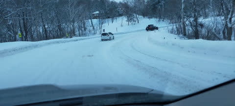

# 2021/12/30(木)の志賀高原焼額山スキー場レポート！…朝は小雪，午後は吹雪気味．そこそこ混んで，ちょいゲレンデも荒れ気味…

📅 投稿日時: 2021-12-31 00:08:08

ってなことで．

中1日挟んでまた志賀高原に戻って来ました～！

志賀→中1日出社→日帰り志賀→年末の家の用事で25時間ほど在宅→志賀…

と．

かなり激しい移動をしたこの5日間でしたが．

今日も朝イチからラストまで滑っちゃいました…

で．

今朝は，高速は信州中野ICからチェーン規制．

高速も結構な積雪路で，中野の町中から

結構な雪道でした…

志賀高原の登り坂は，積もりたての軽い

雪で，かなり滑りやすい路面だったので

気を付けてください！

ってなことで．

今日は8:30の焼額ゴンドラの営業開始に

5分遅れてしまうという屈辱の朝でしたが．

朝のゴンドラで山頂に上がると…

気温は-7℃．

-5℃の予想より2度ほど低いですが，

でも，ここ数日では暖かい方ですね…

そして山頂は…

圧雪コースは，圧雪の上に数㎝のうっすら

積雪で，ここはぴったり予想通り！！

エッジがガッツリ聞く柔らかめの圧雪の

上に軽い新雪が乗っていて，トップシーズン

らしい冷え冷え雪質！

…だったけど．

山頂付近はちょっと視界が悪かった

のが惜しい…

今日は道路も積雪していて，

みんな出てくるのが遅めなのか，

朝10時くらいまではゲレンデも

空いていて快適だったんだけど…

10時ごろには，一の瀬方面から人が

流れてくるため，第2高速が混雑して…

さらには11時前には，1ゴン15分待ち，

2ゴン30分待ちという，耐えられない

待ち時間に…（涙）

さすが年末年始休らしく，ゲレンデも

混雑してきました（泣）

ピーク時には，一番空いている第3高速

でもこのくらいの混雑になりましたが…

まぁ，このくらいなら待てるレベルかな．

ただ，昼の12時前から1時半ごろまでは，

雪の降りが強くなってきたこともあり，

早めのお昼休みで，長めに休んだ人が

多かったのか…

をを！

ゴンドラがガラガラに！！

このままガラガラが続けばいいな…

と，思ったけど．

昼休みが終わって人が出てきたのと，

2ゴンが減速運転になったのと…

さらに吹雪き始め，リフトに乗ってると

凍死しそうなほど冷えてきたために…

また，午後2時前には1ゴンが

すごい待ちに（泣）

しかし，1ゴンが並んだのも一瞬．

気温は朝より冷え，-10℃を下回り，

さらに雪降りが続く，

根性の無いスキーヤー振り落とし機能

がフル発動したため．

次々スキーヤーがふるい落とされて

いったらしく，

3時ごろにはゴンドラも待ちほぼ0，

コースもピークに比べれば，人が

少なくなってきました！

さらにラストには，圧雪コースにも5cmほど

軽い雪が乗った，プチパウダー状態！！

ってなことで．

今日も雪降りの中を，ラストの16時まで

滑り続けたのでした…

が．

当然のごとく，まだ終わらない．

今日は焼額のナイターがやっているのだ！

当然，滑りに行くのだ！！

圧雪かけたてバーンの上に，激軽の

パウダーが5～10㎝乗った，パウダーの

重さを全く感じない冷え冷え最高バーン！！

ナイター中もひたすら雪が降り積もり，

むちゃくちゃ寒くて，リフトにフードが

なければ凍死するかと思ったけど．

ナイターラストまでで，圧雪バーンの上に

これだけまた積もったくらいなので，

明日はかなりのパフパフパウダーを

楽しめそう！！

いやー．

今シーズンは，ホントに良く雪が降る…

パウダー当たりシーズンですよ！

ってなことで．

明日も志賀高原を滑ってます～！

## 💬 コメント一覧

### 💬 コメント by (ふく)
**タイトル**: SNS
**投稿日**: 2021-12-31 07:54:52

おはようございます！

以前もお尋ねしたかもしれませんが、Twitterなどはやられていませんか？

もしやられていたらフォローさせてください。やっていなかったら、是非2022年から始める事をご検討ください。

リアルタイムの志賀を知りたい方も沢山おられるので、ブログとセットで相乗効果があるとおもいます。

### 💬 コメント by (カトウ)
**タイトル**: Unknown
**投稿日**: 2021-12-31 11:22:05

なんて軽い雪なんでしょう‼️

板の上の雪の写真でわかります❗️

そして、痛いくらいの寒さも。。

今日は北陸でも乾いた雪が舞っています。

志賀高原では雪の結晶が肉眼で見れますよねー。

思う存分楽しんでください！

それでは、良いお年を！

### 💬 コメント by (m&t)
**タイトル**: Unknown
**投稿日**: 2021-12-31 13:25:14

現在長野IC〜上越高田IC上下線で通行止めです

移動される方は気をつけてください

### 💬 コメント by (アリス)
**タイトル**: 明日は志賀高原に到着できるか
**投稿日**: 2021-12-31 15:23:06

S様

志賀高原への荷造り完了し、本日の志賀高原と周辺道路のライブカメラ見るとレンズ越しでは真っ白・・・

しかし、リフトとゴンドラはフル稼働で動いていますね♪

Sさんの事ですから、視界が悪くても、寒くてもランチ抜きでガンガン滑っていると推察します♪

m＆t様の情報にもある通り、長野ICからは高速道路も通行止め・・・

明日、無事志賀高原へ到着するか不安になってきました・・・

長野県高速隊と山之内の除雪機動力を信じて早朝出発を心に決めています♪

### 💬 コメント by (Skier_S)
**タイトル**: 明日もパフパフパウダー
**投稿日**: 2021-12-31 22:45:49

＞ふくさま

大変残念ながら，TwitterもFacebookもやってません…

週末だけでもリアルタイムレポートやってもいいのかもしれませんが，

それをやるとたぶんBlog書かなくなりそう…

＞カトウさま

雪は冷え冷えでいい雪でした！

でも，深いパウダーはちょっと重めでしたが…

志賀高原は-15℃で凍死しそうです．

いい感じで冷えてます！！

＞m&tさま

情報ありがとうございます～！

ヤケビメンバーもかなり影響受けたようで，大変だったみたいです…

>アリスさま

今日は奥志賀の第2リフト，焼額のゴンドラが悪天候で予定より早く終わりました．

でも，ちゃんとお昼抜きでラストまですべちゃいました…

