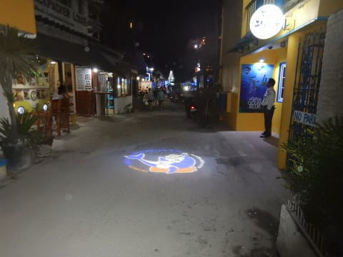

# 2019年8月，4度目のモアルボアル・小6の娘Cカード取得1周年！その2…離陸，そしていつものカバナホテル着

📅 投稿日時: 2020-07-23 00:18:28

なんと．

（カレンダー上は）明日から4連休じゃないですか…！

…本来，東京オリンピックの開催のために

開会式が行われるはずだった23日を起点に

（カレンダー上は）4連休になったはずなのですが．

結局今年はオリンピックをやらなかったわけで．

それでも4連休のままなんだなぁ…

…もし，来年オリンピックが開催できることになったら，

また4連休にするのかな…？

そう言えば，いまからちょうど1年前．

「来年東京オリンピックが開催されたら，都内の

　交通がすごいことになるから，都内の会社は

　在宅勤務を！！」

みたいなことが言われていた気がしていて．

そのころは

「あんだぁ？在宅勤務？無理だょ」

と思っていたものですが．

…当時全く想定しなかった，全然異なる事情により．

1年後にここまで在宅勤務が普及することに

なるとは思わなかったよ…

ってなことで．

（カレンダー上は）4連休らしいのですが．

とりあえず，在宅勤務が続いているこの頃，

家で仕事ができる環境が整っていて．

さらに4日間，どこにも行かないとなると．

…危険だ…

ってなことで．

今日の本題，いつものダイビング旅行記へ，

GO!

ーーー

ってな感じで，ラウンジでくつろいだ後，

セブ島直行便の機内へ搭乗しますが…

機体はA321-200ceoですね．

…相変わらず，機内エンターテイメント用

モニターが着いてません…（涙）

ただ，機内WiFiでの映画・音楽配信を

やっているので．

みんな自前のスマホでつないでみてね，

ってことですね．

これは帰りの時に撮った写真ですが，

マップやら…

映画が自前のスマホで見れます．

ってなことで．

ほぼ定刻，14:30過ぎにスポットを離れた

機体は…

成田を離陸！

離陸後，1時間を過ぎたあたりで，

機内食が配られますが…

ラウンジでおなか一杯お昼を食べたけど，

午後4時近くでもうおなかが減ってた

らしい娘は，大人の一人分を

ガッツリ食いましたね…

機内食はこんな感じで．

日本発の便で，日本製だったからか，

意外と食べられる味でした～！

という感じで．

機内食を食べてしばらくすると，

窓の外は夕暮れタイム…

夕暮れの中，セブ空港のある

マクタン島に近づいていき…

搭乗時間5時間弱，現地時間の

午後5時過ぎ，セブ空港へタッチダウン！

昨年度は工事中だったセブ空港，

今年は工事が完成して，もう全面ピカピカ

ですね…

空港の両替屋さんで，フィリピンペソへの

両替をやっておきます．

1円=0.4563ペソってことで．

大体1ペソ2円ちょい．

ペソの値段を倍すれば，大体の

日本円に換算できます．

うーん．

数年前まで3円を超えてたことを

考えると，ペソ，安くなったなぁ…

そして．

空港の外へ出ると…

現地エージェントが出迎えてくれて，

ホテル送迎ワゴンに案内してくれます．

ここからが長い…

空港からホテルまで，約3時間の

ワゴン車での旅．

途中1回トイレ休憩に寄ってくれますが，

それ以外はひたすら田舎道を走り続ける，

ロングドライブ．

まぁ，自分で運転するわけじゃないので

楽だけど…

ってなことで．

空港を出たのが午後6時ごろでしたが．

午後9時ごろ，ちょうど3時間で，

ホテルへ到着！

ホテルは，もう定宿と化している感のある，

いつものカバナホテルです．

…しかし．

このモアルボアルの街，去年までより

ちょっとにぎやかになってきている気が…

でも．

ホテルの中はこれまでと変わらず…

海に突き出たテラス（？）もこれまで通り．

今回の部屋は，残念ながらビーチ側に

面しておらず，中庭側の部屋ですが．

まぁ，部屋の中はどっちも変わらず．

夜ご飯も食べず，夜9時ホテル到着の日程

ですが…まぁ，午後4時過ぎに機内食を

食べてるので，夜ご飯は無くていいよね，

と，ダイビング器材の準備やら…

水中カメラなんかの準備をしてると，

夜10時過ぎ．

日本時間だと，夜11時ですね…

ってことで．

明日のダイビングに備えて，

お休みなさい～！
