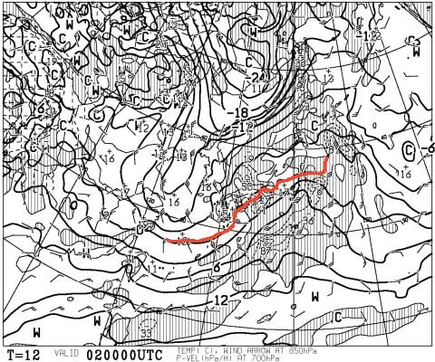
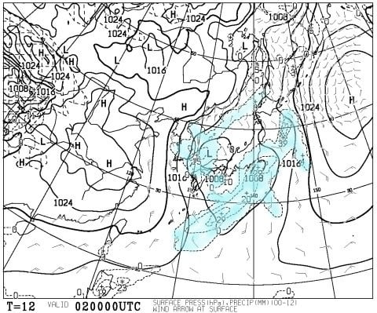
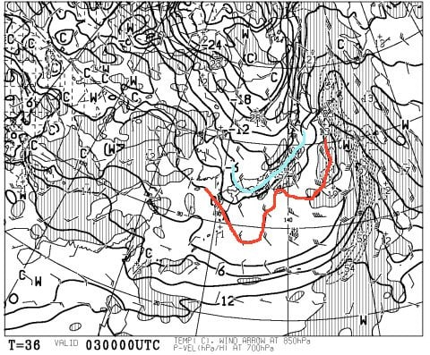
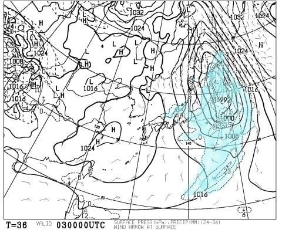
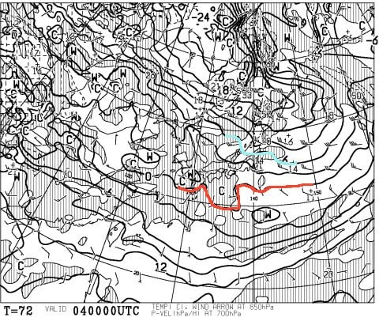
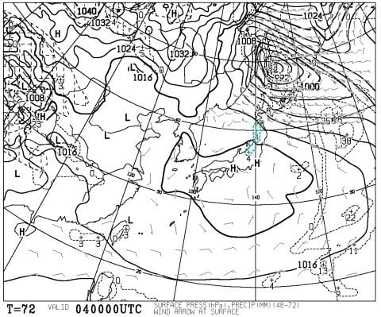
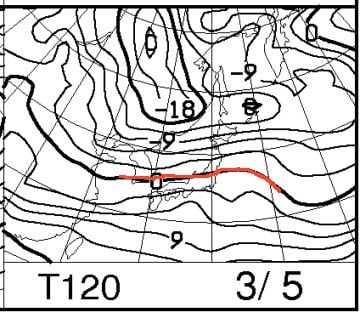
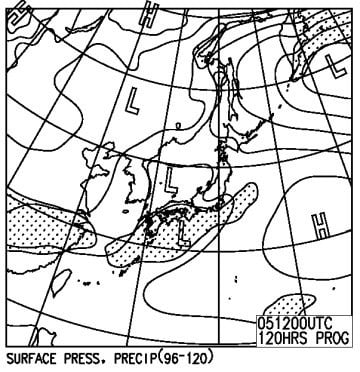

# 3月4，5日の週末の志賀高原スキー場の天気は？…おそらく晴れそうな予感

📅 投稿日時: 2017-03-02 02:21:30

えー．

おそらく，みなさん．

物欲選手権の行く末が気になっているとは思うのですが．

「天気予想はいいから，早く物欲選手権の続きやらんかい！」

…って声も聞こえそうなのですが．

でも．

今日は水曜日．

＃もう，日付が変わって木曜になってるけど…

そうです．

定例の週末の天気予想です～！

とりあえず．

2日木曜，朝9時の850hpa図は…

うむ？？

0℃線が，ギリギリ志賀高原近辺…っ！

これは，ちょいと危険．

降れば雨の可能性も否定できないけど…

でも，地上天気図を見ると．

…微妙だけど，ギリギリ志賀高原は降水域に入って

無いので…

志賀は，午前中は降らない感じですね．

2日の夕方，冷え込んでから雪がちらつき始める感じかな…

で．

3日金曜の朝9時の850hpa予想図は…

うむ．

この日は，志賀高原に水色の-6℃線がかかり，

十分冷えてます．

そして，地上天気図は…

微妙…

ドサドサは積もってくれなさそうだけど．

2日夜から3日午後にかけて，雪が降り．

10cm，運が良ければ20cmくらいは積もりそうかな…？

アイスバーンを隠してくれる，恵みの雪になりそう．

で，肝心な週末．

4日土曜の850hpa予想図は…

うむ．

この日も志賀には水色の-6℃線が掛かってますね．

朝は-10℃近い冷え込みになるかな～．

地上天気図はこんな感じで，

すっぽり高気圧に覆われるので．

土曜は終日晴れますね！

で，5日の日曜は…

あう？？

0℃線が，志賀高原より北にまで上がってますが…（涙）．

でも，午後9時段階の地上天気図はこんな感じなので．

西からひたひたと低気圧は近づいてはいるものの．

降水域を示す網掛けはまだ志賀高原にかかっておらず．

志賀高原は降りませんね．

おそらく日曜も晴れ，午後に雲が増えていく…

という天気になるかな～．

ってことで．

まとめると．

4日土曜：　朝から晴れ！！朝は放射冷却で

　-10℃くらいまで冷え込む．

　朝は前日に積もった雪が圧雪された，

　最高シマシマバーンがお出迎え！

　この日は昼間もマイナス気温をキープ．

　日差しが当たる斜面は，昼間は雪が

　多少しっとりとかもしれないけど，

　南斜面以外，昼間もおおむねいい雪質をキープ．

　午後になって表面の雪が荒れてくると，

　急斜面は凸凹＆ところどころ下地の固いのが出てくるか…

　でも，基本的に天気よし・雪よしの一日かな～．

5日土曜：　この日も朝から晴れ！昨晩からの積雪は無し．

　朝は放射冷却で-5℃以下まで冷え込むかな．

　しっかり締まった圧雪バーン．

　昼間は気温が上がり，0℃をわずかに超えそう．

　なので，日差しと相まって全体的に雪は緩みそう…

　ただ，ザブザブになってしまうほどではなく，

　握ればダマになるような雪になる程度．

　日当たりがそんなによくない斜面は

　昼間もまぁまぁいい雪質をキープ．

　午後はやはり急斜面で下地の固いのがところどころ

　顔を出し，昼過ぎから雲は増えていく…

　

…って感じでしょうか．

基本的に，金曜に積もった雪で，ゲレンデ状況は

結構改善されて，天気がいいのも相まって

土日ともおそらく結構楽しめる，

いい週末になるんじゃないかな～．

PS.月曜まで志賀で滑るであろう某氏のために，

　…月曜は終日曇り．昼間の気温はまぁ平年並み．

　日曜からの積雪は無し，と予想しておきます（笑）
