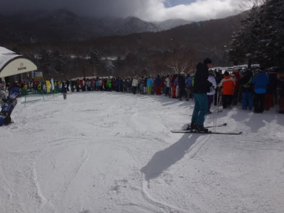
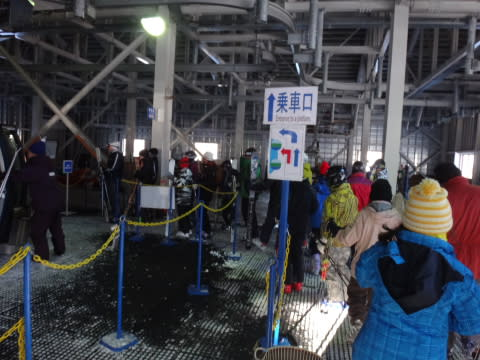
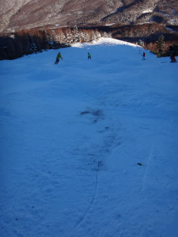

# 12月30日の志賀高原は…積雪が足りない…たりないよ（涙）

📅 投稿日時: 2015-12-30 22:15:11

🏷️ カテゴリ: [2016スキー滑走日記](c70c67ed5248e9432b899dcd5747048bb.md)

えー．

中1日，25時間の自宅滞在で．

また，志賀高原にやってきました，

Skier_Sです．

＃志賀高原に帰ってきたわけではない．

えー．

大変残念ながら．

昨晩からの積雪の積み増しはほとんどなく．

焼額のゲレンデ状況は，28日とほとんど変わりません…（涙）．

とりあえず．

本日30日．

朝の天気は，天気予想通り，曇は多いものの，時折日が差す天気で…

んで，朝イチの山頂気温は，マイナス8度程度と，

まーまーの冷え込みなんですが…．

で，雪も一見まともそうに見えるんですが…

本日．朝8時からのファーストトラック（別料金）が終わった後．

8時半からの通常営業で滑り始めたころには，すでに…

ええ？？

なんだ，こりはっ！？？

…すでに，かなりブッシュ＆小石が出てるんですけどっ…！（激涙）

だのに．

コースはかなり混雑しているんですけど…っ！

…そして．

さらに．

午前10時半ごろには，追い打ち．

第2ゴンドラ，故障で運休…（泣）．

なんてこった…っ！

第2ゴンドラが止まったおかげで．

第1ゴンドラは，すごいことに…

…ゴンドラ20分待ち（激泣）

なぜ．

なぜ，ただでさえ混雑しいる時期に壊れるかな～（残念）．

まぁ．

第2ゴンドラが止まったのは1時間ちょい．

11時半ごろには第2ゴンドラも動き出し，

石ころ地獄の第1ゴンドラはガラガラに…

まぁ，人工降雪のない第1ゴンドラ．

12月末の段階でも．

午後になるとこんな状況なので…

普通の年ならオープンするレベルではありません…

とても滑れた状況ではないので．

まぁ，第1ゴンドラは，常識的にはガラガラになるのが

普通かと…

その代わり．

人工降雪があって，ブッシュがほとんどない第2ゴンドラ側は…

ブッシュや石ころはありませんが．

コースがかなーーーーり，混雑します（涙）

そして，人工降雪なので，コースはちと固め…（残念）．

第2高速リフト，唐松コースも，人工雪がしっかりついているので．

ブッシュは出てないけど…

ここもコースは固めだったかな．

午前中は多少待ちが第2高速．

午後は待ちがなかったけど…

コースの人は多く，アイスバーン状態（涙）．

今日，意外とよかったのが．

本日オープンした第3高速でしたね～．

第2ゴンドラが止まった時以外，リフト待ちも

なかったし…

今日オープンしたばかりで，雪もまだ蹴散らされておらず．

緩斜面ではあるけど，ここが一番ましだったかな．

ってことで．

本日も，全然積雪が足りず．

オリンピックコースなどもまだまだ

滑れなさそうで．

かなり残念な感じですが．

まぁ．

天気は，曇りながらも日が差す時間も多い，良い天気で．

第1ゴンドラはかなり残念な雪ながらも．

今日からオープンした第3高速がまーまーまともに滑れたので．

ううううーーーん．

ぎりぎり我慢できるレベルだったのかな～．

とりあえず．

積雪が全く足りず．

今日も雪が時々ちらついたものの，

全く積もる気配がなかった感じで．

うーーーーーん．

もう一降り…

いや，2降りも3降りも欲しい志賀高原だったのでした．

今も全く雪が降ってないので…

明日もダメかな（涙）

とりあえず．

これから積雪がないと．

第1ゴンドラのGSコースは，オープンしていても

滑れたレベルではありません…

今晩は降らなさそうだけど．

31日から，1日の朝にかけて，ちょっとだけ積もりそうなので．

そこに期待でしょうか…（かなり薄い期待）

あぁ…明日も午前中あであんまり積もらなさそうだし．

ゲレンデ状況は，明日も改善しなさそう…（涙）

## 💬 コメント一覧

### 💬 コメント by (FCAMEL)
**タイトル**: スタッフが・・・
**投稿日**: 2015-12-31 05:49:08

お久しぶりです。今年も時々は焼額行ってるんですけど、いつもより人口密度が濃くてSkier_Sさんを見つけられないFCAMELです。

ここまでなんだか残念なシーズンになってしまいましたね。

昨日ジャイアントスラロームで、スタッフの方が二人コースの真ん中で何かしてるのでなんだろうと思って近づいてみたら、コースの石を一個づつひろってコース外に投げてました（涙）。今シーズンもよろしくお願いします。

### 💬 コメント by (はなげ親分)
**タイトル**: 熊の湯
**投稿日**: 2015-12-31 12:11:16

悲惨な状態の焼額山から逃げ出し昨日、今日と熊の湯にきています。

焼額山のあの激混みは何だったのと思う程の快適さです！

雪、リフト待ち共に全く気になりません♪

### 💬 コメント by (ぴよ＠太田市)
**タイトル**: 苗場も同じ
**投稿日**: 2015-12-31 16:09:11

苗場も同じような状況です．．．

新しく下ろしたロシの板がガリンペイロ状態になってしまいました

神楽は前面滑走可らしいのですが積雪量は少ない様です

今年はみなさん苦労続きですね．．．

### 💬 コメント by (Skier_S)
**タイトル**: 雪よ降れ～っ！！
**投稿日**: 2015-12-31 17:17:17

＞FCAMELさま

私もパトロールさんが石をどけているのを見ました…

ってか，わたしも結構石を拾ってコース外に出しているんですけど．

そういうので間に合う次元じゃないですよね…（涙）

1月3日までは焼額滑ってますので～！

＞はなげ親分さま

熊の湯は混まなかったんですか…

横手山も滑れるようになって，一時期の集中が

なくなったんですかね～．

焼額は相変わらず悲惨なので，熊の湯か

奥志賀がいいかもしれません（涙）

＞ぴよさま

ああ…

苗場もそんな感じですか．

かぐらは混んでいるんでしょうねぇ…

しかし，この少雪の状況で，新しい板を

出しましたか…

私はまだ物欲選手権完敗で購入した板を

出せる状態ではない…と，古いSXを履いてます．

…いつ新しい板を履けるのかな～

### 💬 コメント by (まいる)
**タイトル**: (゜-゜)
**投稿日**: 2015-12-31 17:38:14

Skier_Sさん、昨日、南会津に滑りにいきました。雪質はよいのですが積雪少なく、斜度のあるところは雪着かず(T_T)

### 💬 コメント by (Skier_S)
**タイトル**: まいるさま
**投稿日**: 2015-12-31 21:01:23

南会津は…雪がなさそうな感じですね…

志賀でも全然雪がない状況ですから（涙）

今シーズンは一体いつまともに雪が積もるのか…

