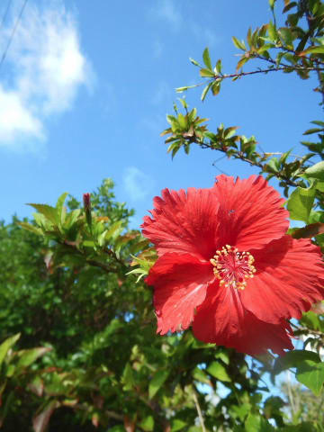

# 2018年8月，子連れ座間味で小5の娘とファンダイビング！その7…ダイビング2日目も晴天でスタート！

📅 投稿日時: 2019-09-10 01:27:57

…昨日は久々のスキーネタでしたが．

やはり，スキーヤーBlogに期待

されるのは，

当然のごとくスキーネタ

というのがすごく良く分かることに．

夏の間は落ち気味のアクセス数が，

スキーネタを一発入れると，

トップシーズン並みに戻りますね…

…でも．

残念ながら，スキーシーズンまでは

まだしばらく待たねばならず．

毎日スキーの話題を書くほどの

ネタもないので．

今日はこの時期恒例のダイビング日記です～！

（大勢の落胆の声が聞こえる…）

では，どうぞ～！

---

ということで，明けて座間味ダイビング

2日目の朝…

起きてみると，見事に晴天！

今回．

ギリギリ座間味に渡ることもできて．

それでいてそのあとの天気が

最高とくれば．

私の日ごろの行いが良かった

からに違いあるまい…！←だから，いつも言ってるけど

それは違うから．違いありまくりだから

ってなことで．

朝7時に，宿の朝ごはんを食べて．

いつも通り，1日おきに洋食・和食が

交互に出ますが．

今日は洋食の日ですね…

そして．

朝9時ちょっと前に船に集合なので．

宿を出て，港に向かいます…

いや，ホントに今日は天気が

最高！！

港で，ティンガーラ号に乗りますが…

そういえば．

去年まで真っ白だったティンガーラ号．

今年は船体が赤く塗り替えられています．

そのほか，後ろのデッキ部分が作り替えら

れて，段差が無くなっていたり．

いろいろ改修されたようですね…

ってなことで．

出航前，揺れないうちに器材セッティングを

完了させて．

すっきり晴天の中，出航！

娘はいつもの特等席をGetしてますが…

本日も外海はちょっと荒れ気味

ながら，高速船は全て

予定通り出航したようで．

昨日はほぼ貸切だった

ティンガーラ号．

今日は逆に，ほぼ満員です．

そして．

子連れに人気のザマミセーリングさん．

当然のごとく，子供も

いっぱい乗っていて．

特等席は，子供でいっぱい！

ってな感じで．

絶好の海遊び日和の本日．

船に乗って20分ほどでやってきた，

1本目のポイントは，阿嘉島の西側の

「儀名」．

まずはポイントのブリーフィングを

行いますが…

いつも通り，娘の最大12m深度制限が

ある，我が一家は別チーム．

オーナー自らがガイドしてくれる

ようで．

では．

本日1本目，エントリー！

