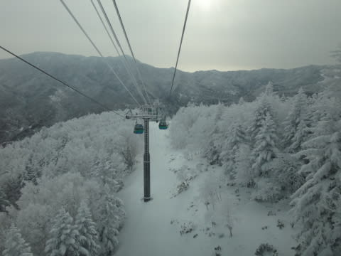

# 1月23日，志賀高原レポート！…晴れのち小雪．積雪はやっとトップシーズン並み！

📅 投稿日時: 2016-01-23 23:54:01

🏷️ カテゴリ: [2016スキー滑走日記](c70c67ed5248e9432b899dcd5747048bb.md)

ということで．

今日の志賀高原ですが．

いやーーーー．

やっと．

やっと，トップシーズンらしいゲレンデ状況に

なりました（感動の涙）

朝の志賀高原に向かう道路は，しっかり除雪されてますが．

やっと冬らしい景色に…

そして．

焼額ゴンドラからの景色も．

…冬だよ．

やっと，冬だよっ！！！

朝の天気は，うっすらと薄日が差す天気で…

気温はマイナス11度！

しっかり冷え込んだ，冷え冷えの，

よだれじゅるじゅるモノのシマシマバーンがお出迎え！

柔らかいけど，板がしっかり食い込む，

最高級のシマシマバーン！

うははははははははははっ！

うひょーーーー！

これだ！

これだよ！

ヤケビの朝イチは，これだ！

そして．

今週は．

待ちに待ったオリンピックコースもオープン．

コースはわずかにうっすら新雪が乗っており．

一見，良さそうにも感じるけど…

意外と荒れていて，

で，さすがに石ころや地面は隠れたけど．

背の高い草や枝の先っぽが，まだちょっと出ている感じで．

うむ．

オリンピックコースより，GSコースのほうがいいな！

GSコース，ちょっと人が多めではあったけど．

かといって混んでるわけでなく．

今日はゴンドラ待ちも，ほとんどないレベルで．

週末と考えれば，人は少なかったですよ～！！

天気は，ほぼ予想通り．

午前中は晴れ時々曇り，って感じで，

結構日が差すタイミングも多く．

だけど，気温は昼間でも-6度程度．

終日冷え冷え最高雪質っ！

そうだよ．

志賀高原の1月って，本来こうだったんだよ…

久しぶりに，小石やらアイスバーンがないゲレンデを

滑ったよ…

当然，第2ゴンドラ側のパノラマコースも．

第2高速沿いの唐松コースも．

雪の量は十分！

そして，私の予想通り．

ええ．予想通り．

そうです．大事なところなので繰り返すと，私の予想通り．←いい加減，しつこいから

午後は雲が増えていったあと…

3時近くになると，雪が降ってきました．

いやー．

今日の天気予想．

雪質，気温，天気ともに．

ほぼドンピシャだった気がしますね～！←誰もほめてくれないから自画自賛

で．

午後3時を過ぎると，ゲレンデはガラガラになり．

多少荒れたものの，人が少なかったので，

最後までひどいコブコブにはならず．

夕方まで，たっぷり楽しめたのでした…

…

…で．

終わりませんよ．

まだ，終わりません．

当然のごとく，ナイターに行くわけですが．

ふははははははは．

今日は，ナイターも最高スペシャルハイグレードな

特上プレミアム圧雪バーンを，おいしくいただけたのだ！

ぐはぁ．

美味しい！

美味しすぎるっ！

柔らかいのにしっかりエッジが利くという．

最高のシマシマバーン！

＃圧雪はちょっと雑だったけど

…いや．

今日は，幸せ．

幸せな一日だったよ…

とりあえず．

これでようやく，志賀高原は，トップシーズンの

状況になってきました…

＃東館山のオリンピックコースなど，一部まだわずかに

＃ブッシュが残ってるようですが…

これで，一安心っ！！

…ただ．

残念なお知らせが．

日本海側で，天気図にみられなかったプチ低気圧が発生し．

こいつのおかげで，西風になってしまった今晩の志賀高原．

現在，見事に晴れ上がった星空です（涙）．

…明日の朝の積雪は，それほど深くなさそうです…

数cm，行って10cmレベルか…（涙）←今日の予想を当てたと自画自賛した直後なのに，

明日の予想を見事に外してるじゃないかっ！！

まぁ，朝の積雪はすくないけど．明日はそこそこ風のある，

雪降りの一日にはなりそうですが．

うーん．

雪がまともになると，次はパウダーを滑りたい，という

欲求が出てくるけど…

ディープパウダーは明日はお預けかな～（残念）．

## 💬 コメント一覧

### 💬 コメント by (Goku)
**タイトル**: Unknown
**投稿日**: 2016-01-24 09:43:16

ようやく、ようやく志賀らしくなりましたね♪

私は朝イチ２時間ヤケビで滑って、ジャイアントまで遠征してきました。

昨日はジャイアント・西館山でさえ極上の粉雪でしたよ。

今日もガッツリ滑ってくださーい。

でも、昨日は一度もお会いしませんでしたね。

### 💬 コメント by (Skier_S)
**タイトル**: Gokuさま
**投稿日**: 2016-01-25 01:39:55

土曜は最高でしたね～．

ようやっと，シーズンの志賀がやってきた感じです．

…ただ，まだ東館オリンピックバーンとか，

結構ブッシュがあるみたいですけど…

パーフェクターも開いてないので，

もう一降りでしょうか．

しかし，土曜は全然お会いしませんでしたね．

朝10時近くまで，ひたすら1ゴンだったのですが…

### 💬 コメント by (こじろう)
**タイトル**: 宿
**投稿日**: 2016-01-25 11:18:25

昨日、アルペン閉店というニュースをググっていましたらこちらのブログにたどり着き楽しく読ませてもらっています。ちなみに志賀高原ではどちらの宿にお泊まりですか？

### 💬 コメント by (Skier_S)
**タイトル**: こじろうさま
**投稿日**: 2016-01-26 01:16:38

コメントありがとうございます！

…ようこそ，この駄文置き場へ…

で．

私の宿ですが．

一人の時は，「アストリア」さんを使うことが多いです．

ゲレンデから離れているので，送迎or車で移動と

なりますが，トップシーズンの週末でも一人で泊まれて，

食事もおいしいし，一人で泊まっても1泊2食8000+税

なので，結構リーズナブルです．

家族で行くときは，一の瀬ファミリーゲレンデ目の前の

「オリンピックホテル」さんを利用しています．

トップシーズンの宿泊料はちょいと高いですが，

夕食のバイキングは品数が多いですし，

お風呂も広くていいし，

人数が5人一部屋とかの大人数・あるいは

12月や4月など，かなりお得な料金になります．

### 💬 コメント by (こじろう)
**タイトル**: 宿
**投稿日**: 2016-01-26 22:07:18

ありがとうございます。

### 💬 コメント by (Skier_S)
**タイトル**: こじろうさま
**投稿日**: 2016-01-27 01:38:28

どういたしまして（＾＾

