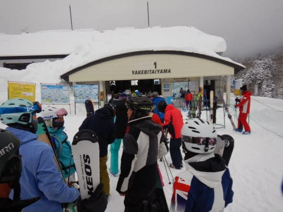
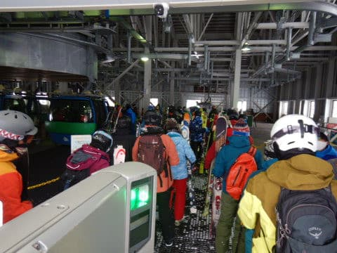
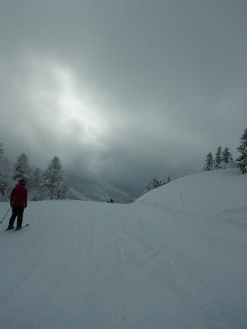
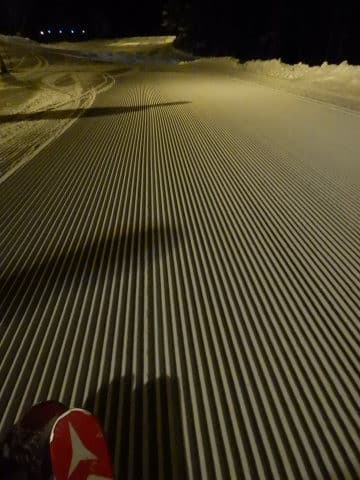

# 2020/12/26(土)の志賀高原，焼額山スキー場は…冷え冷え雪質最高！天気は曇り時々雪，それほど混まなかったよ

📅 投稿日時: 2020-12-27 00:56:17

ということで．

今週末も志賀高原で滑ってました～！

えー．

本日は，上信越自動車道は坂城ICからチェーン規制と

なっていて．

これは，志賀高原はかなりの積雪では？？

…と期待しましたが．

結局，高速はチェーン規制が始まった坂城から

信州中野まで，ほぼ積雪はなく…

中野市街も，多少の積雪はあり．

志賀高原の登りは，予想通りの

本格雪道だったものの．

…なんだか，昨晩から今朝まで，そんなに

新雪はなかったように見えますね…

取りあえず．

今シーズン，昨日から営業開始の第1ゴンドラに

初めて並びます！

いやー．

昨シーズン，3月で強引に強制終了になって以来，

久しぶりに戻ってきました，第1ゴンドラ！

実に，9か月ぶり…！！

ってなことで．

わが住み処の←だから，住んでないから

第1ゴンドラで，久しぶりに山頂にやってくると…

気温は－10℃！

あさイチは－10℃を下回らない程度という

予想だったけど．まぁ，ちょうど－10℃なので

下回っていないということでOKとしておきましょう←自分に甘くないか？

そして．

朝イチは，ゲレンデの天気は予想通り曇り空

だったものの…

ゲレンデは，しっかり冷えて締まり気味の，

かなり快感度が高い最高雪質シマシマ！！

もう，ものすごく気持ちよくエッジが

噛みこみ，一番気持ちいい冷え冷え

最高雪質！！

誰かが圧雪コース上も5cm新雪とい

言っていたけど，そんなことは全くなく．

あさイチのきれいなピカピカシマシマを

思いっきり堪能！

イチゴンは最大乗車定員4人で制限していて．

グループでの乗車の場合，4人以上でも

OKみたいでしたが．

一人乗りレーンもなく，相乗りを特に推奨

していないので…

午前9時過ぎには，1ゴンの列が

ゲートを超えるまで伸びてきました(ちょい涙）

今日の午前中はずっとこの程度の待ち時間．

最大3－5分程度の待ちですかね…

それほどひどい待ちじゃなかったのが救いかな．

ただ，ゴンドラ以外のリフトは大体

待ち時間なく乗ることができたし…

ゲレンデの人口密度も，危惧するほど

高くなく．おおむねガラガラ！

そして，雪質も冷え冷えで最高！

夜のうちに圧雪をして，朝までに積もる雪を

新雪として楽しめるオリンピックコースも

見に行ってみますが…

ここが，新雪5cmかな…

ということで

　朝までに圧雪コース5cm，

　非圧雪コースは15～20㎝の積雪

というのは，ちょっと外れたものの．

昨晩からわずかに積もった冷え冷え雪が圧雪され，

ゲレンデの雪質は最高のまま昼間でいいコンディションが

続き．

…そして，昼間の最高気温は－ド7℃

程度までしか上がらず…

午後には雪は多少凸凹してきたものの．

午後も，ゴンドラはゲート外まで列は伸びたものの，

それ程ひどく人が並ぶことはなく．

思ったよりは空いていて

人が少なかった分，コースはひどい荒れに

ならなかったですね…！

何にしろ，コース全面雪はやわらかく，

なんでもできちゃう勘違い雪．

自分がうまくなったんじゃないか？？？

と思えるコンディションが一日続き．

夕方まで冷え冷えやわらか最高雪の，

それ程混雑していない最高ゲレンデ状況を

キープしてくれて．

今日も一日，午後4時の営業終了まで，

昨シーズンのトップシーズンよりいいコンディション

では？？？

というGoodコンディションのゲレンデを滑り

つづけられたのでした…

…

…で

終わらない．

今日からなんと．

焼額山ナイターが，第3高速にて

営業開始！！

…となると．

当然，午後6時の圧雪かけたてナイターシマシマに

飛び込み！！

もう，朝イチと同じ，最高やわらか雪のシマシマを

一日で2度楽しめるなんて…

リフト待ちもほとんどなく．

最高のシマシマやわらか雪を，ナイターストップの

20時まで堪能したのでした！！

いやーー．

今日は良かった．

混まなかったし，冷えたけど風がそんなになく，

激寒でもなく過ごしやすかったし．

ゴンドラが乗車定員で多少待ったものの，

リフト・コースはガラガラで．

雪質は最高という．

めぐまれた一日でした…

明日もこんなコンディションが続くといいな！

## 💬 コメント一覧

### 💬 コメント by (m&t)
**タイトル**: Unknown
**投稿日**: 2020-12-27 23:57:25

今回は残念ながらお会い出来ませんでした。Gokuさんとは偶然帰路にお会い出来、無事ステッカーいただきました!ありがとうございました。

皆様の格言「リフトが動いているから帰れない」で、奥志賀ラストまで滑ったため、終礼に間に合いませんでした・・・。

次回は参加しますので、よろしくお願いします。

この場をお借りして、yumiさんご夫妻、たくさんお話が出来て楽しかったです。また、奥志賀朝イチにお会いしましょう。

### 💬 コメント by (Skier_S)
**タイトル**: ＞ｍ＆ｔさま
**投稿日**: 2020-12-28 01:45:47

あら，いらしていたのですね！！

奥志賀滑ってたんですか…私も一瞬奥志賀に行きましたが，

お会いしませんでしたね…残念．

またのチャンスにお会いしましょう！

