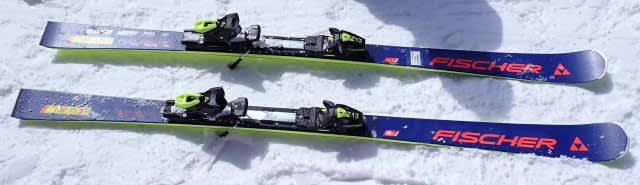
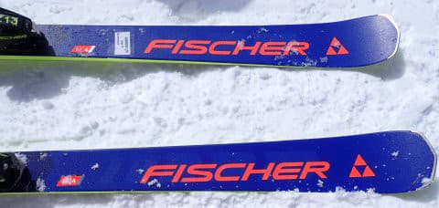
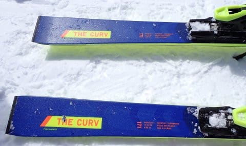
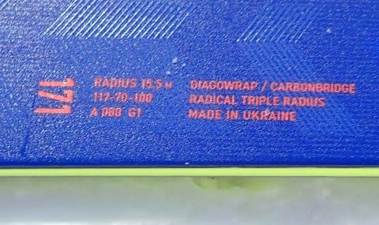
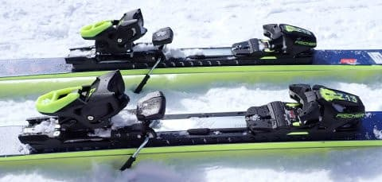

# 2024シーズンモデルのスキー板，試乗レポートその9…FISCHER THE CURV

📅 投稿日時: 2023-05-31 02:00:25

えー．

このBlogを楽しみにしている皆様，

昨日は更新できずにすみません…←いや…いつも

言うけど，このBlogを楽しみにしている人なんているの？

…昨日は会社の飲み会で．

飲み会から帰ってきて，Blogを書く

気力もなく寝てしまってました…（泣）

いや．コロナ禍この方禁止されていた

会社での大人数の懇親会や歓迎会．

コロナの5類移行とともに禁止が解除

されて，会社の飲み会が復活しちゃったん

ですよ…（泣）

会社の飲み会はちっとも楽しくないし，

飲み会の日は夜に仕事がやっつけられず，

仕事が溜まってしまう一方なので．

こんなものにお金を払ってまで参加したくない

という気分でいっぱいなのですが．

それでも立場上参加するという，この

サラリーマンの鑑…！！

えらい！

（一応ごく平凡なサラリーマンなので）

で．

コロナ5類に変更になった5月に入ってから，

早くも仕事関係の飲み会が3回目で，

ものすごい出費…（泣）

さらにまだこれから，数回の懇親会の

予定が入っているんですが…（涙）

あぁ…人事異動時期になると，

歓迎会・送別会でスキー板が買えるくらいの

金額が飛んで行ってしまう

という，戻ってこなくていいあの風習が

戻ってきてしまったか…

しかし．

久しぶりの飲み会続きで，恐ろしい

勢いでお財布のお金が減っていて．

これが1年間続いたら…ということを

冷静に計算すると．

会社の飲み会を全部断れば年間で

スキー板が3セット以上買えるくらい

お金が浮く

という事実に気づいたので．

次回から，

会社のすべての飲み会を断れば，物欲に

負ける言い訳になるんじゃないか？

と思ったけど…

サラリーマンの立場上，それはできない

という気弱な判断をする，Skier_Sだったのでした…

ってなことで，本題へ．

本日も2024シーズンモデルのスキー板の

試乗レポート．

今回もフィッシャー編．

…エキップさんの試乗会，フィッシャーと

ヘッドが多かったので，ちょっと偏ってます…

では，どうぞ～！！

〇FISCHER THE CURV 171cm 

上級者向けオールラウンド

基本的に今シーズンモデルのThe CURVから，

テールのデザインがわずかに変わっただけの

コスメチェンジに見えますが…

実はこの板も，今シーズンのM/Oプレートから，

新しいMプレートに変わっていて．

トゥピース下の可動部品が無くなり，より

足元がしっかりしたプレートになってます．

171cmでR15.5と，大回りと小回りの中間の

サイドカーブを持つオールラウンドの板です．

カタログ上は，CURVシリーズのトップ

モデルと言うことで，結構な上級者向けの

位置づけのこの板．

2シーズン前に履いた時は，エッジグリップも

強く，張りも強めで，結構な手ごわさも

感じる板でしたが…

今回履いてみると…

楽！！！！

すごい楽！！！！

スピードを出していけば，傾けるだけで

板が勝手に回っていく！！

板に乗って傾くだけで，オートマチックに

カービングに入っていき…

そして，スピードがかなり高まって

行って，ゲレンデではかなり高速と思う

自分のトップスピードまで行っても…

全然板が負けないで，気持ちよく板任せで

楽ちんに気持ちいいカービングで

回っていきます！！

普通なら，自分のトップスピードまで行くと

板が叩かれたり，板のグリップの限界が

近づいてきてちょっと怖さを感じて，

板を抑えに行かないといけないことも

多いですが…

この板は，トップスピードでも全然余裕．

楽ちんに乗っていくだけで，しっかり

グリップで気持ちよく曲がります…

それも，たわみすぎて小回りになっちゃう

こともなく．

ちょうどいい気持ちよさで回っていくし．

板の返りも強すぎず弱すぎず，

高いスピードだと強い圧が溜まりすぎて

吹っ飛んでいくようなRC4 CTと違い，

絶妙に返ってきてくれる感じ．

かといって返りが弱すぎて

切り替えられないということもない，

まさに絶妙な返り．

超ハイスピードで，楽ちんに板に乗って

いるだけで，ミドルからロング目の

気持いい旋回半径で，きれいにカービング

してくれます．

ただ，結構張りが強めで，板の重さも

あるので…

ずらせないわけではないけど，低速で

ずらして滑ろうとかは思わない方が

良いです．

ずらして滑りたい人は，他の板を買い

ましょう．

あまりスピードを出さない人はちょっと

手強さを感じるところもあるかもしれない

けど．

でも，ハイスピードクルーズ派にはたまらない

楽さ．

すごいスピードで，気持ちよく楽にゲレンデを

落ちていけます．

板に任せてカービングをしていけば，

キレキレの快楽ハイスピードカービングを

楽しめる，高い官能性をもった板．

板任せとはいえ，傾きを変えてやれば

カービングの回転弧のコントロールは

十分できるので，ターン弧の自由度は

そこそこあります．

ある程度荒れた雪でも，板の重みと

強さがあるので，安定度高く乗り越えて

行けるし．

トップスピードで何も考えず，板なりに

気持ちよく落ちて行けば，楽しい板です！！

かなりスピードマニアの人が，

キレキレターンをするには気持ちいいけど．

人口密度が高くて，それほどスピードを

出せず，小回りばかりしなくてはならない

ゲレンデだと，この板の真価を味わうことが

できなさそう…

そして．

来シーズンは定価税込み￥250,800！！

25万円越えか…
