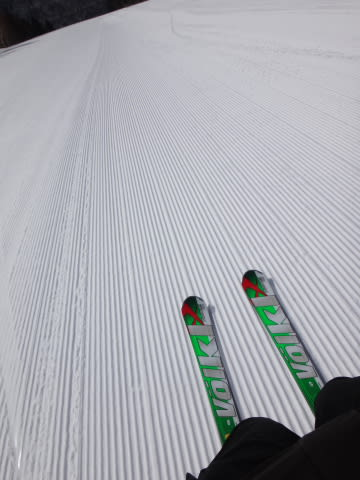
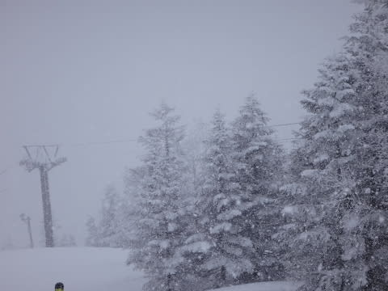
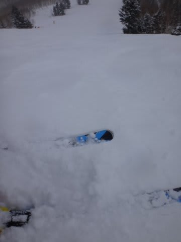
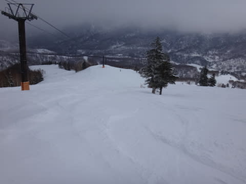

# 4月6日の志賀高原のゲレンデ状況，速報モード

📅 投稿日時: 2014-04-07 00:28:27

🏷️ カテゴリ: [2014スキー滑走日記](c992167609b6415052179ee69ea1ea7d8.md)

あー．

いつも通り．

帰宅は深夜だったので．

詳細は明日にまわして．

今日も速報モードで…

今朝も，気温は冷え冷えで．

朝のうちは，予想通りの冷え冷えの

締まったハイスピード圧雪バーン！！

…でも．

予想の通り．

今日は一日中寒く．

時々，ものすごい雪が降ってきて…

おかげで．

4月というのに．

昼間というのに．

なんだ～！

これはっ！！！

冷え冷えのパフパフになってきたんですが…！

ホントに今日は4月かっ！？？

4月ということもあり．

ゲレンデの人も少なかったので．

ガラガラの軽いパフパフ雪のゲレンデを

滑ることができましたよ～！

…昨日に引き続き．

…なんだか．とても4月と思えない超恵まれたコンディションで．

スーパー満足な一日でしたよ～！！！

詳細は，また明日のお楽しみに！

## 💬 コメント一覧

### 💬 コメント by (Goku)
**タイトル**: サイコーな一日（半日）
**投稿日**: 2014-04-07 19:01:34

昨日はサイコーでしたね～♪

私は半日券だったのがほんと残念でした(T_T)

しかも4時間券ってナニ・・・

しばらくお休みなのでＧＷになっちゃうかな～次は。

でも、急遽参戦するかも。

### 💬 コメント by (Skier_S)
**タイトル**: Gokuさま
**投稿日**: 2014-04-08 02:25:17

いやーー．

ホントに最高でしたね～っ！！！

これから半年くらい，こんな状況が続けば…

と願わずにいられません（ありえないから）．

私は今後，GWまでは毎週出没予定ですので．

またお会いしましょう～！

