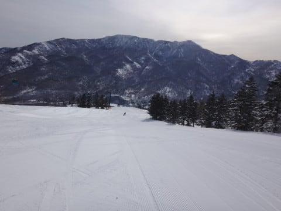
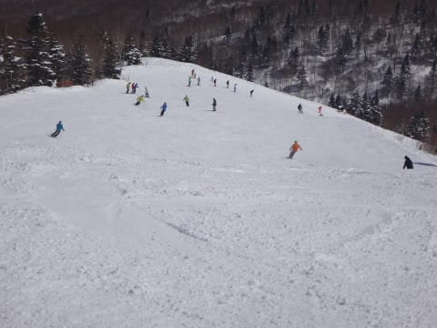
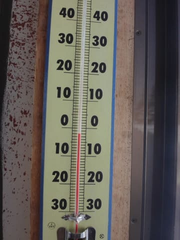

# 3月12日，日曜の志賀高原詳細レポート…天気よし，雪もよし，それほど混まず…恵まれた一日！

📅 投稿日時: 2017-03-14 00:40:44

🏷️ カテゴリ: [2017スキー滑走日記](c7d777cecfc91bdf0fa464ad62c6d49ab.md)

ということで．

今週は，すでに何度も書いたように．

土曜に用事があり，日曜に日帰りと

なったわけですが．

焼額のリフトスタッフの方々．

土曜なのに私を見かけなかったことが

気になったらしく．

焼額のリフト係員の方　「あれ？昨日は見かけませんでしたね～！

　昨日はお休みだったんですか？」

私　「そうです～！昨日はちょっと用事で来れなくて…」

　　（完全にチェックされてるな…）

と，その時は違和感なく回答したものの．

あれ？？

…

…ちょっと待て．

土曜は休みじゃなかったからスキーに来れなかったんだけど？

今日は休みだから，焼額にいるのだ．

…

私にとって，スキーは休みの日の娯楽であり，

決してスキーに来ていない状態が「休み」なのでは無い…！

と，いまさらながらにツッコミを入れたい，Skier_Sです．

…という前フリのあとは．

日曜の志賀高原，詳細レポートです～！

えー．

まず．

昨日レポートした通り．

この週末から，土日の焼額第2ゴンドラ早朝営業が始まり．

…日帰りなのに，朝（深夜?）1時半発で，

早朝スキーに参戦してしまったこの日．

山頂に朝日が射し始めた，朝6時半に営業開始！

ゴンドラの山麓付近では，太陽がまだ顔を出し切って

いないうちから，焼額第2ゴンドラに乗りこみます…

山頂の気温は…

マイナス10℃ですか．

まぁまぁ冷えてますね．

で．

山頂に着くと．

見事に朝日が差し込むゲレンデは…

うほ！

シマシマっ！！

これは…

跡が何もついていない，最高グレードシマシマ！

まだ誰も滑っていない，焼額クオリティの

よだれじゅるじゅる状態のきれいなシマシマ，

いただきま～す！！！！

うははははは！

最高っ！

雪質は冷え冷え最高圧雪！

ちょいと一部，氷のコロコロがあるところも

あったものの…

でも，しっかりエッジが食い込むシマシマを

切り裂いて落下していく，この快感っ！

有料2000円だし，朝早いってのもあって…

もう，ホントに人がいない．

限りなく貸し切りに近いゲレンデなので，

早朝営業終了の2時間経っても，まだほとんどシマシマが

残っていて…

2時間フルでシマシマを滑りたい放題っ！！

いやー．

早朝スキー，イイよね…！

…で．

早朝スキーが終わり，8時半になると．

1ゴン側コースへの通路がオープン！

…これはすなわち．

8時半に通常営業開始の1ゴンに乗る人より早く，

1ゴン側のGSコース＆オリンピックコースを

滑れるということで…

そうです！

滑り初めから2時間後，

またフレッシュシマシマをいただけるのです！！

いや…

開始から2時間以上，

ひたすらシマシマを味わい続けられるなんて…

やっぱり早朝スキーはいいわ～！！

通常営業開始時間の山頂気温は-3℃と．

結構気温が上がってきましたね～．

天気も晴天すっきり晴天！

だもんで，雪は日差しで結構緩むかな…？

と，思ったけど．

朝のうちは極めて雪質も良く．

通常営業開始後1時間くらいは，ガラガラコース

飛ばしたい放題！

いや…

もう滑り初めから3時間．

人のいない快適バーンを大回りし続けて，

かなり満足なのに…

まだ朝9時半ですか（笑）

けど．

10時に近くなってくると…

ありゃ？

さすが，人が増えて来ましたか…

第2ゴンドラは，待ち時間20分！？

…でも，第1ゴンドラは最大でも

この程度の待ち．

待ち時間2分も無かった感じ…

しかし．

人が増えてきたから．

ちょっとゲレンデは荒れ始めてきたかな…？

オリンピックコースは，下地の固いのが

出始めてきましたが…

カチカチアイスバーンではなく，圧雪がザラザラ

固まった感じの，そこそこエッジが効く感じだし．

すっきり北アルプスが見えるほどの晴天で，

日差しは強かったものの…

昼間も気温はマイナスをキープし．

昼になっても雪質は良いままで…

で．

昼になると，また人がいなくなっちゃいましたよ？？？

こんなガラガラでいいんですか？？？

…とはいえ．

午後になると，比較的いい雪質ながら．

やはり南斜面の焼額．

ちょっと固まったような感じの雪質になってきたので…

また午後1時過ぎに，ちょっと奥志賀へ遠征！

…さいごの「っす」が．

なんというか，味わいですね…

奥志賀ゴンドラのダウンヒルコースを滑ってみると…

やっぱり北斜面の奥志賀の方が，焼額より

雪質はいいかな～．

あ，でも．

この日のエキスパートコースは，

わずかに荒れ気味．

でも，十分大回り可能！

しかし，3月の晴天の昼間でこんなに雪質が

良くていいんだろうか…

ザラメやザブザブ雪になる気配全く無し！

そして，人も少ないし…

いやーー．

恵まれてる．

今シーズンは，恵まれてるよっ！！！

…って感じで．

朝6時半から滑っているので

そろそろ疲れがたまっている3時すぎ．

焼額に戻ると…

もう，そこは無人のゴーストタウンゲレンデ！

完全貸し切り状態にハイテンションになり．

疲れているにもかかわらず，ちょい荒れバーンを

ところどころ飛ばされながら，

リフトストップの最後まで，大回りで

かっ飛ばし続けたのでした…

いやーー．

しかし．

良かった．

死ぬほど眠かったけど．

早朝からのシマシマ2時間以上連続に始まり．

夕方の無人バーン貸し切り滑走まで．

超満足な一日だったのでした…

PS.

今週15日以降．

19日まで，また冷え冷えウィークになりそう…

ただ，積雪がありそうなのは15日．

それ以外は，冷えるけどあんまり積もらなさそうかな～

## 💬 コメント一覧

### 💬 コメント by (Goku)
**タイトル**: 最高っす！
**投稿日**: 2017-03-14 18:49:51

日曜日は最高でしたね！

今日も山は雪だったようで長野も寒い１日でした。

今週末は最高の３連休になりそうですね♪

３連休のどこかで早朝行こうか考え中です(笑)

### 💬 コメント by (かず)
**タイトル**: 入れ違いです
**投稿日**: 2017-03-14 19:27:55

12時位まで奥志賀にいました　午前中奥志賀の字作成中でしたよ　3連休混みそうですよね〜SKBL有りますし

### 💬 コメント by (まうちゅう)
**タイトル**: Unknown
**投稿日**: 2017-03-14 20:24:20

是非ともナイターまでフルコースで滑って欲しかったです！

### 💬 コメント by (Skier_S)
**タイトル**: 今週末もコンディション良さそう！
**投稿日**: 2017-03-15 01:04:43

＞Gokuさま

日曜は恵まれてましたね～！

長野は今日も寒かったんですね…

明日はおそらく，山は雪が積もるかと

日曜あたりまで，寒い日が続くと思います…

でも，3連休は天気も良く．

コンディション良さそうです！

＞かずさま

あら．

入れ違いでしたね…

でも，12時～13:30までは，

焼額滑っていたので，

やはりタイミング合わなかっただけでしょうか…

3連休はまた焼額滑ってます～！

＞まうちゅうさま

…無理です．

日帰りで，早朝からナイターまで…

機械の体でも持ってないと，

不可能です（笑）．

かつて早朝～ナイターまでというのを，

一度だけやったことありますが．

次の日までに疲労が回復せず，

次の日の滑りがヘロヘロになった思い出が

あります…

