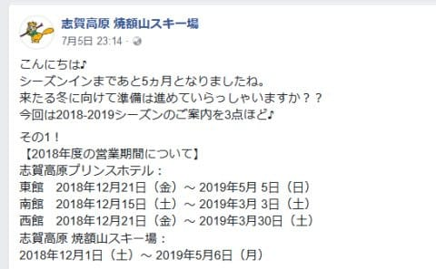
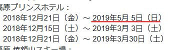
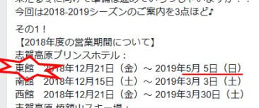
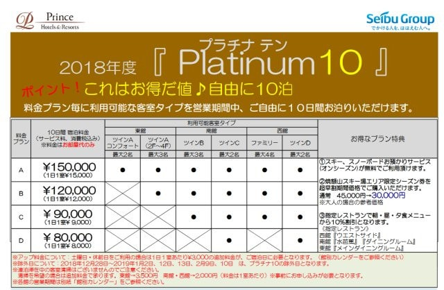

# 2019シーズンの焼額山スキー場の情報…来シーズンも，また第1ゴンドラで春営業をやるみたい！

📅 投稿日時: 2018-07-11 01:12:27

えー．

今日はスキーネタですよ～！！

そうです．

やっぱり，「徒然スキーヤー日記」ですから．

アイディンティティを示すために．

このあたりで，スキーネタをば…

7月5日に焼額のFacebookの投稿が

あったのですが．

（[焼額山FB](https://www.facebook.com/yakebitaiyama/posts/1728156957279643)より引用）

ふむ．

プリンスホテルも5/5まで営業するってことは．

やっぱり焼額，来シーズンもGWまで営業

してくれるんだな～…

と，何気なく読み飛ばしていたのですが．

今，冷静に見直してみると…

…

…

うむむっ！？？

ひ，東館っ！？？？

…GWまで営業するのが東館ってことは…

来シーズンも，春営業は第1ゴンドラで

やるってことじゃないかっ！！！

やったーー！！

来シーズンこそ，GWまで1ゴンでグルグル

できるぞ～っ！！！

これは，いいニュースだ～っ！！

今シーズンの雪不足に懲りて，

来シーズン，最悪だと春営業を第2高速の

唐松コースと割り切って．

12月からひたすら唐松コースにだけ

人工雪を打つのでは…？

と，危惧してましたが．

また，1ゴンでの春営業を目指すようです…

いやーー．

良かった…

そして．

そのほかのニュースとしては．

来シーズンもプリンスホテル10泊セットの

販売をやるようですね～．

（[プリンスホテル予約ページ](https://www.princehotels.co.jp/shiga/files/platiunm10_2018.pdf)より）

西館・南館の2人部屋なら，一部屋1泊8000円で

泊まれますね～．

年末年始・3連休は利用できず，

休前日は+3000円かかりますが．

休前日でも，一部屋11000円．

一人あたり，5500円ですね…

南館3人部屋，西館4人部屋も泊まれるプランなら

一部屋1泊9000円．

休前日でも12000円．

4人で泊まれば，一人当たり3000円ですね…

素泊まりですが，週末にこの値段で泊まれれば

かなりお得かと…

まぁ，私は定宿にお世話になるので，

プリンスにはあまり縁がありませんが（笑）．

ってなわけで．

焼額のシーズンインまであとわずか5か月弱．

イエティオープンまで3か月．

来シーズンが待ち遠しい…

## 💬 コメント一覧

### 💬 コメント by (もりや)
**タイトル**: あと5ヶ月かぁ〜
**投稿日**: 2018-07-11 05:28:05

今年もヤケビ限定シーズン券申込みしました。先週、ショップへ板のチューンナップを頼みに行きましたが、そこでやはり物欲に簡単に負けてしまい、Keo’sとTC、2セット購入してしまいました。物欲には勝てないなぁ〜

### 💬 コメント by (Skier_S)
**タイトル**: もりやさま
**投稿日**: 2018-07-11 23:56:15

え！？？

板2セットですか！？？

見事に物欲に大敗ですね…．

さらに，プロジェクトXもあるんじゃなかったでしたっけ…？？

今シーズンも散財ですね（笑）．

でも，シーズンインが待ち遠しいですね～！！！

### 💬 コメント by (たろ)
**タイトル**: Unknown
**投稿日**: 2018-07-12 17:54:09

横手山リフトが、民事再生みたいですね・・。

今後の動向が気になります。

### 💬 コメント by (ほっぽ)
**タイトル**: 横手山が、、、
**投稿日**: 2018-07-12 21:38:14

Ｓさん

横手山が逝ってしまいました。(T_T)

ここ数年は志賀高原に行っても殆ど滑ることはありませんでしたが、来シーズン営業出来るのか、不安です。

https://headlines.yahoo.co.jp/hl?a=20180712-00010000-teikokudb-ind

### 💬 コメント by (Skier_S)
**タイトル**: 横手山，ショックです…
**投稿日**: 2018-07-13 00:08:32

＞たろさま

なんてことだ！！！

まさか横手山が，そこまで経営状況が

厳しかったとは…

ってか，志賀高原中央エリアとかも

大丈夫でしょうか…

来シーズンは，営業リフトがガバッと

減るんじゃないか…とドキドキしてます．

とりあえず．

中央エリアもこのまま殿様商売を続けてたら

ヤバそうな気がしています…

＞ほっぽさま

いや…

逝ってしまいましたね（涙）

夏山リフトはいつも通り営業しているみたいで．

民事再生なので，基本的に営業は続くと

おもっているのですが…

いや．

この冬はどうなるのか．

営業リフトが減って，志賀高原の魅力が

さらに無くなり，さらに客が減っていく…

という，ネガティブスパイラルに陥らないよう

祈るばかりです…

