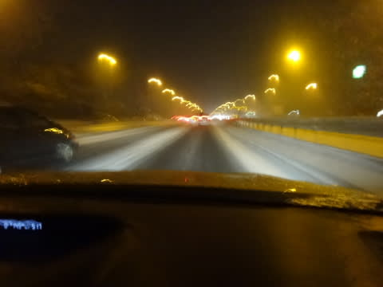

# 2月8日の志賀高原は…強風荒天，涙・なみだの一日

📅 投稿日時: 2014-02-08 22:04:52

あー．

今日は，ですね～．

…

…ひどかったです．

以上．

----

って感じで，終わりたいくらい．

悲惨な一日でした．

…そして，私の天気予想も大外しでした．

8日は積もるのは太平洋側で．

志賀は，そんなに積もらないんじゃないかな～，

風もそこまで強まらないだろう…

と，思っていたところ．

かなりの降り＆強風(泣）．

そして．

リフトが次々止まり，午後3時過ぎにはすべて運休という

悲惨な状況…

いや，それより．

朝の高速道路がやばかった．

通行止めになる前に志賀高原まで到着できたからよかったものの．

朝5時に練馬ICを通過した直後から本格的に降り始め…

うむ．

チェーン規制されていない埼玉県内の関越道でこれは，危険すぎるっ！！

おそらく夏タイヤで走っているチャレンジャー（またの名を自殺志願者）

がたくさんいるはずっ！

そして．

藤岡ジャンクションを越えて，上信越道に入ると…

あー．本格積雪路面だわ．

そして…

左路肩にバンパーが…

次々現れる，突き刺さってお亡くなりになっている車たち(合掌)．

このような事故やら，ところどころの渋滞をなんとか突き抜け，

休憩なしで6時間以上走りきり，自分にとっては屈辱＆後悔の

朝9時半という遅い時間に，やっとこさ焼額にまでたどり着くと…

なんだー！

焼額第1，第2ゴンドラ運休っ！

それどころか．

山の神もダイヤモンドも，寺子屋も東館も動いてないんですがっ！

ということで．

一の瀬ファミリーで滑ってみますが…

前が見えませんね…(涙)

そして．雪はアイスバーンの上にぼそぼそ吹きだまった感じ．

さらに，まともに滑れるのが一の瀬だけとあって，

人が集中（泣)

なぜ，こんなに天気が悪いのに．

こんなに混んじゃうのかしらん…

結局，早朝から降り始めた雪は，昼過ぎにはさらに強くなり．

午後2時ごろにはもう，全くなんだか見えませーん(激泣)

そして，午後2時過ぎには西舘，高天ヶ原，焼額もつぎつぎと

息絶え，すべてのリフトが止まってしまい…

午後3時には，唯一動いていた一の瀬ファミリーのペアに

人が集中．

寒い中，長時間待った上に遅いペアリフトで緩斜面を

滑るのか…と思っていたけど．

このリフトも3時10分には息絶えました(悲）．

…ということで．

午後3時には，吹雪のため志賀高原全山リフトストップ．

ナイターの営業も中止が早々に告げられ．

宿に帰って寂しくすごしたのでした…（大泣）

…今も結構降ってるので．

明日の朝は，予想通りパウダーじゃないかな～．

明日は雪がそこそこ降るけど，先日の予想みたいに

終日エンドレスパウダーってほどじゃないのかも．

PS.

しかし．

今日の天気予想，外したのはくやしいな～．

いや，先週も外しましたが．

先週ははまぁ，予想を外しても仕方ないんですよ．

数値予想自体がずれていて，誰もが全員外してますから．

でも．

今日の雪＆大荒れは，結構正確に予想してる人もいたので．

いやー．はずしたのはかなり悔しい．ホントに…

＃外した理由は後日ゆっくり説明…するかも．

## 💬 コメント一覧

### 💬 コメント by (いか)
**タイトル**: Unknown
**投稿日**: 2014-02-09 00:10:21

あらら…雪国も大変なことになっていたんですね…。

外を見ながら、パウダー楽しそうだなーとかのんきに考えていました。

東京はだれも除雪しなさそうで、いつになったらまともに歩けるか心配です。

そんな心配はさておき、東京でもスキーをやってみました、笑

かなり軽い雪が降る時間帯もありました！

### 💬 コメント by (Goku)
**タイトル**: Unknown
**投稿日**: 2014-02-09 00:33:21

えーっと、そんな日に我が娘は長野から相模大野なんて所に大学受験に行ってたわけで・・・

金曜日前泊していたから良かったものの、帰りは小田急が大幅に遅れ、長野新幹線も200分遅れ、7時に帰ってくる予定が、11時過ぎに疲れ果てて帰ってきました。

明日の帰りは気を付けてくださいね。

### 💬 コメント by (アル)
**タイトル**: Unknown
**投稿日**: 2014-02-09 07:22:19

初めまして いつも楽しく読ませていただいています。

3枚目写真の軽のワンボックス？もキャリアにボードつけてるのに夏タイヤなのでしょうか？関東の関越道がよく止まる理由がよく分かりました。

自分は関西在住ですが志賀高原は25年くらい前に滑ったきりなんで、久々に行きたいなとは思っています。今日は晴れるといいですね(^_^)

### 💬 コメント by (Skier_S)
**タイトル**: 悲惨な一日でした…
**投稿日**: 2014-02-09 21:56:30

＞いかさま

東京でスキーって…

どこでやったんですかっ！？？

ぜひ，そのレポートをお願いしたいところです(笑)

＞Gokuさま

あいやー．

よりによって，一番悲惨な日に首都圏に行っちゃい

ましたね…

無事，試験会場には行けたようで何よりです．

こっちの宿は，深夜11時になっても到着しない

お客さんが多数で，宿の人も大変そうでした…

＞アルさま

はじめまして～っ！

愛読ありがとうございます．

3枚目の車は，おそらくスタッドレスだと思います…

でも，スタッドレスでも気をつけないとかなりやばい

路面状況でした…

また，志賀高原にぜひ来てください．

12月～GWまでの週末であれば，焼額で

滑っていればかなり高い確率で私を

目撃できるかと…

また，今後もよろしくです！

