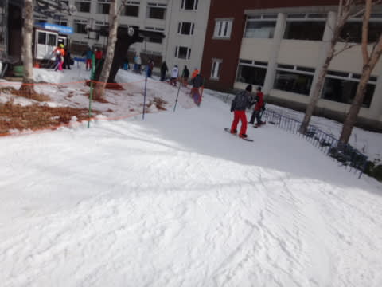

# 12月4日，日曜日の志賀高原・焼額山スキー場詳細レポート…晴れのち曇り，アイスバーン（涙）．

📅 投稿日時: 2016-12-06 03:05:25

🏷️ カテゴリ: [2017スキー滑走日記](c7d777cecfc91bdf0fa464ad62c6d49ab.md)

えー．

昨晩から今朝にかけて．

スキー場でも雨が降ってしまい．

ちょっと雪が減ってしまった今日この頃．

皆様いかがお過ごしでしょうか（涙）．

しかし．

今週は．

期待の星，ブロッキング高気圧が

明瞭化するのだ！

カムチャツカ半島～東シベリアの

高緯度で，赤丸で囲ったように，

北側に入り込むような高気圧が発生すると．

日本近辺に寒気が下がってくるのだ！

だもんで．

今週は，冷える．

冷えるはずだ！

6日は降ります！

7日は雪はひと休みだけど…

8日も降ります！…が，西風なので．

志賀高原はほとんど積もらないかも…（涙）．

…今のところ．10日土曜日も積もりそうな

感じ．

土曜までに天然雪がどっさりと積もるかは

微妙だけど．

そこそこ積もってくれるはずだし．

人工雪がガンガン打てて，

雪が全く融けない気温が続くので．

今週末は，ゲレンデ状況は改善するはずっ！！

…と，いいニュースを伝えたあとで，

本題へ．

昨日速報した日曜の志賀高原焼額山．

詳細レポートをば…

さて．

日曜の朝は…

放射冷却で，車が凍り付く程度の

気温ではありましたが．

…でも．

例年のこの時期に比べて冷えが足りないっ！！

結局土曜の夜からは全く降雪機が動かず．

積雪の積み増しは0です…

うーむ．

3日夜は人工降雪機が動かせないだろうから，

　前日からの人工降雪の積み増しは無し．

という当たってほしくない予想．

…見事に当たったなぁ…（涙）．

こんな予想，当たらなくていいのに…（泣）．

日曜も，焼額は第4ロマンスリフトしか動かないので．

朝イチに4ロマに並びますが…

うむ．

朝イチからすでに5分待ちとは．

これは，今日は混みそうな予感…

でも．

山頂に出ると．

うほう！！！

朝イチシマシマっ！

晴れ晴れシマシマっ！！！

結構固めのバーンだけど，

スピードが出て最高っ！！！

アサマ2000ほど手ごわくは無く．

イエティほど緩すぎでもない．

丁度いい中斜面が，スタートから中間地点まで

ほぼ幅いっぱい滑れます！

いやーーー．

これだ！

やっぱり，スキーはこうじゃなくっちゃ！

…という気分も．

リフト乗り場にやってくると…

あう．

午前中はずっと5分～8分待ち程度…（涙）．

とはいえ．

朝は気持ちよく晴れて．

3-4本ほどは，コースも荒れてなくて．

すごーーーーく気持ちよく滑ることが

できました～．

午前中の雪は，だいたいこんな感じで．

固い人工雪の上に，人工雪が削れた粉状の

雪が乗ったようなバーン状態．

コースのところどころ，下地の

固い雪が顔を出して，ちょいと手ごわい

感じです…

緩斜面も，コース幅が狭いところに繰り返し

大勢が滑るからか．

コース真ん中は結構削られて，固い下地が

出てきてます…

だのに．

リフト待ちは長いよ…（涙）

コース上の人口密度も，Yetiやアサマほどでは

無いにしろ．

ちょっと高くなってきたかな…

でも．

昼休みの11:30過ぎからはリフト待ちも

ちょっと短くなり…

運が良ければ飛び乗れるタイミングも！

でも，まぁ．

午後の平均待ち時間はこの程度かな…

運が悪いとこの程度待ったので．

午後もガラガラ，ってことは無く．

リフト待ち0～3分，ってとこでしょうか…

うーむ．

意外と午後まで人が残ってましたね～．

天気は，

昼ごろから雲が増えていく．夕方はおそらく曇り．

という私の予想通り．

そう．私の予想通り←一生懸命主張しておく

昼ごろになって雲が増えて行って．

気温は+7-8℃近くまで上がったものの．

…日差しが強くなかったおかげで

雪が融けてしまうことがありませんでしたね～．

…ということは．

昼間も，コース上のかなーーーり固い下地が

全く緩む気配を見せない，というわけで…

エッジを立ててない板，

ヘタった板では．

もう，ズルズル状態．

ちょっと手ごわいゲレンデ状況に…（涙）．

視界が悪かろうが土が出て酔うが雨が降ろうが

槍が降ろうが止まらず滑り続ける，20000mクラブの

某user1985a氏が，

「何かの修行に感じてきた」

という，驚きの迷言を残すほどのゲレンデ状況．

石ころ踏み用のへたった板を履いていたから，

仕方ない感じですか…

そして．

リフト乗り場近辺では．

うーむ．

結構石ころが出てきてます…（涙）．

まぁ，石ころがあるのは，リフト乗り場近辺の

20m～30mのエリアだけだけなのですが．

でも，もう少し積雪が欲しい…（泣）．

とはいうものの．

アイスバーン＆アイスバーンが削れた粉が溜まった

もさもさが入り交じるバーンを．

この日も夕方のリフトストップまで，

ひたすら滑り続けました～！

…しかし．

向かいの岩菅山にも，全く雪が無いなぁ…（悲）．

リフト乗り場の石ころが隠れてほしい！

アイスバーンじゃなく，柔らかい天然雪で滑りたい！

ペアリフトだけじゃなく，高速リフトも滑りたい！できればゴンドラも！

…もう少し．

もう少し，積雪が欲しい…（切実な願い）．

今週は雪が積もるはずなので．

今週末に期待っ！！！

## 💬 コメント一覧

### 💬 コメント by (マルハバ)
**タイトル**: 昨日5日・・
**投稿日**: 2016-12-06 17:26:51

私も「センターコース1450m滑走可能！」の

たんばらでシーズンインです。

アサマ2000の手もあったのですが・・

あの斜面のコブコブを想像して怖気づき

たんばらにしましたが、正解でした。

シーズン初めにはちょうどいいバーンでした♪

昨年の開幕アサマ2000はスキーもそこそこに

温泉へ逃亡！でしたから・・

### 💬 コメント by (Skier_S)
**タイトル**: マルハバさま
**投稿日**: 2016-12-07 01:49:40

たんばら，良かったんですね…

もしかしたら，志賀高原より良かったのかも？？

リフトは混みませんでしたか？

…志賀高原は，アサマ2000ほどでは

無かったにしろ，固かったですよ…（泣）

