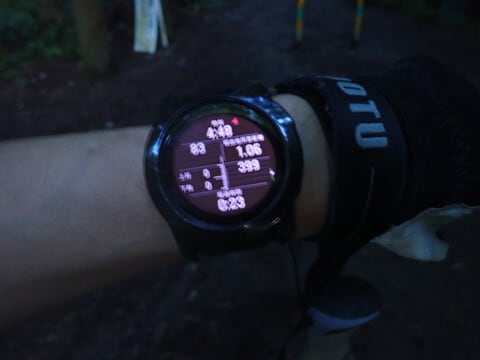
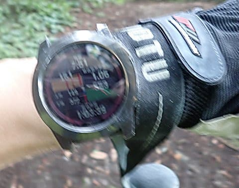
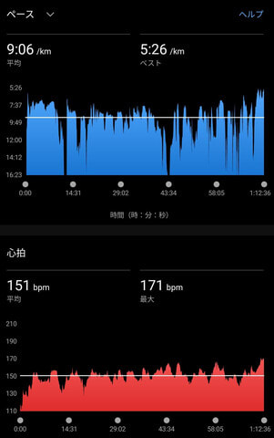
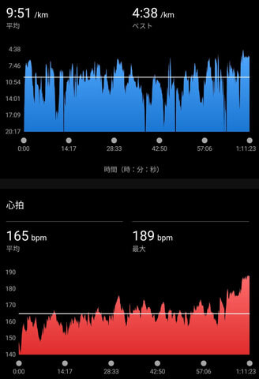
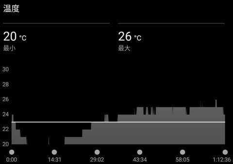
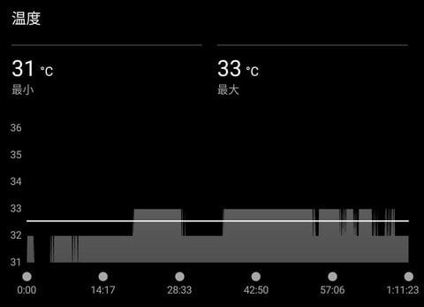
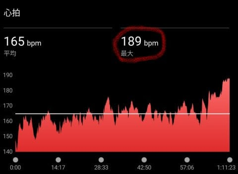

# この週末も陣馬山に行って追い込んでみたんだが…タイムが伸びない（涙）

📅 投稿日時: 2024-07-29 01:06:20

スキーシーズンが終わり，

身体を動かさない週末が続くと，

仕事のストレスが発散できないのと．

身体がなまってダメになってしまい

そうなので．

いつも通り，今週も山に行こう…

と思ったわけですが．

今週末も仕事やら予定やらが詰まっていて，

土日2日間で，土曜の午前11時まで

だけが空いていたので…

土曜朝11時までに帰宅するという条件で

山に行くしか無い状況（泣）

ってなことで．

あまり時間がかけられないので，

いつも通り，時間がかからない小仏駐車場から

陣馬山までのコースをひとっ走り往復して

きました～！！←普通はその状態で山に行こうとは思わないから

とりあえず．

いつも通り睡眠時間を削り．

朝3時半に家を出て．

5時前スタートで…

約3時間で陣馬山まで1往復して，

8時前には下山！

予定の11時までに問題なく帰宅して，

朝ごはん前にひと運動こなせたわけですが．

（走りながら撮っているので手振れしまくり…）

これで，スキーシーズンが終わってからの

1か月ちょいで陣馬山を4往復しているけど，

1回目は昨年のトップタイムからかなり

タイムを落としていて（涙）．

3回目の前回も，去年のトップタイム比

登り5分，下りで5分遅いというかなり

屈辱的なタイム（泣）

いや．

先週は睡眠時間2時間以下でのチャレンジで．

ちょっと膝も痛かったから下りで攻められず

タイムが悪かっただけだ！←言い訳だね

今日は膝も痛くならなかったし，下りもかなり

攻めたから，昨年同様くらいのタイムには

行ったよね…？？

と．

タイムを見てみると…

登り1時間40分とベスト7分落ち．

下り1時間17分とベスト5分落ち…

前回よりタイム悪くなってるじゃん（激泣）

いや．

決して今回の追い込み方が足りなかったわけ

じゃなく，

むしろ昨年のベストタイムの時は

心拍数が平均151，最大171と余裕の心拍数で，

平均ペースが1kmあたり9分06秒．

今回の記録は

心拍数が平均165，最大189と．

ちょっと心拍数上げすぎだろ？？

というくらいに追い込んでみたけど…

それでも同じコースでペースが

1kmあたり9分51秒と，かなり悪化…（泣）

とりあえず．

平均心拍165って，ちょっと上げすぎだろ？？

と思うレベルまで引っ張ってこれか…（泣）

これは．

心肺能力が落ちて，同じ運動をするのにも

かなり心拍数を上げないといけなくなった

ということで…

これが年齢による体力の衰えってやつか！？（激涙）

と，思ったけど．

前回の記録を見ると．

なに？？

前回は気温最小20℃で，平均23℃だったの？？

まぁ，涼しい10月だったからな…

それに比べ．

今回は…

最低31℃で，最高33℃！！

平均32℃を越えるという，運動しちゃ

いけないレベルの殺人的高温ですね…

山のうえでも30℃を大きく超える気温で，

そのなかで3時間山道を走り続けたん

だから…

うん．そりゃペースも上がらないはず．

気温が1度上がれば心拍数も1上がると

言われるので．

前回より10℃ほど気温が高ければ，

心拍数が10以上上がってもタイムを

上げられないのは仕方がないはず．

うん．

老化じゃないはず…！！

と．

タイムが落ちたのは，年齢による体力の衰えじゃない

はずであることを自分に言い聞かせながら．

山を16㎞，3時間走った後に11時から職場へ出かけ．

さらに夕方に職場から帰宅してから，別の用事で

娘と都内に出かけ…と．

休日でも相変わらず，忙しい1日を過ごしたの

でした…

PS.1　しかし，登り1時間40分，下り1時間10分以上走ったあとの

最後のラストスパートで，心拍180以上を数分間キープして，

ピークで心拍189まで上げているのは結構すごいんじゃないか？

と思う…

## 💬 コメント一覧

### 💬 コメント by (油漏＠あちこち)
**タイトル**: Unknown
**投稿日**: 2024-07-29 22:59:31

スキーヤーは寒さに慣れている分、暑さには弱いと勝手に思い込んでいる自分です。最近暑いので朝６時前から走っていますが、それでも暑いし寝起きで体は動かないし、、、、そろそろウォーキングとラジオ体操位がちょうどよいのかもと思っています。

月初の志賀のトレランでは、心拍を１４５までで抑える作戦で臨み、結果は平均１３３、最大１５４でした。１キロあたりペースは１０．５分でした。（遅い！）

涼しかったのですが、推定発汗量は６９０９ミリリットルに達したようです。

※完走後は宿で美味しい志賀高原ビールを頂いたのでした。

### 💬 コメント by (Skier_S)
**タイトル**: ＞油漏れ＠あちこちさま
**投稿日**: 2024-07-30 03:45:53

志賀のトレラン，お疲れさまでした～！

いや…40kmあるアップダウンコースで，キロ10.5分は速いと思いますよ…！！

すごい！

私はそんな長時間，キロ10分ペースで山を走れません…（涙）

