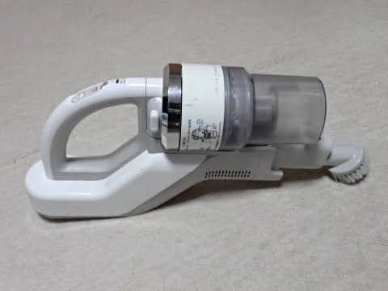

# コードレス掃除機，東芝VC-CL410の充電池を交換してみた

📅 投稿日時: 2023-09-16 01:37:19

🏷️ カテゴリ: [日記](cc4b5682fb7b8b144980957a978653fb0.md)

えー．

先日．

とある米国（米どころ新潟のことではない）の

かなりでかい業界団体のえらい方が

日本に来るから，会わないか…

と誘われて，会ってきたのですが．

そこで，某業界団体の方が冒頭に．

「こないだのうちの業界の会合で，

　某社からこんな素晴らしい提案が

　出てるんだよ！

　このスライドは我々はこのコンセプトに

　合っていて，我々は今後このような

　活動をしたいと思っている」

…ってなことを言いながら，

スライドの説明を始めたんですが…

そのスライドを見て，

ちょっと驚いて，

「え？」という顔をして，

顔を見合わせる我々日本側一同．

おずおずと私が手を挙げて．

「…そのSlideのOriginal Versionを作った人が

　ここにいます…」

というと．

…一同しばらくの沈黙の後，爆笑．

…某社の誰かが私の作ったコンセプト

スライドを引用して，私の知らないうちに

団体会合でプレゼンしていたようですが．

それを聞いて「これは使える！」と思った

Board Directorが，まさかその製作者本人と

思わず，私に向かって私の作ったコンセプト

スライドをプレゼンするという，面白い

打ち合わせでした（笑）．

まぁ，そんなことも起きますね…←いや，滅多にない

…ってな前フリの後は，本題へ．

今日はダイビング日記には飽きたと思うので，

ちょっと違うネタを…

…ってなことで．

スキー道具にはお金をかけても．

それ以外の家電なんかにはお金をかけない

という経済観念の我が家．

前の掃除機がぶっ壊れて，買い替えるとき…

掃除機に何万円も払えるか！

と，コードレスとしては激安だった東芝のVC-410 

というエコノミーモデルの掃除機を購入し，

4年以上使ってましたが…

さすがに4年も使うと，電池がヘタってきて．

短時間で電池切れになるようになってきました…（涙）

で．

バッテリー交換をしようかと思ったら．

ユーザーでバッテリー交換できず，メーカー修理のみ

という衝撃の事実が…！！

うーむ．

おそらく，激安で買ったこの掃除機．

メーカー修理費用のほうが，新品を買うより

高くつきそうだし…

新しい掃除機を買うのももったいない．

ということで．

部品だけ，どこかで売ってないかな…

と探すと．

今のネットは便利ですね～．

通販サイトで，交換用バッテリーが売ってました…

しかし，こんなバッテリーが

8000円近くするのか…(涙)

本体購入価格の半分以上じゃないか！！

まぁ，掃除機を買うよりは安いから，

仕方ない…

ってなことで．

到着した，交換用バッテリー．

古い品番ではCL4-PGR2．

新しい品番で414799039で．

どちらの品番でも，電池容量は同じです．

これが8000円もするのか…

とりあえず．

交換してみますが…

交換方法はマニュアルにも何も記載が

ないので，適当に蓋を開けてみます．

ねじ2本で外れるこの部分を開けると…

うむ．

やはりここにバッテリーが収納されてますね．

バッテリーを引っ張り出すと，

後ろのケーブルが見えるようになるので…

あとはこの二つのコネクタを外すだけで，

バッテリーは簡単に外せます．

まずはこっちの黒いコネクタを

引っ張って外し…

次にこっちの白いコネクタの爪を

外して引っ張れば…

バッテリーはいとも簡単に外れます．

あとは，新品のバッテリーに，逆の手順でコネクタを

つないでやって…

元の場所にバッテリーを収めて．

蓋をしてやれば…

バッテリー交換，完了！！

うーん．

ねじ2か所，コネクタ2個の挿抜だけで

簡単に交換できるバッテリーがユーザ交換

対象じゃないのか…

とりあえず．

こんな簡単な交換で，電池の持ちは新品時同様に

復活しました～！！

まぁ，こんな古い掃除機を，電池交換してまで

使おうとしている人はいないと思うけど．

そんな奇特な人がいれば，参考にしてやってください．

## 💬 コメント一覧

### 💬 コメント by (カンタロス)
**タイトル**: Unknown
**投稿日**: 2023-09-16 06:38:36

Sさま、こんにちは。

仕事でなかなかレアな体験をされたようですね（笑）

私も同じような経験がありますが、コロナ前に提案したことが当時は今までのやり方を変えたくない、偉い人たちによって理由なく却下され、その後コロナという外圧により私が提案したことをまんま実行しだすというミラクル（笑）

掃除機のバッテリー交換、さすがです。わたしも同じような事をやりますがまず開けてみて、これなら自分で出来るという確証を得てから交換部品を買ってます。

見切り発車で交換部品を買っても対応できる技術に脱帽です！

### 💬 コメント by (Skier_S)
**タイトル**: ＞カンタロスさま
**投稿日**: 2023-09-17 02:39:33

似た経験されてますか（笑）．

「それ，俺のアイディアだよ！！」ってやつですね…

私の件も，日本人だったら私が原案を出しているか，最低でも私の会社のネタだと知ってる

はずなんですが…米国では知られてなかったのが残念（笑）．

あと，私は何でも分解して直しちゃったり改造したりする人で，

これまでデジカメも壊れた2台を2個イチ化するとか，いろいろやってきたので，

「電池は少なくとも自分で交換できるレベルだろう…」

と，何も考えずに注文しちゃいました．

まぁ，買ってきた新車の内装をその日にはばらばらにしちゃう人ですから（笑）

### 💬 コメント by (大本営八俵)
**タイトル**: 感謝
**投稿日**: 2024-12-08 18:16:07

大変参考になりました。

ありがとうございました！

### 💬 コメント by (Skier_S)
**タイトル**: ＞大本営八俵さま
**投稿日**: 2024-12-09 01:55:44

お役に立てたようならよかったです～！！

