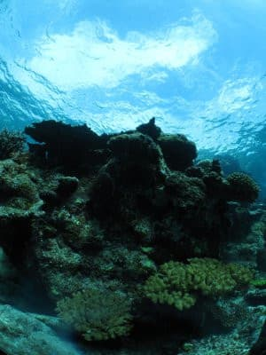

# 2010年7月，2歳の子連れで座間味でダイビングその3…ニューカメラ使ってみたけど…

📅 投稿日時: 2021-09-22 08:17:22

9月末の上半期終了が迫っているというのに．

祭日が多く，仕事が詰まりまくり．

なんとなく，クリティカル

って感じのSkier_Sです．

って感じで．

昨日もBlog更新をすることなく

夜に倒れたように寝てしまったので．

本日はちょっと遅くなりましたが，

朝に更新！

今日は，10年以上前の座間味ダイビング

レポート，続きです…

ーーーー

ってな感じで．

ニューカメラデビューの1本目．

と，気持ちよく撮影を始めたところ…

あれ？

あれ？

なんか，画面の端っこに太陽光が入るような

アングルだと…

強烈にゴーストが出るんですけど…！

これは，太陽を入れるなってこと？

逆光あおりでの撮影でその持ち味を

発揮するフィッシュアイレンズ，

それは厳しい…（涙）

と，戸惑って洞窟を出て．

定番のアオリ上げ珊瑚アングルを

撮影しようと，アングルを決め，

シャッターを押したところ…

え？

今度は…背景が飛ぶ！

派手なゴースト＆水面が紺色にならず

白っぽくなっちゃう，

ダブルパンチっ！！

このINONのお手軽フィッシュアイ．

前面ドームがガラスじゃなくプラスチックで，

プラスチックは無反射コートがガラスほど

完璧にできないため，

どうやらハウジングポート表面と

フィッシュアイレンズ内部での

繰り返し反射で派手なゴーストが

出るようですね…

で．

ゴーストはやむなしとして．

背景が真っ白に飛ぶのを避けるため，

露出補正をかけてみますが…

補正-1.7段にしようが，

-2段にしようが，

背景が飛ぶ！

シャッター半押しでは，ちゃんと背景が

-2段分の暗さになっているのに…

シャッターを押して写った写真は，

背景真っ白．

プレ発光の段階で，フラッシュ光で

光が周る場所があると判断したら，

背景を飛ばしてでもフラッシュが

あたったところが最適露出になるように，

逆光補正アルゴリズムが働いてる？？？

えええええ！

これは…背景がきれいなブルーで，

珊瑚にフラッシュがあたっているという

写真が撮れないではないか！！！！

とりあえず，フラッシュ発光OFFにして，

露出補正を―1.7段かけてみると…

今度は，水面がいい感じの明るさに

なりますね…

フラッシュONで水面の明るさが

このくらいに落ちてほしい…

フラッシュONのこの写真の

サンゴの明るさと．

フラッシュOFFのこの水面の明るさの

両方がミックスされるのが理想

なんだけど…

普通は，露出補正を掛ければ

自然光がその明るさに写るよう

絞り値が調整されて．

あとはその条件でサンゴの明るさが

ちょうどよくなるよう，フラッシュ強度が

調整されるんだけど…

このカメラ．

自然光とフラッシュ光のミックスが

考慮されてなくて．

フラッシュONにすると，フラッシュ光を

届かせようと，絞りを開ける仕様のようで．

…これ，強力な外付けフラッシュを

着けている意味がないよ…（涙）

露出補正が効くのはフラッシュOFFの

時のみ…

フラッシュOFFにすると，水面の青色は

綺麗に出るけど．

サンゴが写らない…

そしてゴーストが左下に（涙）

これはちょっとワイドはきついのか…

と，ワイコンを外してマクロ撮影に切替え，

ウミウシなんかを撮ろうと思ったとき…

このカメラ，ズーム望遠いっぱいにすると，

マクロモードが

使用不可能になるんだ…

ズーム望遠いっぱいだと，45cmより近づくとピンボケ！！

45cmって…ウミウシが米粒みたいな写真になっちゃう．

ワイド側にして近づくしかないのか．

ワイド端なら3cmまで近づけるけど…

ウミウシだったらOKだけど，魚は逃げるぞ．

間違いなく．

…ハゼ撮影，無理か？？？このカメラ？？？

ががががが～～ん．

しょっく～

という，打ちのめされた感を感じて

エグジット．

やはり14000円のカメラに多くを

期待してはいけなかったか…
