# 2021/2/21(日),22(月)の志賀高原スキー場，特派員レポート！…2日とも晴れだけど高温の春スキーだったようです（涙）

📅 投稿日時: 2021-02-23 03:19:29

また，昨日このBlogが更新されておらず．

「また，Skier_Sは死んだか…」←何度も死ぬのか？

と思った読者の方が多かったと思いますが．

ええ．

そうです．

昨日も死んでました．

今朝は睡眠1時間半で都内に出張へ出かけて．

出張先から戻ってくる電車で体調を崩して

新宿駅のトイレに籠ってしまったのは

ナイショです…

さらに，今日戻ってきた健康診断の結果で，

血尿が出てると指摘されてて…

うーん．以前もご無体仕事した時に一回

ひどいのをやったんだけど．

またぶり返してきたのか…

トイレが真っ赤になって，「人間疲れるとこうなるのか…」と思った

どうやら，緊急事態宣言が出てなくても

スキーに行くのはいろいろきわどい状況に

なりつつあると感じている今日この頃．

皆様におかれましては，ますますご健勝の

こととお慶び申し上げます（以上，時候の挨拶）

あ，でも．

健康診断のそれ以外の結果は．

「ものすごい健康です．

　これだけ異常な数字が無いのは

　むしろ珍しいレベルです」

と言われたので．

基本的には健康ですから，

ご心配なく～！！

…ってなことで．

一日Blog更新をさぼってしまいましたが．

本日は日曜と月曜の志賀高原レポートです！

まずは日曜ですが…

この日は朝からすごいいい天気だったようで…

あさイチは…

うひゃーーーー！！

おいしそうな，見事な晴天シマシマ！

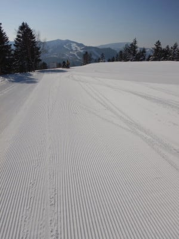

ただ，気温は朝の段階ですでに-1℃と，

すでに2月の志賀高原の朝としては

ありえない高温で…

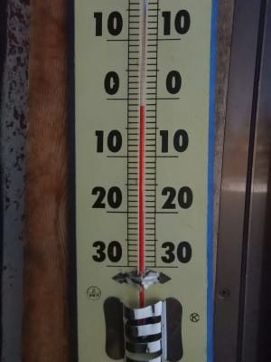

朝のうちはまだゲレンデコンディションは

良かったものの．

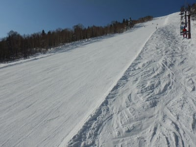

この日も朝から焼額ゴンドラは

第1，第2ともに激込み！

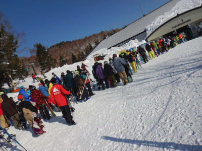

いつもならすいてくる日曜午後に

なっても，飛び石4連休で翌日以降も　

残る人が多いからか…

午後になっても，波はありながらも

列があったようです．

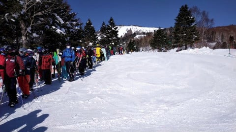

ゴンドラのピークは30分待ちまで

行ったようですが，列があったのは

ゴンドラのみで，リフトは待ちが無かった

ようです…

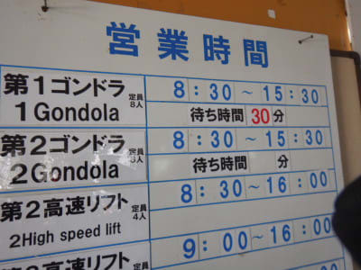

あ，でも．

西館フーディーが意外と混んだという

レポートもありましたね…

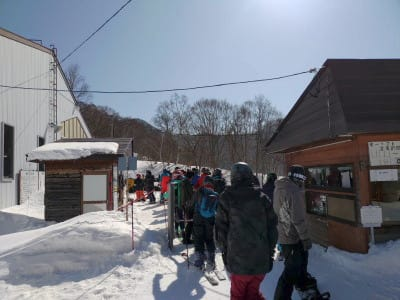

で．

昼間の最高気温は+6℃まで上がったようで．

…志賀高原の2月ではあってはならない

気温ですね…(涙)

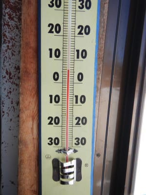

だもんで．

ゲレンデは日当たりのいい焼額は

かなり重い，難しい雪になっていき…

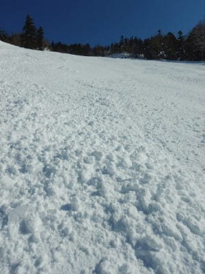

日当たりが少なく，いつもなら

いい雪をキープする奥志賀も午前11時には

重くて滑りにくい雪になり．

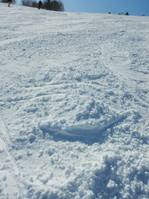

一の瀬ファミリーも，結構重めの

雪になっちゃったみたいです…

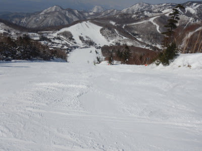

でも，寺子屋は雪はしっとりしていたけど

それほどひどい雪にはならず．

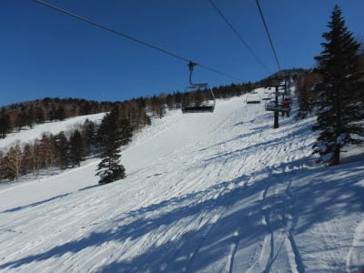

さらに高天ヶ原も，ちょい重めながらも

荒れておらず滑りやすかったみたいです…！

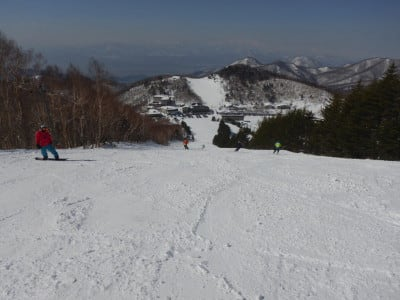

ってなことで．

日曜はゴンドラが結構混んで．

雪もかなり重くなっちゃったけど…

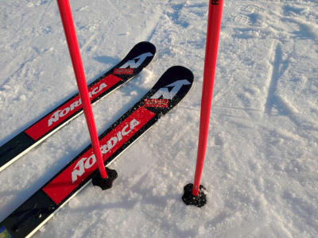

張り付く雪になるほどではなく，

重い雪ながらも，終日いい天気に

恵まれて，春スキーだと思えば

楽しい一日だったようです…

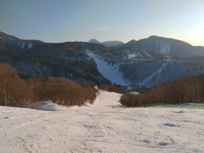

そして，

翌21日の月曜は…

なんと．

あさイチからすでに0℃！！（泣）

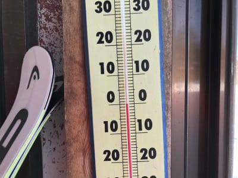

朝イチは昨日緩んだ雪が固まった

硬めのバーンで…

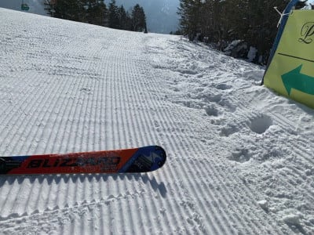

朝のうちは，殺人コロコロバーンと

化したようです

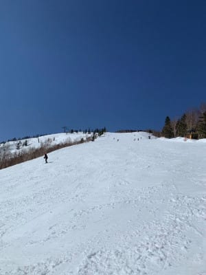

一の瀬ファミリーは，上部は硬め，

下部は殺人コロコロだったようです．

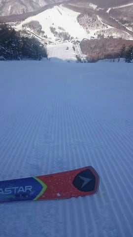

ただ，この殺人コロコロバーンも．

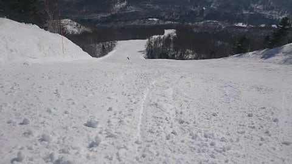

すっきり晴天の強い日差しと，

高い気温で，すぐ緩み始め…

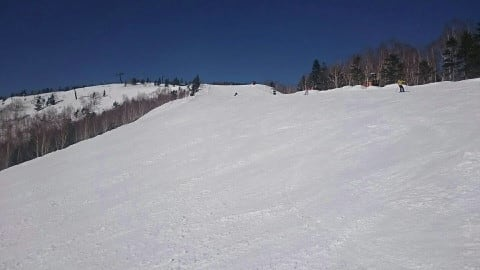

昼前からは，焼額や奥志賀，一の瀬も

下の方は板が滑らない雪になって

いった状況が，実況中継のように

次々特派員から入ってきたのでした…

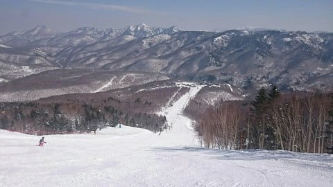

で．

今日は平日なのに，祭日との谷間だったからか，

焼額ゴンドラは意外と混んだようで．

いつもの平日よりは人が多かったようです…

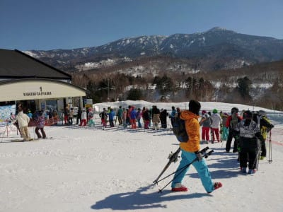

まぁ，それでもゲレンデはガラガラ

ですけどね．

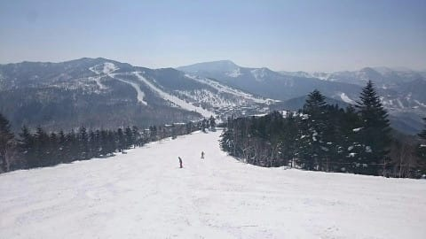

結局，月曜日のこの日は，志賀のほぼ全面が

重い雪．

寺子屋も重い雪になり．

焼額や奥志賀，一の瀬も下の方は

妖怪板掴みが発生するレベルの，

2月としてはありえない雪質に

なっちゃったようですが．

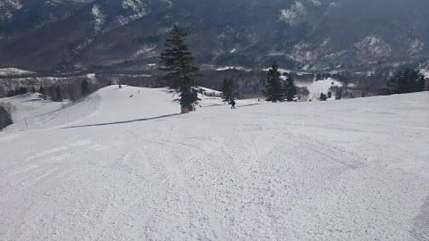

勝ち組だったのは，渋峠に行った人

だったかも．

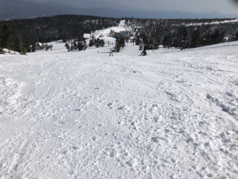

雪はしっとりしている感じだったようだけど，

板が張り付くほどではなく，

板が潜ったりせず，しっかりエッジが効く

いい雪だったようです…

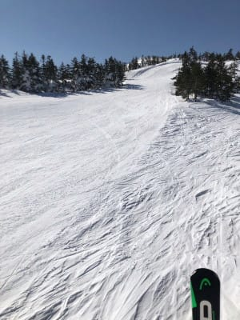

熊の湯も，ちょっと緩み気味ながらも，

板掴みはいなかったというレポートが

入ってました…

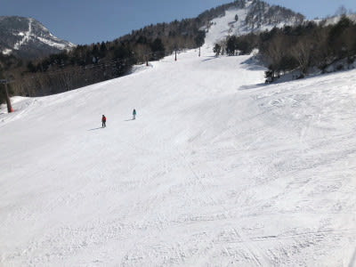

ってな感じで．

本日月曜は，4月並みの残念なコンディションに

なった志賀高原ですが．

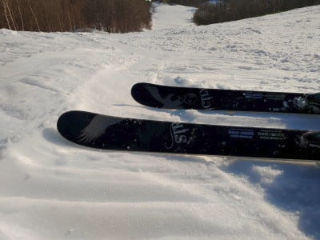

23日の午前3時現在の志賀高原，

冷え始めて雪になってます！

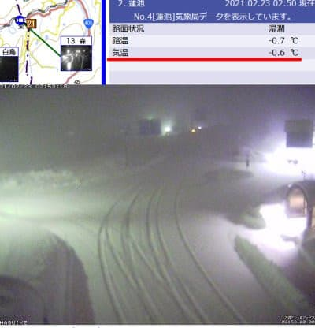

23日は一日降り続けてくれて．

気温も夜には-15℃くらいまで冷えるので．

24日には，バーンコンディションは回復

してくれそうな感じ…

ただ，その後26日までは冷え込みは

続くものの，24日以降は積雪は

ほとんどなさそうなので．

来週末までにどこまでいいコンディションに

なってくれるのか…

あ，週末の27，28日は今のところは

晴れそうです！

27日はそこそこの冷え込み，28日は

例年通りくらいの気温なので．

月曜のような高温にはならないと

思うので…

今週末，意外と良い雪で，晴天かも…？？

## 💬 コメント一覧

### 💬 コメント by (レインボー73)
**タイトル**: Unknown
**投稿日**: 2021-02-23 07:54:47

火曜日の志賀高原情報

こんなの初めて！

7時湯田中から時速50㌔くらいで、のんびり登ってくるのが日課なのですが、前にも後ろにも対向にも、一台の車にも出会わない。今日ってなんかあるの？本当に休日なの？皆んな自宅で天皇陛下を拝んでるの？夢見てるのかなあ！

やっと出会ったのがダイヤモンドでの対向車。

上林0℃　蓮池ー６℃。道中湿雪が少し。ニゴンパークではかなりの除雪量。湿った雪が吹き付けてくる。

### 💬 コメント by (ダウンヒル)
**タイトル**: Unknown
**投稿日**: 2021-02-23 07:59:01

やはり、このブログの御主人さん、特派員さんって、凄いですよ。

全エリア、時間帯ごとの状況がわかりますし、天気予報までしてくださるだなんて。

あー、次回出勤も楽しみだなあ。

### 💬 コメント by (レインボー73)
**タイトル**: Unknown
**投稿日**: 2021-02-23 12:03:17

火曜日の志賀高原情報２

昨日の大掃除や布団干しで、数日前からの腰痛が悪化したみたい。車を降りるとしばらく動けない。そうだ、こんなときはスキーリハビリだ（完全にエス化している）。幸いにも朝は凄い霧。視界良好な、カラマツ、イースト（三高の整地）で基本練習を黙々と。腰への振動は危険なので、ふと板なのにミドル（三高の非整地）には目もくれず。

私ってこんなに勤勉だったっけ？　若い頃からそうだったら、今みたいな人間、いや生き物に、ならずにすんだかも？

最後に１ゴンに集ったのが、特派員五人衆。

『皆んなが写真やデータを送るから、エス様は更新を余儀なくされるんた。送らなきゃ、血尿も出なかったかも!』

『エス様からこういう写真を撮って下さいって、言ってくるんだもん。』

『志賀高原病患者は死ななきゃ治らないんだ！』

『んだ、んだ。』

そんな訳で、10時30分リタイアとなりました。

帰路、ひどいスリップ痕が！　下の方でしたよ。気をつけてくださいね。

### 💬 コメント by (新米パパ)
**タイトル**: Unknown
**投稿日**: 2021-02-23 18:04:25

今朝のヤケビはよかったですねー。

休日とは思えないすき具合でした。

11時に奥志賀に滑り降りたのが大失敗。

ゴンドラも第三も動かず、シャトルでgrandPhoenixにいきランチで無駄に散財してしまいました。

シャトルで高天ヶ原にいき焼額山な戻りましたが、林間の焼額山は風もなく雪も最高。

高天ヶ原も一の瀬もカリカリなとこありましたね、結構。

### 💬 コメント by (オオスギ)
**タイトル**: Unknown
**投稿日**: 2021-02-23 18:24:18

S様、朗報です‼️

どうやら、3月7日に、緊急事態宣言が解除になりそうですよ。

体調を崩されているようですので、お身体に気をつけて、存分に滑って来てくださいませ‼️

わたしは、会社の命令にて、今シーズン県下の移動も制限されてしまいました‼️

### 💬 コメント by (Skier_S)
**タイトル**: 今日はゲレンデ一気に回復！
**投稿日**: 2021-02-23 21:32:00

＞レインボー73さま

おっと．

腰はスキーをやるにはすごい大事なので，くれぐれもお大事に…

しかし，特派員5人衆ですか(笑)．

結構たくさん集まりましたね．

今，スキーに行けずネタに困ってますので，いっぱい写真送ってください～！！！

＞ダウンヒルさま

もう，数多くの優秀な特派員に支えられているこのBlogですから…

自分がスキーに行けないこの時期，ネタが無いので

特派員の皆さん頼りです．

もう，本当に特派員の皆さん，よろしくお願いします！

次回，志賀高原でお会いできるのを楽しみにしています！

＞新米パパさま

今日は朝イチヤケビだったんですね…

うらやましい…

奥志賀の第3ペアが止まったのは午後科と思っていたら，

午前から止まっていたんですね！！

焼額は雪が一気に回復したみたいですね．

一の瀬はやっぱり急斜面は下地の硬いのがでてましたか…

＞オオスギさま

ををを！！

緊急事態宣言解除を心待ちにしています！！

早く体調も回復させて，万全の体調で滑りに行けるようにせねば…！！！

…とはいえ．スキーに行けるよう，ちゃんと仕事が終わるか

どうかの方が心配です…

