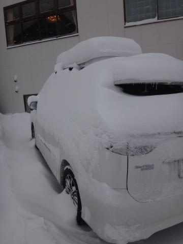
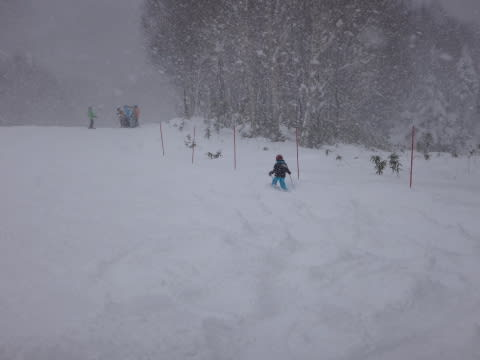
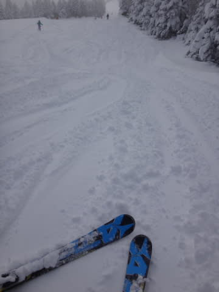
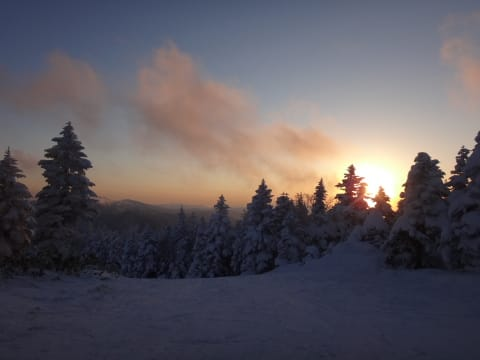

# 12月7日，志賀高原焼額山詳細レポート…もうあと一降りほしいけど，けっこう楽しめたよ

📅 投稿日時: 2014-12-09 00:32:16

という感じで．

昨日速報した，日曜の詳細レポートをば…

えー．

土曜の夜から，雪は降り続け．

日曜の朝も，私の予想通り←強くアピール

雪降りで始まった朝．

土曜夜からの積雪量は，こんな感じで…

一晩で20㎝くらい積もったのかな？？

…これは．

今日から動く焼額ゴンドラ．

状況がいいに違いないっ！！！

と，喜び勇んで8時半のゴンドラスタートに合わせて

焼額に向かったところ…

な，な，

なんだ，これはっ！！？？

運休！？？？

係員「すいませんっ！

　機器故障のため，営業見合わせ中です～！

　修理していますが，営業再開の見込みも不明，

　一日動かないかもしれません！」

という係員からの説明を受け，

ショック…

シーズン営業開始日から，何かケチがついた感じの

第2ゴンドラ．

…たしか．

[昨シーズンのGWも壊れて，2日間営業できなかった](e4e75316817d516962984db26630789db.md)思い出が…

…もう，古いからかな…

とりあえず．

超楽しみにしていたゴンドラが動かないという

大・大・大ショックを受けつつ，第4ロマンスに乗り込むわけですが．

ふむ．

リフトから見えるコースの雪付きは，十分．

そして，リフトを降りて．

ふむ．

コースの雪は，フカフカ新雪．

滑ってみると．

…こ，これは…っ！

た，た，楽しいっ！！！！

そうだ．

雪って，こんなに柔らかかったんだ！

天然雪って，こんなに優しいんだ！

スキーって，こんなに楽しいんだっ！！！

と．

コース幅いっぱいに，きれいな天然雪が積もったコースで，

久しく忘れていた感覚を思い出し．

超楽しい幅いっぱいの大回りっ！！

そうだよ～！

これだよ～！！

そして．

コースわきにはプチパウダーもあり．

なんだ～，

ペアリフトでも，意外と楽しいっ！！

雪質も，最高！

と，思って，滑ることしばし．

…でも．

ペアリフトしか動いておらず，リフト待ちも多少あり．

さらに，雪は時折強く吹き付け．

…低速なペアリフトでは，乗っている間に

冷凍人間化してしまう…！

という危機を感じた，午前11時ごろ．

うむ？

ゴンドラが動き出したよっ！

無事修理が完了して，営業運転開始の案内が！

急いでゴンドラに飛び乗って…

いやーーー．

帰ってきたよ，焼額ゴンドラ！！！

実に，7か月ぶりの再会！

そして．

この温度計とも，7か月ぶり！

…山頂気温は，昼間の11時過ぎでも，

マイナス7度と．

今日の山頂は冷えてます…

で．

コースに出ると．

ほう．

うはーーー！

なんだー！

最高～っ！！！

いやーーー．

やっぱり，ゴンドラコースはいいなぁ…

と，思っていたのは2本ほど．

しばらく経つと…

あれれれれ？？

なんだか．

旧第1高速降り場からの急斜面．

コース全面，あっという間に雪がはがれて，

かなりの部分にブッシュやら石やらが出てきちゃって

ます…

石が出てるのは，急斜面部分の100mほどなんですが．

コース幅いっぱい，かなりの部分がデンジャラスゾーン化．

新しい板だと，ちょっと厳しい感じ．

うーむ．

こんな警告は出ていたけど．

ちょっと残念…

まぁ．でも．

石を避けつつ，滑る！

って感じで滑っていると…

私の予想通り←ここも強調

午後は日が射してきました！

うはーーー．

いい雪質で，

いい天気で．

なんて恵まれてるんだ！

＃コースの石ころが残念だったけど

って感じで．

ゴンドラストップの4時まで．

たっぷり楽しんで帰ったのでした…

…でも，さすがゴンドラコース，雪が足りないとのことで．

明日からはゴンドラが動かず，一生懸命人工雪を付けていた，

第2高速が運転開始になるようです…

とりあえず，来週に期待！

…なんですが．

なんだか．

11日の木曜日は，志賀高原も雨になるかも…（涙）

でも．

12日からは冷えて，雪になって，13日はそこそこ降りそうなので．

13日からの土日は，またコンディション改善するかな…

PS.声をかけてくださったBlog読者の方，ありがとうございました～！

　また，今後もご愛読のほどよろしくお願いします（拝）．

## 💬 コメント一覧

### 💬 コメント by (はなげ親分)
**タイトル**: 私のような気が
**投稿日**: 2014-12-09 00:57:26

第二ゴンドラの故障・・・

心がけの悪い奴がいたに違いないと思われるでしょ！

多分私だとおもいます（詫）

先週末に、ちょっとアレしちゃいまして・・・

まさか、こんなに、てきめんにとは思いませんでした。

シャトルバスで宿のある一の瀬とヤケビとの往復、

虚しかったですよ～

これからは、絶対！絶対！いい人になりますっ！

### 💬 コメント by (Skier_S)
**タイトル**: はなげ親分さま
**投稿日**: 2014-12-09 01:14:05

あれ？

ヤケビにいらしてたんですか？？

うーむ．

だとすると，日ごろの行いの悪い人というのは，実は！？？

…しかし，一日動かないかも…

と言っていたのが，11時には動いてくれたので．

結果オーライだったのかと．

とりあえず．

これからは，ぜひいい人になってください！

（お前こそ，というツッコミが大量に来る気配）

### 💬 コメント by (komu)
**タイトル**: 富士見も
**投稿日**: 2014-12-09 02:01:48

オープン初日とは思えない素晴らしいコンディションでした。

多分日頃の行いの賜物です(・ω・)ノ

志賀高原も一気に冬モードなのですね。

今シーズンこそトップシーズンの焼額に行きますよ～

### 💬 コメント by (Fcamel)
**タイトル**: お邪魔してスミマセンでした。
**投稿日**: 2014-12-09 08:14:06

日曜日はご家族でお楽しみのところ話しかけたりして申し訳ありませんでした。

熱心なスキーヤーではなく、すぐゲレンデからは撤収してしまうのですが、私もシーズン中は神奈川から月2,3回ペースで奥志賀、焼額方面に通っておりいつもいろいろと参考にさせていただいています。

いつか一言お礼をと思っていましたので、思わずお声かけてしまいました。滑り始めてすぐSkier_Sさんと気がつくことができたのは、開いているコースが限られるシーズン初めならではでの幸運でした。

またお目にかかる機会もあると思いますのでよろしくお願いいたします。

### 💬 コメント by (Goku)
**タイトル**: Unknown
**投稿日**: 2014-12-09 21:35:47

日曜日はお世話様でした(^_^)

やっぱり焼額山はサイコーですね♪

次は１ゴンが早く動くように毎日志賀の山を見ながら「雪降れ～！」ってお祈りしておきます。

### 💬 コメント by (Skier_S)
**タイトル**: みなさん，コメントありがとうございます
**投稿日**: 2014-12-10 01:27:45

>komuさま

え？そうなんですか？

富士見までかなり降ったんですか！

たのしめたようで，良かったですね．

ぜひぜひ，ハイシーズンの焼額へ

お越しください！

>Fcamelさま

コメントありがとうございます～

しかし，神奈川から，月2-3回とは…

なかなかすごいですね…

でも，よく私が分かりましたね…

みなさん私を発見してくれるんですが，

良く見つけてくれるな～，と驚いてます．

私はこれからGWまで，全土日はすべて

志賀高原（ほとんど焼額）を滑り続けてますので．

また，見かけたらよろしくお願いします～！

>Gokuさま

日曜はお久しぶりでした～！！！

朝のうちどうなることやら，と思ってましたが，

ゴンドラが動いてくれてよかったです…

午後に晴れてくれたのも良かったですね～．

また来週も，大雪に期待！

