# GWに志賀高原へ行く方へ参考情報…先週20，21日の積雪状況をば

📅 投稿日時: 2013-04-26 03:52:03

えー．

仕事の都合で朝5時半に出かけなくてはならないというのに．

こんな時間に仕事から帰ってきて，ブログ書いてる暇あるのか？

…って自己突込みを激しく入れたいところですが．

ここはブログを書いている自分をほめてあげましょう←ほめるところか?

とりあえず．

GWに「志賀高原に滑りに行こう！」って方もも結構いると思うので．

参考のために，先週末の志賀高原の積雪状態を報告しておきましょうか…．

まずは，高天ヶ原ですが…

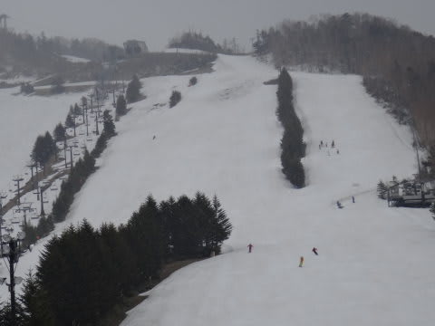

NHKバーンはまだぜんぜんOKですね～．

ただ，メインバーン上部はちょっとそろそろ雪が薄くなってきてるかな．

高天ヶ原クワッド山頂からの狭い通路は…

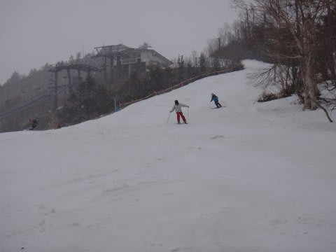

うーん．

GW前半はいけそう．GW後半は，雪をかき集めれば何とかなるかな…

NHKバーンを上から見ると…

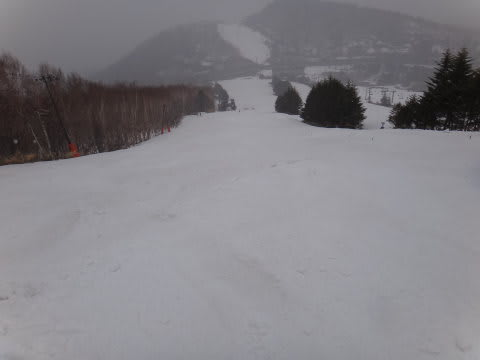

こんな感じで，幅いっぱいありますし，積雪も十分．

ここはGWはおそらく問題ないでしょう．

モーグルバーン側も…

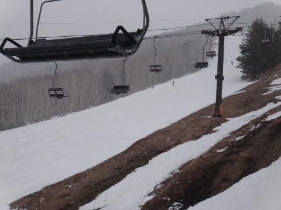

GW後半までもつかどうかは微妙ですが，まだ雪はあります．

コブ溝も，雪はまだほとんど出てきてません．

んで，東館山は．

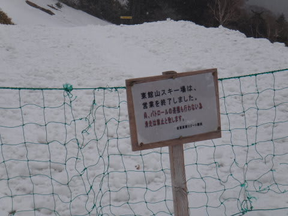

残念ながら，もう滑走できません．

そして，タンネの森を見てみると…

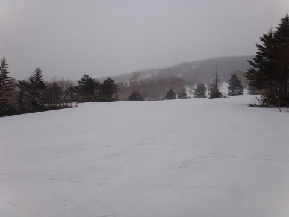

うむ．

まだ行けそうです．

タンネから高天ヶ原への通路は…

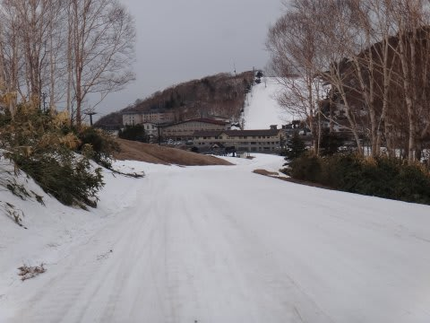

GWの谷間くらいに切れちゃいそうな気がします…

んで．一の瀬ファミリー．

うーむ．ここは問題なさそうですね～

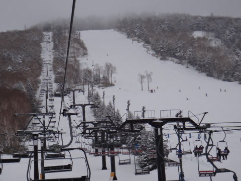

メインバーンはまだ十分な積雪です．

まだ，下もコース幅いっぱい滑れて，薄くなってる部分は無いので安心かな～．

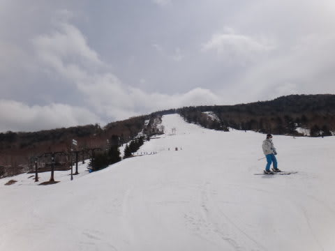

意外と，天狗コースもまだ雪がいっぱいあります．

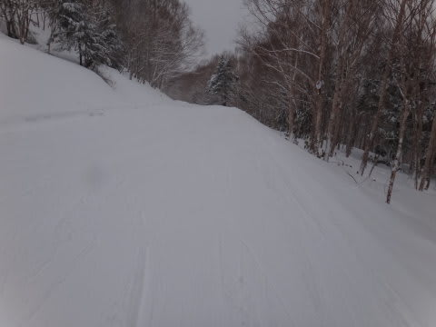

少なくとも，GW前半はまったく心配なさそう．

パノラマコースも大丈夫な感じ…

ただ，パーフェクターコースは…

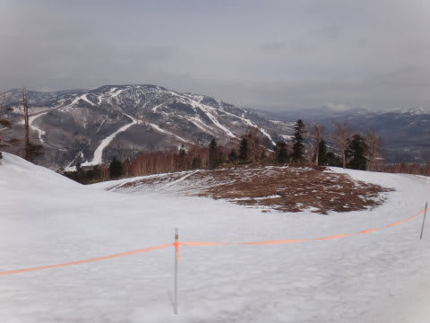

こーんな感じで，残念ながらもうクローズしてます(涙)．

次は，一の瀬ダイヤモンド．

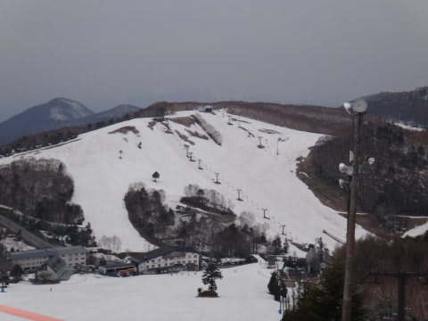

うーむ．

山頂部分の雪解けが進みましたね…

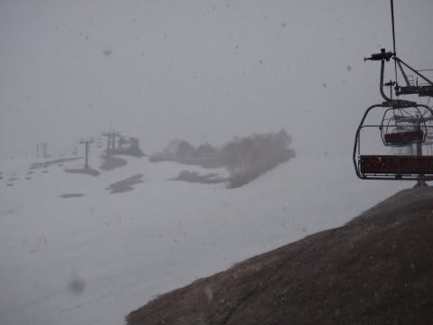

でも，人工雪をつけている，クワッド沿いはまだ大丈夫．

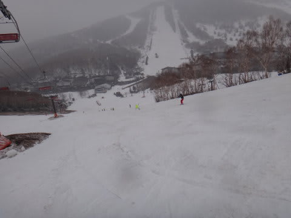

一の瀬山の神は，先日書いたように，もう営業終了です(涙)

…まだ雪がありそうなんだけど…

そして，我が愛する焼額は…

山頂は雪がたっぷり．

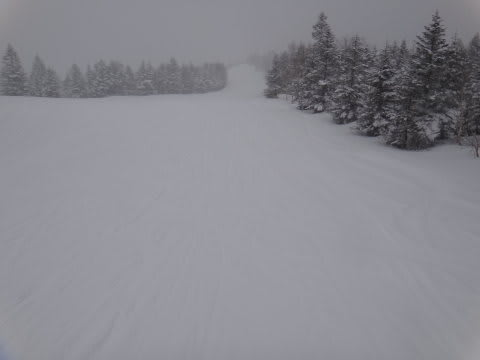

ゴンドラの一番下も，まだコース幅いっぱい雪があります．

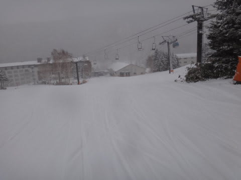

第2高速沿いの白樺コースも…

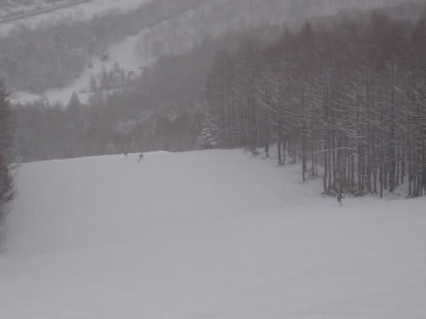

まだ幅いっぱい滑れますね～．

ここは，意外と例年並に雪が残っている気がします…

って感じで．

4月下旬の冷え込みで．

意外と，GW前半は問題なく滑れそうな状況ですよ～！

…GW後半がどうなるかは，これからの天気によります…

＃私の日ごろの行いによる，のかも…
