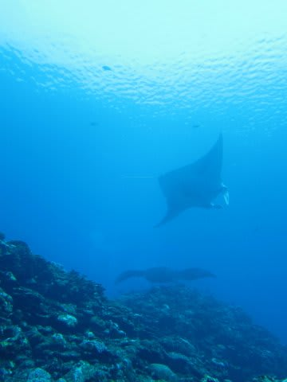

# 2014年9月　3連休，子連れ石垣ダイビング　その6

📅 投稿日時: 2014-11-18 01:15:31

🏷️ カテゴリ: [ダイビング日記](ce3a7a8d424d112fce83ee85c81a0e344.md)

ふむ．

実に幸運なことに．

気温が上がるかも…と危惧していた今日17日．

…気温は上がったものの．

かぐらでは，昼間は日も射したようで…

心配していた雨は降らず．

雪はそれほど解けずに済んだようで，一安心…

で．

冷えるよ！

と予想した18，19日．

予想通り冷えて，信州も雪になりそうですっ！！

志賀高原の蓮池のライブカメラを見ると．

すでに道路上，天然雪が積もり始めているようですし…

さらに．

18日朝の850hpa図．

この図の赤線に示すように，0度線はかなり南に下がってます．

風向きも，矢印で記したように北風です！

18日も終日，雪が降ってくれそうです！

…だけど．

…なんだか．

21日から，3連休の24日までの間，

また気温が上がりそうなんですよね…

今日・明日の冷え込みのあとは，しばらく，

昼間に人工降雪機が動かせないくらいに温まりそう…

だもんで．

3連休に滑れるかは，19日までの，あと2日間勝負になります…

うーむ．

せめてもの救いは．

この高気温の間は，天気は良さそうなので．

雨で雪が壊滅的に融けることもなく．

いい天気の3連休が過ごせそうであるところかな～．

って感じで．

また，3連休の天気は直前予想を入れるとして．

今日はダイビング旅行記です～

----

ということで．

石垣と言えばここ…

マンタスクランブルへエントリーしたわけですが．

エントリーして数十秒．

いきなりすぐ目の前に…

いきなりのマンタ様，登場ですっ！

いやー．

2年ぶりのマンタ遭遇っ！！！

久しぶりに見ると，やっぱり

デカいですね～！！

そして，マンタクリーニングステーションへ向かうと．

ステーションの根の上には，すでにマンタが3枚，

ひらひらと舞い踊っておりますな～

大体，こんな感じで．

ダイバーは，写真の左側のクリーニングステーションから，

10mちょい離れた，この写真でいえば右側のところに着底して，

マンタを眺めるわけですが．

いやー．

さすがマンタスクランブル．

エントリー直後からずっとマンタがい続けて．

ぜんぜん立ち去る気配はありません．

いやー．

ダイビング中，ずっとマンタを見続けてられるなぁ…

と，思った，その時．

なんと．

頭上に．

予想もしていなかったものが現れたのだったっ！！！

（続く）
