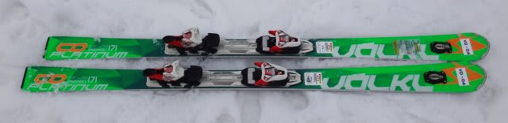

# 2016シーズンモデル，スキー試乗レポート第19回…VOLKL編その3

📅 投稿日時: 2015-05-27 01:03:40

あー．

何とか無事，体調が完全に回復したらしいSkier_Sです．

いやー．

先週の土曜から木曜まで，6日間も微熱が続いてどうなるかと

思いましたが．

かぐらに滑りに行って，治りましたね←違うと思う

やはり，スキーは健康にイイのだっ！←先週土曜に滑った直後に体調を崩したのでは？

ということで．本題へ移るわけですが…

…この記事，今日投稿する予定のものだったんですけど．

間違って昨日の午前のあいだ，編集中のモノを

さらしてしまってました…

本日再投稿ですが．

昨日読んだ方は，2度読んじゃうことになります…

すいません．

ってことで．

気を取り直して．

2016シーズンモデルのスキー板の試乗インプレッション．

今回は，フォルクル編です．

では，どうぞ～！

○VOLKL PLATINUM CD Speedwall 171cm

基礎オールラウンド

GDと同じ大回りベースだけど，GDよりセンター幅が広く，

楽に乗れるというCD.

基本的に，今シーズンモデルと同じとのことですが…

もった時からそうですが．

履いた感じ…

すごい軽い！

そして．驚きの振動の少なさ．

雪が荒れているのが全く足に伝わってこず．

板が軽いのもあって，ザブザブ雪の上を

浮かぶように滑っていく感じです．

この軽快な浮遊感が，すごい特徴的…

だのに，不思議な安定感があり，

傾けただけで楽に回っていきます．

このあたり，GDと通ずる乗り味ですね…

ロッカーが効いているのか，センター幅が広いのが

効いているのか．

悪雪での走破性は高いです．

トップが浮かび上がるような感じで，荒れた雪の上を

まさに浮かぶように滑っていけます…

この板．

荷重ポイントはセンターで，決してテール寄り荷重の板では

ないのですが．

トップがグリップして，トップが内に入ってくるような

操作感ではなく，板のトゥピースよりテールがグリップして，

トップが浮き上がってくるかのような操作感．

板に仕掛けず，横Gを求めない領域では，結構な

スピードまで，エッジに乗った大回りができます．

ガチガチグリップの板ではないので，

楽にずらしていけます．

ずらしていけば，171cmでも小回りまで行けますね～．

楽な大回りベースの板として．

SALOMON X-MAXのいいライバルかも？？

＃こっちの方が，もう少しフレックスや板の返りが

＃優しくなってる感じ
