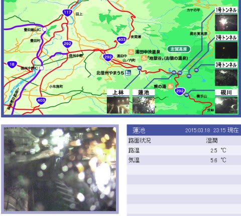
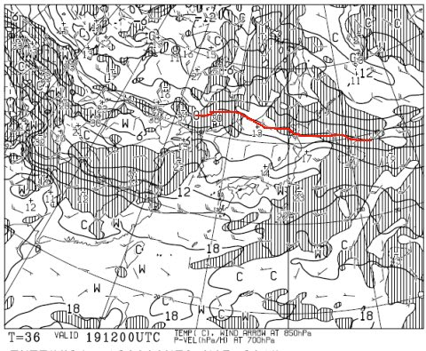
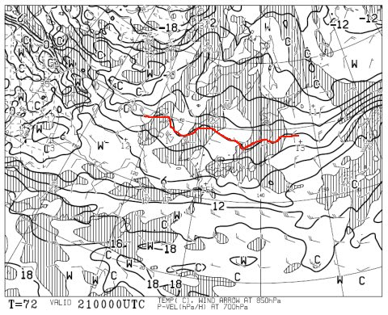
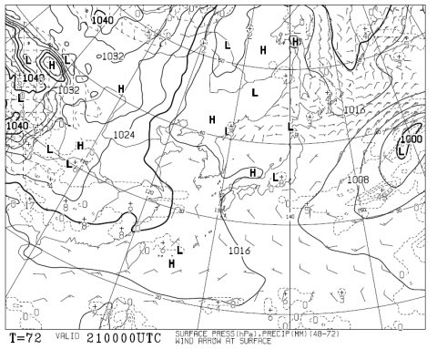
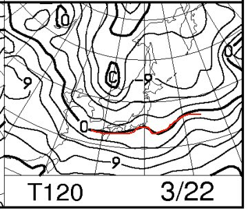
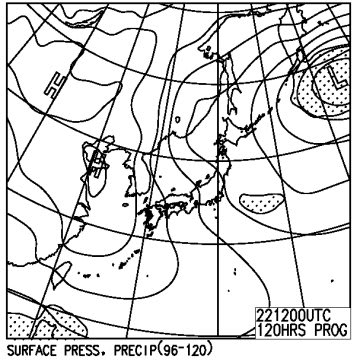
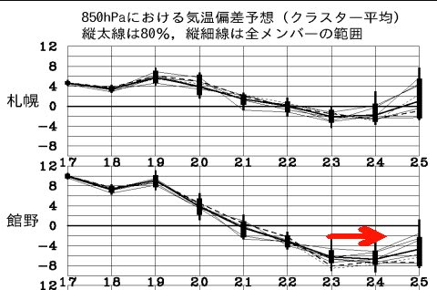
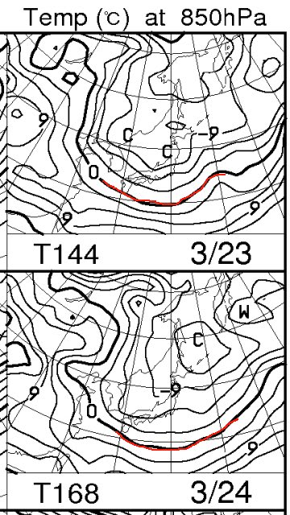

# 定番！この週末の志賀高原の天気は…晴れそうだけど…微妙な感じ．

📅 投稿日時: 2015-03-19 00:37:15

えー．

現在．志賀高原は，雨となっております．

繰り返します．

志賀高原は，かなりの雨が降っております（涙）．

気温が下がる夜というのに．

蓮池の気温は，プラス5度を超えており．

…雨が降っております（涙）．

そして．

この雨は．

明日一日降り続きます．

…ええ，降り続きます（激烈な涙）．

だって．

19日木曜日の850hpa図を見ると…

こんな感じで，0℃線ははるか津軽海峡近辺．

志賀高原には，+9℃線がかかろうか…という感じ．

…これは．絶対に雨です．雪にはなりません（泣）．

ウェザーニュースのサイトでは．

19日の焼額の予想は「雪」となっていますが…

雪になるわけないだろ～っ！！！！

という，激しいツッコミを入れたいところ．

ってことで．

木曜の雨で壊滅的な雪質になったゲレンデは．

週末までに回復するのかというと…

…

…

大変残念なお知らせですが．

回復しません（悲）．

金曜も，気温は下がらず．

雪は全く降りません…

で．

土曜朝の850hpa気温もこんな感じで…

0℃線は東北止まり．

志賀高原は，朝のうちから0℃を超える，暖かい朝になりそう．

地上天気図はこんな感じで，志賀近辺にプチ低気圧が

予想されており．

このプチ低気圧がホントに発生するかどうかで，

天気は微妙な感じですが…

今のところ，曇り時々晴れ…って感じかな．

でも，土曜はだんだん冷たい空気が入ってきて，

午前より午後が冷えていく感じになりそう…

でも，午後は雪は重い春の雪かな…

で．

日曜は．

ふむ．

0℃線は，志賀高原より南に下がりますね～！

地上天気図はこんな感じで．

一見冬型の縦縞っぽくて，

「お，雪が降るのか…？」

と思っちゃいますが．

うーむ．

降水域の網掛けが，日本海側にかかっていないので．

雪は降らなさそう…

だもんで．

この低温は，ゲレンデをカチカチのアイスバーンにしてしまう

だけの感じ…（涙）．

ああ．

ダメだ．

ダメだよ．

この週末は．

アイスバーンと激重な春雪にやられそうな感じ…（残念）．

さらに残念さを増すのが．

こんな感じで，週明けの23日から，すごい冷えるのだ．

平年比6～8度くらい冷える，冷え冷えになりそうなのだ．

そして，月・火曜日と，850hpaの0℃線も，かなり南まで下がり…

なんだか．

来週火曜くらいは，雪が降ってくれれば

いい感じになっていそうなのだ．

うううーむ．

残念！

とりあえず．

週末の天気をまとめると…

土曜日：朝は曇りかな～．プチ低気圧が発生しなければ，晴れるかも．

　　朝のゲレンデは，アイスバーンっぽい感じ．

　　午前中から気温は高めなので，アイスバーンはすぐに緩んでいくけど．

　　それはつまり，重い春の雪になっていくということで…

　　日が射すと壊滅的に水を吸った，重い雪になっていきそう…

　　典型的な，暖かい春スキーの一日かな．

　　天気自体は，晴れるか曇るか微妙な感じ．

　　夕方から冷えていくと，ゲレンデがそのまま固まっちゃいそう．

　　…ナイターは，またアイスバーン覚悟か…

日曜日：今のところ，朝から晴れそう．うーん．状況によっては雲が多いか…

　　朝はカチカチアイスバーン．気温が低めなので，午前中は

　　アイスバーンに苦しめられるか．

　　午後に向かって，アイスバーンがとけて雪は重くなっていくが，

　　夕方はまたそのまま固まったカチカチバーンになるのかな…

ということで．

なんだか．

この週末，アイスバーン＆重い雪で．

先週末の天国から一気に突き落とされる感じ…

…でも．

雨にならないだけましかも…
