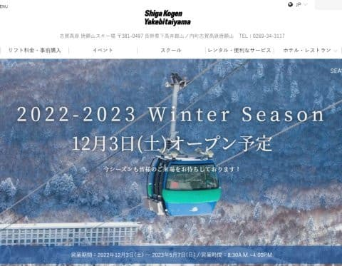
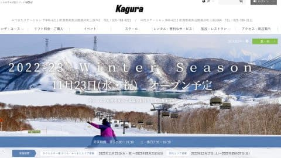
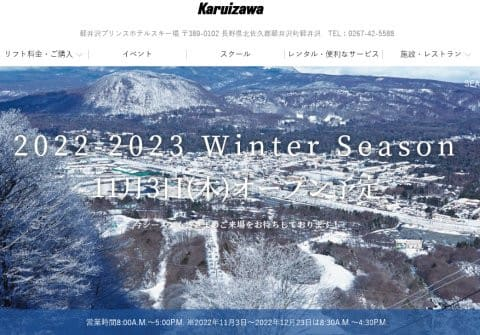
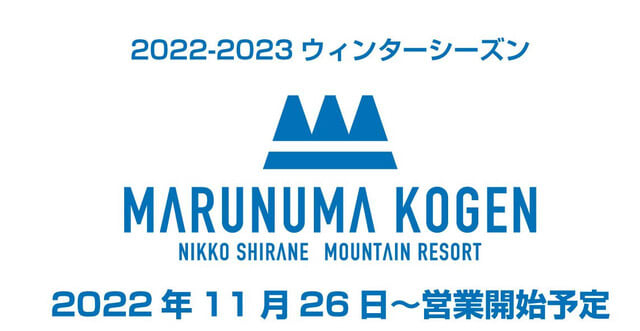
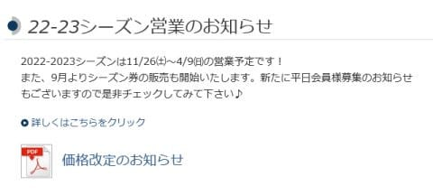
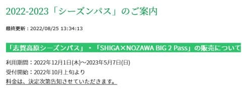
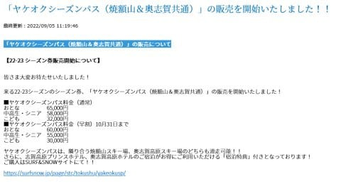

# 2022/2023シーズンのスキー場オープン情報がボチボチ出てきてるけど…リフト券は値上がりか？

📅 投稿日時: 2022-09-07 01:13:01

最近，登山用のスマートウォッチやら

サプリやらの解説をする，

謎の登山ブログ

と化している，徒然スキーヤー日記．

これまでも夏はダイビングブログ化してたり，

徒然車工作日記になってたりしましたが．

改めて言っておきましょう．

このBlogはスキーBlogである

と…（自分でも忘れかけてた）

なので．

今日は久々にスキーネタ！！

（ホントに久々だな…）

で．

早くも，この世は9月という時空の中に

突入したらしく…

今日は8月37日じゃなかったっけ？

という認識が誤りであるということを

知らされつつある今日この頃．

ちょっと待てよ．

9月と言えば…

もう，来月にはYetiがオープンするの？？？

あと一か月半くらいで，もうスキーシーズンに

突入するの？？

早い…時間が経つのが早すぎる…

ってなことで．

そろそろ2023シーズンのオープン情報が

出てきているわけですが．

まずは，わがホームゲレンデの焼額．

例年通りの12月第1週にオープンです！！

（[焼額山スキー場ホームページ](https://www.princehotels.co.jp/ski/shiga/winter/)より）

そして，かぐらも例年通りの

11月23日の祭日にオープン予定．

…まぁ，雪が降らずにオープンが遅れる

ことが最近多いですが…

（[かぐらスキー場ホームページ](https://www.princehotels.co.jp/ski/kagura/winter/)より）

さらに．

軽井沢も例年通りの11月3日の祭日に

オープン予定です！！

（[軽井沢スキー場ホームページ](https://www.princehotels.co.jp/ski/karuizawa/winter/)より）

うむ．

プリンスホテル系列は西武グループから

資本が変わって，営業方針が変わったり

しないか心配したけど．

例年と同じ時期にオープンになりましたね！！

特に軽井沢は，経費削減のためにオープンを

遅らせるんじゃないかと心配したけど…

予定通りアイスクラッシュを使って

11月3日のオープンを目指してくれるようで，

一安心…っ！！

で．

同じく11月にオープンしそうなスキー場を

いくつか調べたけど．

今のところ，オープン時期を明示しているのは

丸沼高原が11月26日から．

（[丸沼高原スキー場ホームページ](https://www.marunuma.jp/winter/)より）

鹿沢が11月26日から，ってくらい．

（[鹿沢スノーエリア](http://www.kazawa.com/snow/)ホームページより）

まぁ，このあたりもだいたい例年並みか

2-3日遅めって程度で．

すごいオープンが遅くなることはなさそうで

一安心．

狭山やイエティは，まだオープン情報が載ってませんね…

うーん．

イエティも，例年並みの10月21日くらいに

オープンしてくれるかな…

とりあえず．

オープンが異常に遅れるってことは無さそうですね．

で．

まだ，志賀高原のリフト券のお値段は

出ていませんが．

シーズン券は，昨シーズン同様に12月1日からの

ようで，11月中は使えないみたいです（涙）

（[志賀高原索道協会ホームページ](https://shigakogen-ski.or.jp/)より）

そして，

既にいくつかのスキー場で，リフト券の値上げが

アナウンスされていて…

さらに志賀高原で唯一，来シーズンの価格が

公表されている焼額・奥志賀の2スキー場で使える

ヤケオク券．

これのお値段が…

大人早割：60000円

大人通常：65000円

と，昨シーズンより5000円値上がりです！！

（[志賀高原索道協会ホームページ](https://shigakogen-ski.or.jp/)より）

うーん．

約一割値上げか…

これから予想すると．

昨シーズンの志賀全山共通券が77,000円だから…

1割近くの7000円くらい値上がりして，

85,000円くらいになりかねないってことか…？？

そして．

焼額限定シーズン券もまだ情報が出てません…

昨シーズン，超早割が無くなって実質

値上げになったけど．

この時期になっても情報が出ないって…

早割もなくなるのかも？？

果たして．

来シーズンの志賀高原のリフト券のお値段は

どうなるのか？？

あぁ…どこかの気まぐれなお金持ちの石油王が，

志賀高原に100億円くらい寄付して，

リフト券がお安くなったりしないかな…←絶対にありえないシナリオだな…

## 💬 コメント一覧

### 💬 コメント by (あっつん)
**タイトル**: Unknown
**投稿日**: 2022-09-07 12:46:07

SURF＆SNOWで焼額山のシーズン券の情報が出ていてもう買えるんじゃないのかな?って思います。

PRINCE会員で大人が45000円です。

### 💬 コメント by (Skier_S)
**タイトル**: Unknown
**投稿日**: 2022-09-08 01:01:24

>あっつんさま

コメントありがとうございます～！

確かにでてましたね…

やっぱり1割値上げ（涙）

さっそくネタにさせてもらいました。

情報ありがとうございました！

### 💬 コメント by (ikkun)
**タイトル**: Unknown
**投稿日**: 2022-09-17 12:35:21

お久しぶりです

あやつがいる中 スキー人口も減れば……我が？アカカンも１割程の値上がりですが 長野方面の値段と比べたら…おっさんだからって 皆がお金を潤沢に持ってはいないよね？とスキー屋さんでも話しました

ちなみにアカカンゴンドラにて横手 高天ヶ原北志賀 野沢のゲレンデが見えてます

### 💬 コメント by (Skier_S)
**タイトル**: ＞ikkunさま
**投稿日**: 2022-09-18 04:01:51

あら．赤倉も値上げですか…

来シーズン，スキー人口さらに減りそうですね（涙）

まぁ，欧米ではスキーは金持ちのスポーツですから…

志賀からも妙高・赤倉方面はしっかり見えるので，

やっぱり向こうからも志賀が見えてますよね…

