# 4月10日の志賀高原詳細モード…晴れのち曇り．雪が…雪が減っていく…（涙）

📅 投稿日時: 2016-04-12 02:59:59

[金曜日の記事](ed79f6eeab75ca91ab88cb43318691500.md)に．

　月曜は，終日冷え冷えで雪が積もるような天気になる…

って感じのことを書きましたが．

どうやら本日，志賀高原でも雪が積もったようですね．

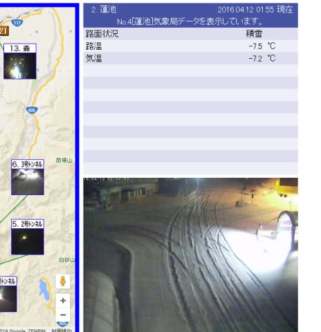

そして，蓮池の夜の気温は-7.2℃と．

この時期としてはいい冷え込み方ですね．

今日・明日はいい感じでしょうけど…．

…しかし，なぜ．

なぜ，週末が終わった翌日に，こんなにいいコンディションに

なるかな～（涙）．

…もしかすると．

以前に踊った冷え冷え踊りが，時間差で今になって

効き始めたのかも…？？←んなわきゃない

…ということで．

かなり悔しい思いをしながら．

この日曜の詳細レポートに行ってみますか…

えー．

まず．朝イチは．

前日にかなり良かった奥志賀へ向かったわけですが…

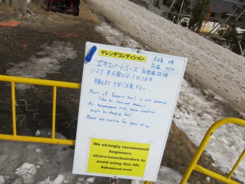

なに？

圧雪車がまた壊れた？？

半圧雪って？？

リフトに登ってみると…

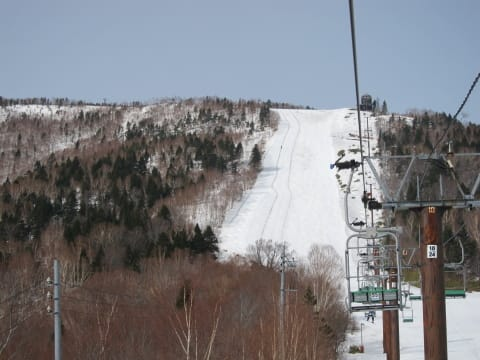

なんだか，ゲレンデに黒い筋が2本…

これは…

圧雪車がオイルを撒きながら走ったのか？？

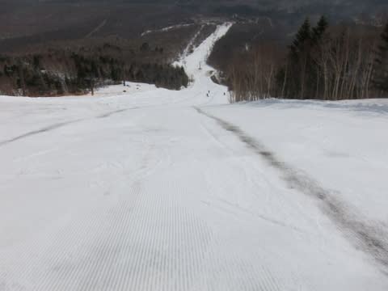

見事に圧雪の真ん中に，黒い汚れが…

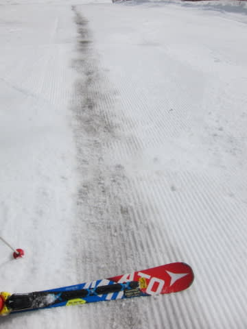

圧雪されているのは，圧雪車の幅2台分．

小回りするのが精いっぱいの広さ．

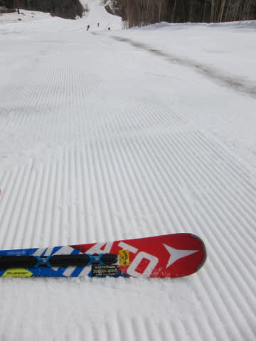

あとは…コース幅のほとんどが，

昨日の夕方の荒れ荒れのままなんですが（涙）．

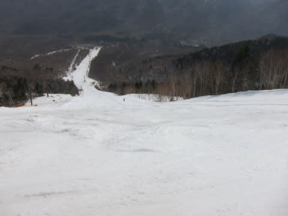

せっかく，朝イチはいい感じの固めの雪になっているのに．

なんだか…昨日の朝イチの気持ちよさからほど遠いのですが…っ！！（激泣）

下半分の緩斜面に入ってからは，コース全面圧雪されているんですけど…

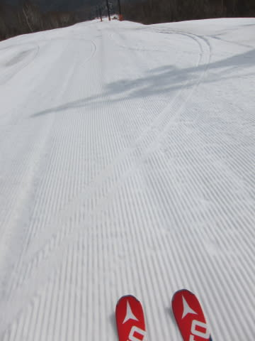

意味がない．

緩斜面だけピカピカ圧雪でも，あんまり意味がないよ…（涙）．

そして，朝から気温は高めで．

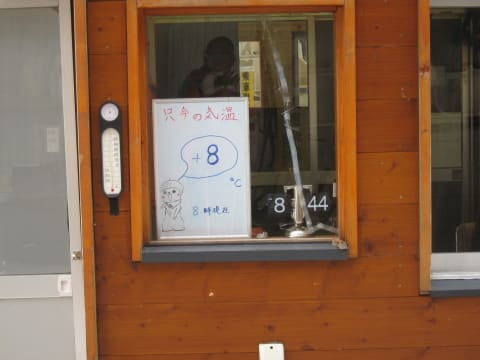

かつ，一の瀬が大会でコースの大部分が閉鎖されているので，

今日は奥志賀に人が集中したのか，人も多めで…

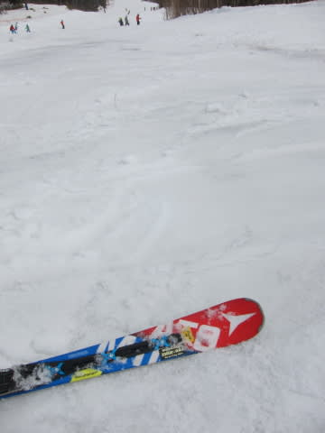

わずかの幅の圧雪コースも，あっという間に荒れてきちゃいました（泣）．

あぁ…朝10時ごろには，もう全面荒れ荒れのコース状態に…

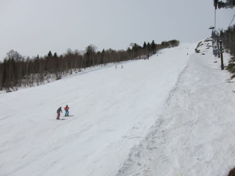

すごく快適だった昨日の午前中と，

あまりにも違いすぎる…

かなーり，残念…

あまりにも残念なので．

ガツガツ滑るのは諦めて．

10時半ごろの．

「11時から，レストランシャモア前でBBQの無料サービスが行われます～！」

というアナウンスに引かれ，

会場であるゴンドラ乗り場側へ…

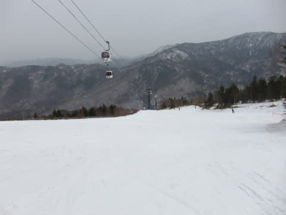

ゴンドラ山頂付近はいいんですが．

相変わらず雪のないところを滑り降り…

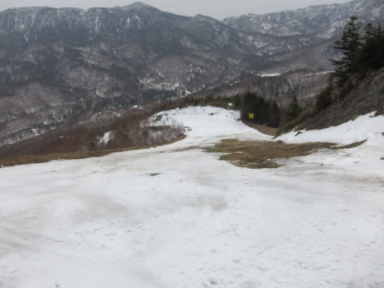

（これ，絶対普通の年ならクローズにすると思う…）

で．ゴンドラ乗り場手前のレストランシャモア前にやってくると．

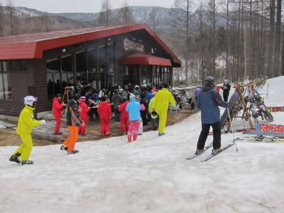

豪快なBBQの無料振る舞いが！

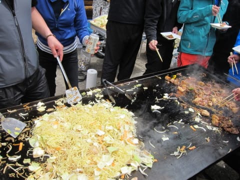

…普段なら滑るのに必死で，あまりこういうイベントに

参加しないけど．

今日は，あまりにも滑るテンションが低い状況なので，

1時間近くのんびりして，有り難く無料のBBQをたらふく

いただきました…（感謝）．

って感じで，

まったりした後は，エキスパートコースに戻ってきますが…

ありゃ？

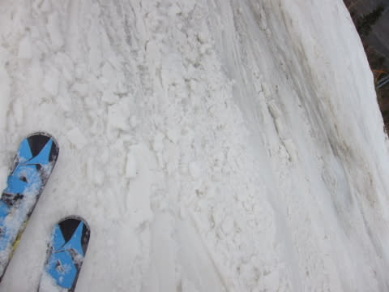

ありゃりゃ？？

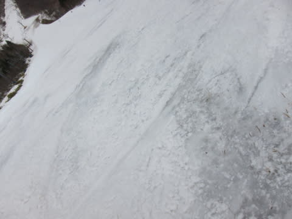

昨日は出てなかったブッシュが顔を出してきてるんですけどっ！？？

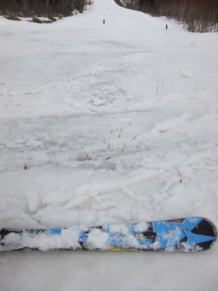

なんてこった．

なーんてこった！

まだ，4月第2週なのに，ここまでひどくなるって…

志賀高原の歴史始まって以来じゃないか？？？

もう，下半分の緩斜面，第1ゲレンデも…

あぁ．

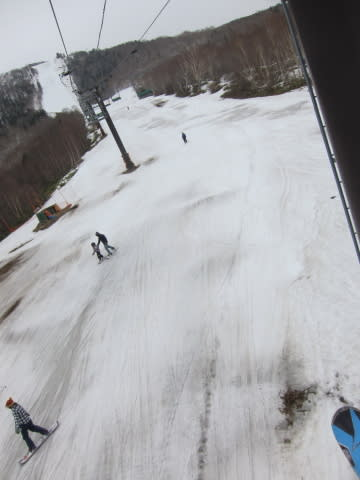

…もう，来週が精いっぱいかも…（悲）．

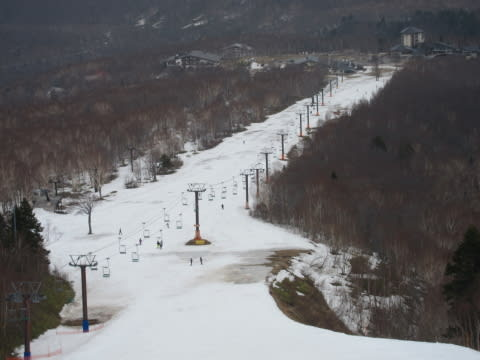

ってことなので．

昨日と同じパターンで．

午後1時過ぎに，一の瀬ファミリーへ移動っ！

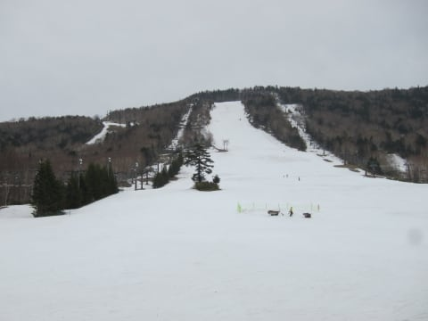

一の瀬ファミリーの正面バーンは，午前中は大会でクローズ

されていたので，あまり一般客に荒らされておらず，

意外とフラット！

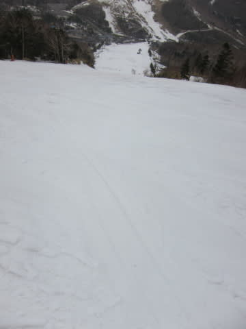

…なれど．

昼前からは曇り空で，直射日光は射さないものの．

10℃を超える気温のため，当然雪は重いし…

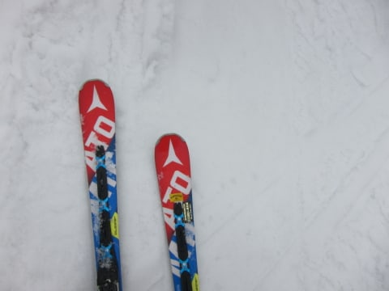

そして．

やっぱり部分的にこんな感じです（泣）．

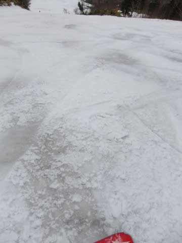

こんな状況にもかかわらず．

パーフェクターコースがオープンしているようなんですが…っ！？？？

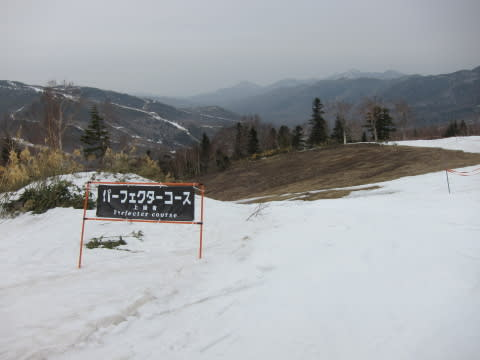

滑れるのか…？？ホントに…？？

と，怖いもの見たさで行ってみると．

…は？

これの左側の狭いところを通らないといけないの？？

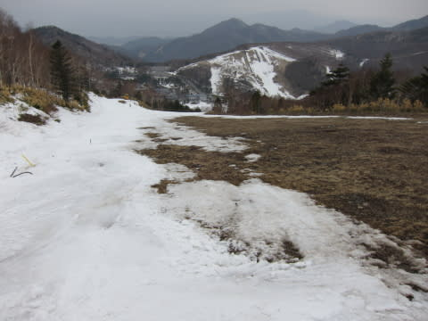

そして，メインの落ち込み部分もこれですか…

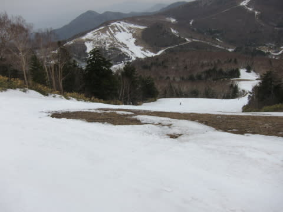

…普通の年なら，ここもクローズするレベルだということは，

間違いない（断定）．

ということで．

一の瀬の正面バーンをグルグルしますが…

雪は死ぬほど重くなってきて．

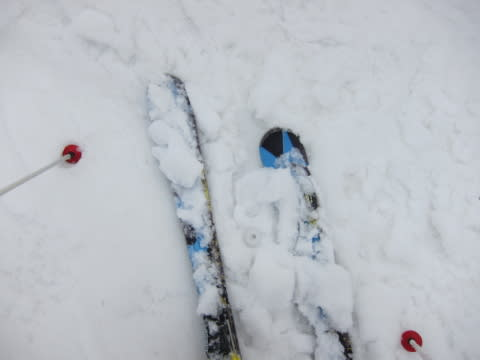

ゲレンデは，超強化版疲労蓄積加速バーンとなり．

強烈に体力が奪われていく…

疲れる．

疲れるよ…

もう，まともに滑れない…

…という雪の状況なので．

やっぱり，他に滑っている人はいませんね…

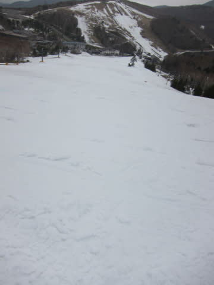

雪は死ぬほど重かったけど．

ゲレンデの人はむちゃくちゃ少なく．

雪も，板に貼りつくストップスノーにならなかったのに救われて．

「この日は早く帰ろう！」

という，朝の思いとは裏腹に．

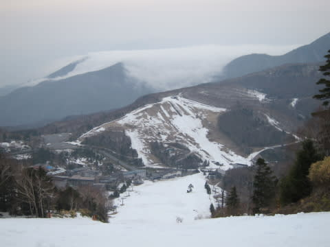

…この日も，いつも通り

リフトストップまで滑ってしまった

Skier_Sなのだった…

しかし．

この週末は，疲れた．

平日がかなり厳しかったのもあって．

土日どっちか休んで，日帰りじゃないと死ぬかも？

と思っていたけど．

良くまぁ，日曜もリフトストップまで滑ったもんだ…←自分にあきれてどうする

## 💬 コメント一覧

### 💬 コメント by (いー)
**タイトル**: Unknown
**投稿日**: 2016-04-12 14:04:40

不整地トレーニングだと思い土日は頑張りました！

午後のファミリーは人も少なくさみしい感じでしたね  

声かけしようかと思いましたがお連れ様がいたのでやめました。

また今度よろしくです 

20000mシールが目印でしたね

GWまで雪があるかな？

### 💬 コメント by (れお)
**タイトル**: この状況は悲しすぎる…
**投稿日**: 2016-04-12 15:24:04

今の時期の志賀がこんななんて…（涙）

数年前のように、ＧＷに雪が降って、新雪を楽しむとか今年は期待できませんかね。

ＧＷにスキーができなかったら、何すれば良いんだろう…。

せっかくの大型ＧＷなのに…

このままだと、ＧＷのかぐらは激混みの予感です

### 💬 コメント by (Skier_S)
**タイトル**: ダメだ…
**投稿日**: 2016-04-13 04:06:06

＞いーさま

あら．

一の瀬で見られてましたか…（汗）．

一の瀬に来たときはかなりヘロヘロになっていたので，

あれを見られていたら恥ずかしいかも…

＃もう，死ぬかと思うほどヘロヘロでした

一緒に滑っていた人も20000mクラブな方だったので，

声をかけていただいて良かったのですが（笑）

また今度お会いした時によろしくお願いします～！

＞れおさま

とても4月の志賀と思えません（涙）

GWにスキーできなかったら，私は死んじゃいます…

