# 2010年7月，2歳の子連れで座間味でダイビングその2…ニューカメラ，デビュー！！

📅 投稿日時: 2021-09-20 01:43:58

🏷️ カテゴリ: [ダイビング日記](ce3a7a8d424d112fce83ee85c81a0e344.md)

えー．

[先日の車検](e858f3669006f21faaff07a0e3313ff46.md)の際に購入したLEVORGのエアコンフィルタ．

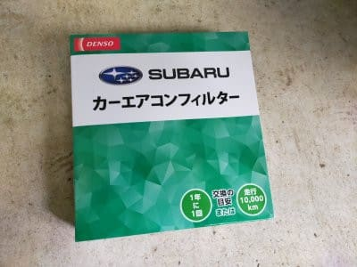

こいつを交換したのですが…

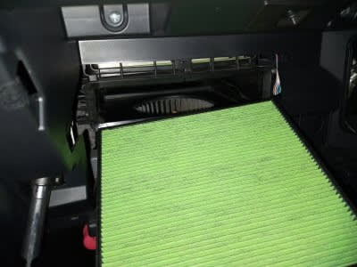

1年半使ったエアコンフィルタを見ると．

うぎゃー！！

すごい汚れてますね…

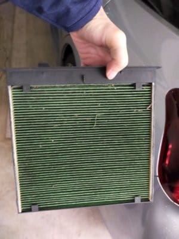

新しいフィルタと並べると一目瞭然…！

エアコンフィルタ，室内へ汚れが入るのを

これだけ防いでくれてるってことですね．

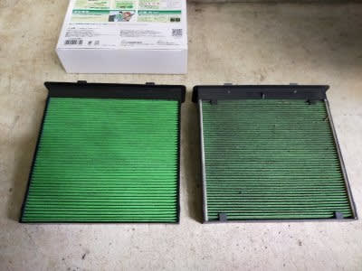

…しかし．

昔の車って，エアコンフィルタなんてなかった

なぁ…

外気導入すると，フィルターを通さない

そのままの外気がはいってくるのが当然

だったんだけど．

車にエアコンフィルタが付き始めたのって

一体いつごろからなのかな？

ってなことで，本題へ．

10年以上前の懐かしダイビング日記です…

では，どうぞ～！

ーーー

ということで．

座間味の1本目．

ニューカメラのデビューに向かったわけ

ですが．

…果たして，ドームレンズの効果やいかに？

絞り優先AEがないカメラで，露出が

合わせられるのか…

ニューカメラデビュー戦のこのダイビング．

果たして吉と出るか，凶と出るか？？？

まだ何も知らない私は，どきどきしながら

ダイビングポイントへ向かったのだった…

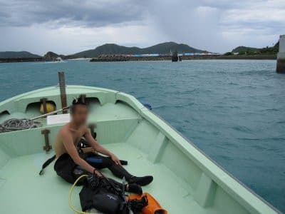

1本目のポイントは…

座間味島北西にある

「新田タイドプール」

湾内の洞窟をくぐった先が，珊瑚で浅い

プール状に囲まれたような海になっている

感じの地形メインのポイント．

まぁ，洞窟があるって，フィッシュアイの

画角の確認としてはもってこいかな？

とりあえず，これが今シーズンの1本目．

…例年のことですが，シーズン初の1本は，

実に約10ヶ月ぶりのダイビング．

久しぶりです．

潜り方を忘れてます．

お約束ですが，フィンをグローブと間違えて

手にはめたり，レギュレータと間違えて

インフレーターに繋ぐ中圧ホースを

口にくわえて潜ったりしないか…

ちょっと心配．←そんなことしないから，普通

しかし，つい先日潜ったばかりのように

違和感無くバックロールでドボン．

をを！

透明度20mくらい．

雨上がりだけど，そこそこ抜けてて．

そんなに悪くない．久しぶりの海だ～！！

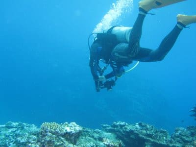

そして．

上の写真がニューカメラの水中デビューの

1枚目ですが．

まぁ，フィッシュアイを着けないと普通は

この程度の画角ですね．

まずは，洞窟へ向かいますが…

ここで，フィッシュアイ装着！！

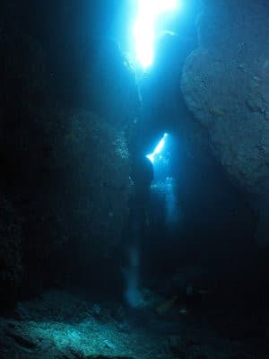

をををっ！

…これは，すごい．

やはり，165度の画角はすごい…

以前のワイコンなら，とても入りきらない

範囲まで写りこむ…！！！

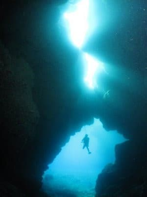

これだっ！

これだよ．

この画角が欲しかったんだ…

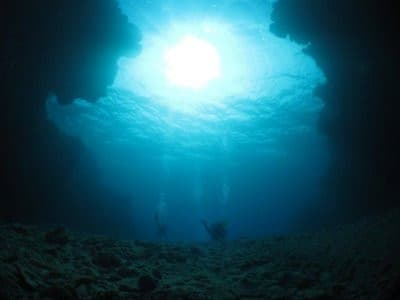

慣れないフィッシュアイの画角，

最初は戸惑うかと思ったけど，

違和感があるどころか，自分が

欲しかったものがこの画角である

ことがはっきり分かりました！！

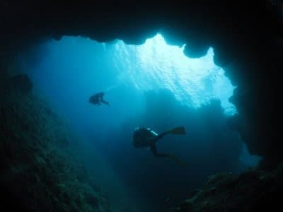

うーーん．

…これはいい！！！

面白い！！

これまでに無かったアングルから攻められる！

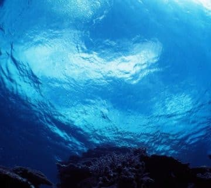

と，初めてのフィッシュアイの画角に

驚きと満足を覚えて．

最初はゴキゲンで写真を撮っていたのでした…
