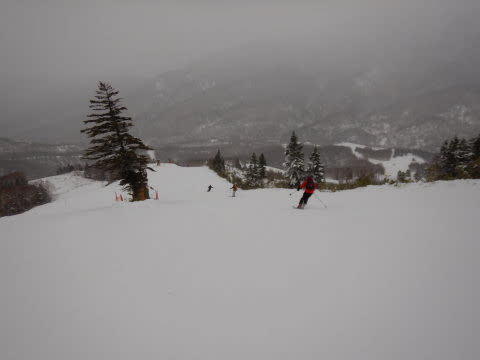

# 2019/12/30(月)の志賀高原は…焼額山頂は雪だけど，ふもとはミゾレ～雨の午前(涙)．午後は止んだけど，気温高め

📅 投稿日時: 2019-12-30 22:07:45

🏷️ カテゴリ: [2020スキー滑走日記](c282e9230de179e245c7334eabeb0a3b3.md)

えー．

かなり以前より，雨の危機を予告していた本日．

やはり，サンバレーや丸池などの標高が

低いところは完全な雨だったようです…

焼額や奥志賀は，ふもとはぎりぎり雨か

ミゾレか…という程度で，山頂は雪のまま

踏みとどまってくれました！！

その雪～ミゾレも午後には止んで，

その後，深夜の現在まで志賀高原は降ってません！

そして．

30日夜から31日朝にかけて，降り始めは雨…

という予想でしたが．

最新の天気図を見ると．

これから明日の朝まで降らなさそうな予想に変わりました！！

30日夜9時から31日朝9時までの降水量予測を見ると…

水色で塗った降水量の予想域，志賀高原を見事に

避けている気が…？？

…拡大すると．

見事に志賀近辺，水色の降水域が

避けている感じですね…！

これは．

明日の朝は，風はあるものの．

志賀高原は雨にならずに済みそう…！！

土砂降りで解けた雪が，低温で固まった

アイスバーンになることは避けられそう！

…でも．

逆に言えば．

雨の後の雪が，それほど降らなさそう…

ということでもあり．

積雪の期待はできない方向に行っているのが

微妙なところ…

とりあえず．

今の志賀高原，風もなく．

雨も雪も全く降っておらず．

穏やかな感じです…

明日の朝，ちゃんとゴンドラが動いてくれると

いいんだけど…

ってな感じで．

本日の志賀高原のレポート，行ってみよう！

まず．

今日は，朝に志賀高原に登る道は，

完全な雪道で．

登り坂の途中で息絶えて，

チェーンを巻いている方もいましたので，

ご注意を…

で．

今日もやってきました，焼額第1ゴンドラ！！

…でも．

8:30営業開始だから…と余裕をかましていたら．

今日はなぜか予定より早めの8:20過ぎに動き出し．

朝イチゴンドラ命の私が，朝イチを逃したのは

ナイショにしておきましょう…←ここに書いている時点でナイショじゃないから

そして．

山頂に登ると．

山頂の気温は-3℃ですね～．

（久しぶりの，1ゴン山頂温度計！）

　　気温は0℃を下回る程度

という予想でしたが．

それよりはちょいと低めですか…

で．

あさイチのゲレンデは…

シマシマ！！！

ちょいと天気は悪いけど．

固めながら，エッジが食い込むちょうど

いい感じに締まった，快適シマシマバーン！！

GSコースは，人工雪でところどころ

硬めの場所があったものの．

いい感じのハイスピードシマシマ！！

GSコースも良かったけど．

昨日オープンした白樺コース．

今シーズン初の挨拶をしに行かなくては

いかんなぁ…

と，白樺コースへ向かいますが…

人工降雪がない白樺コース．

雪は100％天然雪！！

朝のうちは，まだいい感じの雪質で．

最高のバーンコンディション！！

天気も，

昨日の予想に

「朝のうちは雪がぱらつく」

と書いたように．

朝の早くは雪で，幸いになことに

雨ではなかったです…

いや．しかし．

　昼間に向かってグングン気温が上がり，

　午前中，ぱらついていた雪は．

　昼ごろに雨に変わり，午後は降ったりやんだり．

と書いたように．

これがいつ雨に変わるんだろうか…？

と，ドキドキしながら滑ってましたが．

午前10時ごろ．

雨になるニュースの前に，別の悲しいニュースが…

なんと．

故障修理で第1ゴンドラ一時運休！！！(涙)

そのあおりを食って，第3高速リフトが

5分～10分待ちに…（泣）

1ゴン故障のあおりを受けて，

2ゴンも10分待ちまで行ったようです…(涙）

そして追い打ち．

ふもと付近は，雪じゃなく限りなく

雨っぽい霙になり．

ウエアもしっとりと濡れてきました…（激涙）

リフトのフードも，雨粒が叩いてます(泣）

ちなみに，焼額の山頂付近はまだ雪だったのですが．

サンバレーや蓮池，丸池は完全な雨だったようです（泣）

あぁ…なぜこんな予想に限って当たるのか…

1ゴン運休＆雨っぽい霙というダブルショックに

かなりへこんでいた11時前．

何とか1ゴン修理が終わり，営業再開！！

…なのですが．

うぎゃーーー！！

1ゴンのゲート外まで列が…っ！！

とはいえ，輸送力の高い第1ゴンドラ．

これでも5分程度の待ちですんだのですが．

コース上は…

人．

人．

そして，人（涙）

ゴンドラ待ちがあったのはせいぜい30分程度で．

ふもとの雨っぽいミゾレに嫌気がさして，

帰った人が多かったらしく(焼額朝礼メンバ-含む）

昼になると，またゴンドラ待ちは

1～2分待ちまで減りましたが．

とはいえ．ゲレンデの人口密度は

相変わらず高く．

第2高速なども，午後まで人が

結構並ぶタイミングも…

うーむ．

さすが，年末休…

ただ．

午後1時ごろになると．

それまで降っていたミゾレが止んで

くれました！！！

気温は0℃近くまで上がり．

雨っぽい雪のために，ゲレンデの雪は

かなり重い，どっしりとした雪になって

しまいましたが(涙)

…さらに．

人工雪をつけていないコースの一部．

ブッシュが出てくるところもあり．

1ゴン乗り場前も，かなり茶色くなって

来てしまいましたが(泣)

でも．

午後は雨予想だった本日．

その予想をいい方向に裏切って．

最後はうっすらと日も射してきました…！！！

ゲレンデの雪は，ミゾレ＆高温の

おかげで，かなりしっとりした感じに

なり．

明日，このまま冷えるとガリガリになりそう…

という危惧も残りますが．

雨予想の午後から夜にかけて．

全く雨になることなく．

むしろうっすら日が差すくらいだったので．

…これは，私の日頃の行いの良さに違いない

と，自己満足に浸りながら．

今日も定番のラストゴンドラまで

滑り倒したのでした…

うーむ．

ゲレンデの雪が完全に春の雪になっちゃったので．

このまま明日冷え込むと，かなり硬くなりそうですが．

志賀高原，23時現在，全く雨は降ってません．．

「降り始めは雨」という予想を裏切り，

このまま，朝まで雨が降らず．

明日の朝は，いきなりの雪降りで始まるかも…？？？

ただ．

その場合は．

あまり積雪量がなさそうなので．

今日，しっとりと融けてしまったゲレンデ表面が

固まった，なかなか難しいバーンになりそうで．

…そして，風はやっぱり強そうなので．

ゴンドラが動くか微妙．

1ゴンは動いてくれるかも…

とりあえず．

今場から明日にかけて．

雨にならなさそうなだけで，ラッキーなんだけど．

その代わり，31日のドサドサ積雪も可能性が

低くなってしまったのが，ちょいと残念…

いや．今は吹雪いてもなんでもいいから，

雪が欲しい…

雨で水を含んだ雪が凍ったアイスバーンよりは

## 💬 コメント一覧

### 💬 コメント by (ほっぽ)
**タイトル**: 無事お会いできました
**投稿日**: 2019-12-30 23:21:09

Ｓさん

今日は最後の最後でお会いできてよかったです。

多分、ラスト１時間で１ゴン回していたら、

どこかで捕捉されると思っていましたが、予想通りでした。

あの湿った雪？雨？の中、ラスゴンまで滑られたのは流石です。

明日もゴンドラ動いたらヤケビスタートの予定です。

明日で一旦帰宅して1/4、5で再起動します。

今シーズンもよろしくお願いします。

http://www2.tokai.or.jp/nana_hoppo/

### 💬 コメント by (Hide)
**タイトル**: さすがです
**投稿日**: 2019-12-31 00:45:02

1ゴン山頂で今年初のご挨拶ありがとうございました。

今シーズンもよろしくお願いします。

今日のコンディションでもラストまではさすがです。

私は重くモサモサした雪だったので15:00前で切り上げました。

しかし今年は暖かい・・・

明日もあまり降らないとなると、まぢでちょっとヤバイですね。

### 💬 コメント by (地元民)
**タイトル**: Unknown
**投稿日**: 2019-12-31 01:11:56

里からみたら、志賀高原の山々がみえたので、雨だろうなとは思ってました。ただ岩菅山、焼額山はよく見えないので・・・。雪、だったんですね。竜王山は山頂まで見えてたので、雨だったんでしょうね・・・。

### 💬 コメント by (そとく)
**タイトル**: Unknown
**投稿日**: 2019-12-31 01:36:56

はじめまして、この年末から、読ませて頂いてます。

30代後半から小学生になった娘と一緒にスキーを初め、すっかりスキーの魅力に取り憑かれ、ここ3年毎年娘を送りこんでいる志賀高原スキーキャンプの話に当てられて、初めてハイシーズンの志賀高原の西日本から、12/30-1/3予定でやってまいりました。

雪不足シーズンという事もあり、年末にキャンセルか否か悩んでおり、ギリギリのタイミングまで、悩んでおりましたが、本ブログを読んで、直前の大雪予報を知り、キャンセルせずに昨日、焼額山を楽しんでました。

結果、来てよかったよ思います。一言、お礼をもうあげたく書込みさせて頂きました。

本当ににありがとうございます。

これからも楽しい文章とスキーヤー独特の天気予報を楽しませてください。

### 💬 コメント by (ノーザンレインボー)
**タイトル**: Unknown
**投稿日**: 2019-12-31 05:56:30

いつも楽しく読まさせて頂いています。昨年、一の瀬の試乗会の時にステッカーを頂いた者です。

今年は早割の魔力に負けてHakubavalleyのシーズン券に浮気してしまい、雪不足と激しい混雑にやられています。

それで早くも志賀高原が恋しくなって、一昨日、昨日と来てしまいました。結果、サイコーです。

来年からは浮気をしない事を志賀高原の神に誓おうと思い、書き込みをさせてもらいました。

今シーズンもブログを楽しく、そして羨ましく思いながら読まさせていただきます。

### 💬 コメント by (musi)
**タイトル**: Unknown
**投稿日**: 2019-12-31 06:13:48

年末のドカ雪降って欲しいですね。

私達は昨日滑って帰京しました。

昼ものんびり奥志賀のグランフェニックスで少しリッチなランチを楽しんだおかげで、それ程雨にやられた感じはしなかったのですが、春スキーの雰囲気で、奥志賀もだいぶ茶色やブッシュが目立ち始めてしまってます。

エキスパートコースもコブコブです。オープンした寺子屋も雪が少なくブッシュが出てる部分が多くて、本来の地形がまだ感じられました。まあ、でも全体的に楽しい志賀高原を楽しみました。Sさんともすれ違ったかな？良い年末年始スキーになると良いですね。東京で、ヒエヒエ踊りを踊ってお祈りしてます。

帰ってすぐに、また志賀に行きたい病が…,

### 💬 コメント by (おおすぎ)
**タイトル**: Unknown
**投稿日**: 2019-12-31 12:20:54

Sさんこんにちは

不思議ですね！関東南側特に東京なんて、雨で気温が全く上がらず(この時期特有の寒気も南下させて)日中なんて6度位でしたよ！

夕刻から、天候が回復したのと気温の上昇は、志賀高原と一緒ですね。

年始のどか雪、期待ですね！(ただ、交通機関がマヒするほど来られると、また雪国に被害が被ってしまい、それも問題ですが…)

今年一年、楽しく拝読させて頂き、有難う御座いました。

来年も、宜しくお願いいたします。

### 💬 コメント by (Skier_S)
**タイトル**: 2019年もお世話になりました
**投稿日**: 2020-01-01 00:39:42

＞ほっぽさま

今日は何度かお見かけしたのですが，タイミングが合わず，

一緒に滑れませんでしたね…

また4日にお会いしましょう！

＞Hideさま

今シーズンもよろしくです～！

今日は意外と積もらなかったのですが，明日からオリンピックコースも

開くし，着実に積雪は増えてます．

地獄の2016シーズンよりかなりマシな状況なので，

まだ何とか我慢できるかな…

と思いながらも．

やっぱりドサドサ降ってほしいですよね！

＞地元民様

焼額は，山頂はずっと雪で，雨にはなりませんでしたよ～！

焼額はおかげさまで，それほど雪のコンディションは

悪化せずに済みました．

＞そとくさま

初めまして～！

このBlogがお役に立てたようで良かったです．

1月3日までいらっしゃるのですか．

焼額をグルグル滑ってますので，見かけたらぜひ声をかけてください～！！

＞ノーザンレインボーさま

ダメですよ．浮気しちゃ（笑）．

志賀に忠誠を誓いましょう！

まだ志賀高原のシーズン券買えますよ（笑）．

ぜひ志賀高原にまた滑りに来てください！

＞musiさま

奥志賀は，今日は雪が薄くてエキスパートは圧雪が

かけられなかったようで，かなりコンディション悪化が進んでます…

焼額は大丈夫なのですが，もう一降りほしいところ…

志賀に行きたい病になられたなら，病気に逆らわず，

ぜひ志賀高原へお越しください（笑）．

＞おおすぎさま

ホントに，どか雪が欲しいところです…

2019年もお世話になりました．

今年もよろしくお願いします～！！

