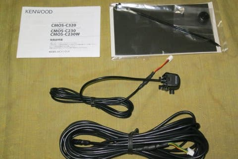
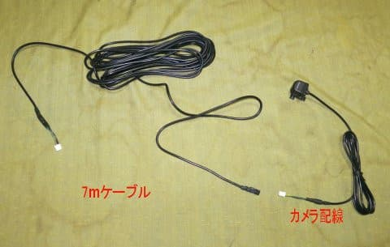
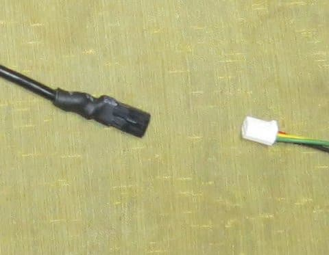
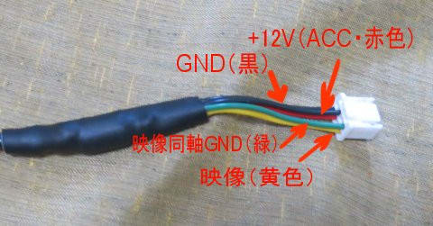
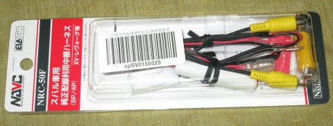
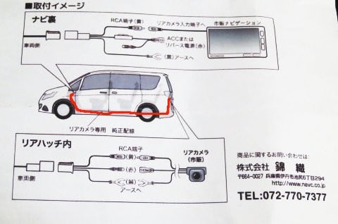
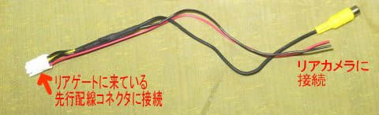
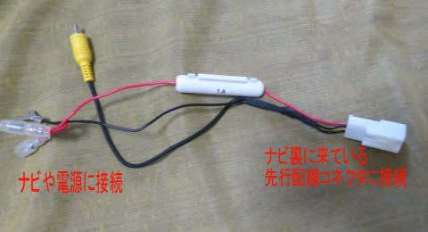
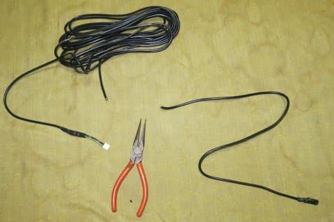
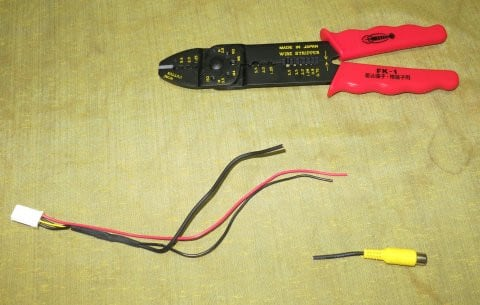

# プロジェクトX2第2章…LEVORG E型にリアカメラをつけてみた・配線加工編

📅 投稿日時: 2018-07-22 03:17:29

うーむ．

今日のネタを，自動車ネタと言っていいのだろうか…

とりあえず．

今回新車で購入した，LEVORG E型への

ナビ・ETC・リアカメラの3種の神器（？）の

取付を行うわけですが．

その中でも一番の難題が，

リアカメラの取り付け．

今回は，リアカメラとして．

KENWOODナビ独自コネクタ仕様の

CMOS-C230を買ったわけですが．

このリアカメラ．

こんな感じで，短めのカメラ配線と，

カメラからナビまでつなぐための7mケーブルが

セットになっていて．

カメラと7mケーブルをつなぐコネクタは

かなり小型な特殊コネクタになってます．

…これは，カメラにつながるケーブルを

車外から車内へ引き込む際に，

大きな穴を開けなくても済むよう，

小さい特殊コネクタになっているようです…

ナビ側のコネクタは，+12VとGND，映像と映像GNDの

4種類の線がつながるようになっており．

こいつを，KENWOODナビの専用コネクタに挿せば，

別途ACCやアース線を取る必要がなく．

配線がシンプルになるように作られています…

…という，シンプルな専用コネクタの配線を，

そのまま使えばいいんだけど．

今回，

この7mケーブルをリアゲートからナビ裏まで

配線するのはめんどくさい

のだ．

…ということなので．

取り出しましたる，この純正配線利用中継ハーネス．

こいつを使って．

LEVORGに元から配線されている，

純正リアカメラ用のハーネスを活用することに

したのだ…！！

このケーブルは．

マニュアルを見て分かるように…

純正リアカメラ用に先行配線されている純正配線．

こいつに，市販カメラ＆市販ナビを接続

できるようにする，スグレモノなのだ！

…ただ．

このコネクタ形状を見て分かるように…

（リアカメラ側）

（ナビ側）

一般の，RCAコネクタタイプのカメラを

繋ぐためのケーブルで．

今回私が購入した，CMOS-C230のような，

特殊コネクタのカメラを繋ぐことを全く

考えてないのだ！

というわけで．

ケーブルを潔くちょん切って，加工してみましょうか…

（続く）←リアカメラ編だけで何回分の記事を書くつもりだ？？

## 💬 コメント一覧

### 💬 コメント by (もりや)
**タイトル**: SUBARU車
**投稿日**: 2018-07-22 16:21:15

SUBARU車をいろいろ試乗し、スキーに行く車として最後にXVとフォレスターが残り、ツーリングアシスト、全席シートヒーター、ステアリングヒーター、アダプティブドライビングビーム、2X-MODE等の装備、室内の広さでフォレスターを契約しちゃいました。私も今シーズンよりSUBARU車で通いますので宜しくお願いします。

### 💬 コメント by (Skier_S)
**タイトル**: もりやさま
**投稿日**: 2018-07-23 04:44:34

をを！

フォレスターご契約ですか…

おめでとうございます．

家族でスキーに行かれるには，

XVよりは良い選択だと思います…

これにルーフボックスつければ無敵かと…

### 💬 コメント by (ほっぽ)
**タイトル**: Unknown
**投稿日**: 2018-07-24 07:08:23

Ｓさん

うーむ、配線加工の作業を考慮すると、

内装脱着してKENWOOD配線を通した方が時間的に早いかも

と思ってしまいました。(^^;

左側面内装、全部剥がさなくてもカー用品店に売っている

配線通しを使えば結構早くに貫通できる気がしました。

### 💬 コメント by (Skier_S)
**タイトル**: ほっぽさま
**投稿日**: 2018-07-25 00:31:47

そうなんですよ…

配線加工するのも結構めんどくさいんですけど．

私ははんだ付けやら配線加工は得意なので，

内装剥がすよりこっちが楽だと感じました…

普通の人は，こんな細線同軸の接続するよりも，

普通にRCAコネクタのカメラを買ってきて

そのままつなぐのが正解かと（笑）．

### 💬 コメント by (Skier_S)
**タイトル**: ほっぽさま
**投稿日**: 2018-07-25 00:32:12

そうなんですよ…

配線加工するのも結構めんどくさいんですけど．

私ははんだ付けやら配線加工は得意なので，

内装剥がすよりこっちが楽だと感じました…

普通の人は，こんな細線同軸の接続するよりも，

普通にRCAコネクタのカメラを買ってきて

そのままつなぐのが正解かと（笑）．

### 💬 コメント by (ほっぽ)
**タイトル**: ハンダ付け
**投稿日**: 2018-07-25 06:59:00

Ｓさん

私もカー用品取り付けでギボシ加工やハンダ付けもやりますが、

Ｓさんの考え抜いた加工は凄いです。

確かにKENWOODカメラの特殊端子（小型）は活かしたいですよね。

しかし、これで私が下取りしたあとにカロナビに

入れ替えようと思ったら、カロナビリアカメラの配線は

一からやり直すんだな、と思った今日この頃でした。(^^;

### 💬 コメント by (Skier_S)
**タイトル**: ほっぽさま
**投稿日**: 2018-07-26 00:50:47

あ，車載配線にはんだ付けする方が

ここにもいらっしゃいましたか！

かなりレアな存在かと思っていました…

ちなみに，この改良をしたリアカメラでも，

ナビ側の中継ハーネスを普通のRCAコネクタの

ものに取り換えれば，

そのまま普通のナビに接続可能です！

### 💬 コメント by (ほっぽ)
**タイトル**: Unknown
**投稿日**: 2018-07-26 06:52:21

Ｓさん

レヴォーグ納車儀式を見ていて、私と似た趣向の人が世の中にはいるもんだな、と思う今日この頃です。(^^;

でも、Ｓさんの方が私より遥かに手間をかけています。

確かに、車体側ハーネスは無加工なので、

カメラとナビの中継ハーネスを別に買えば復活しますね。

恐らく次のオーナーのことも考えてくれた、素晴らしいアイデアだと思います。(^^;

### 💬 コメント by (Skier_S)
**タイトル**: ほっぽさま
**投稿日**: 2018-07-27 04:34:49

似てますでしょうか（^^;

私はあんまり足回りやエンジンはいじらないのですが（笑）．

とりあえず，私は車両側に手を入れるのがあまり好きではないので．

今回のナビも，後付けハーネス側で何とかするなど，

元通りにできる方法で加工しています～！

### 💬 コメント by (Unknown)
**タイトル**: Unknown
**投稿日**: 2023-10-21 20:55:15

ケンウッドのリアカメラをRCAにて変更する方法教えていただけませんか？

### 💬 コメント by (Skier_S)
**タイトル**: ＞Unknownさま
**投稿日**: 2023-10-22 01:46:59

カメラ側の黄色ケーブルをRCAコネクタから出てる同軸心線に，

カメラ側の緑色の線をRCAコネクタの同軸被覆線につなげばRCAに変更できるはずです．

あとはカメラ側の赤線を+12V（ACC)へ，黒色をアース（GND)へ接続で動くはずです．

