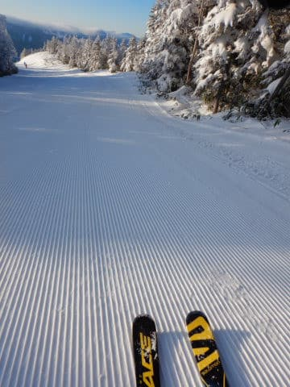
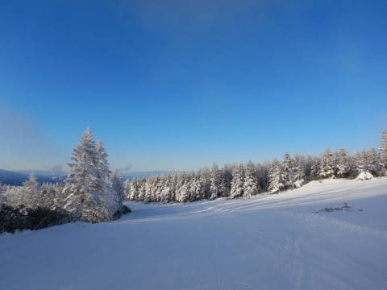
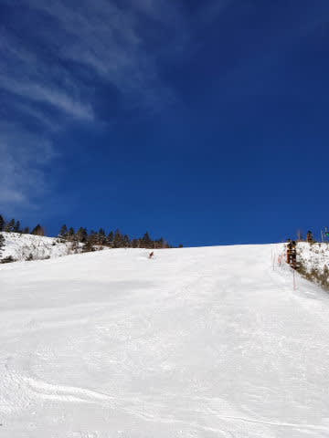

# 2020シーズンはまだ終わってない！終わってないけど…スキー断ちすでに2か月半

📅 投稿日時: 2020-06-16 02:10:22

えー．

なぜかBluetoothイヤホン記事のアクセス数が

スキー関係記事より圧倒的に多く．

「このBlog，スキーBlogなんですけど（涙）」

と．

いつもながらにこのBlogのアイディンティティを

疑う事態が続いている今日この頃，

皆様におかれましては，ますますご健勝のことと

お慶び申し上げます（以上，時候の挨拶）

しかし．

スキーBlogと名乗っておきながら，

最後に志賀高原に行ってから，

はや2か月半が経ちましたね…（遠い目）

…そもそも，普通のシーズンなら6月末～7月頭の

月山まで滑り．

10月半ばのYetiから滑り始める私にとって．

普段であれば，

スキーのオフシーズンですら3か月半程度．

（そして，オフシーズンはダイビングやら

　何やらで気を紛らすことができる）

だのに．

今回．

ダイビングやらなにやらの他の気晴らしが

全く無い状態で，

スキー断ちして2か月半…

その間スキー場レポートは全く無く．

車ネタやらスマートウォッチネタばかり

やっていて，

「どこがスキーBlogやねん！」

と突っ込まれる記事ばかりだったので．

最近から読み始めた読者の方は，ここのBlog主が

スキーやらないと死んじゃう病

にかかっているスキーヤーだと知らない方も

いるのではないでしょうか…←ないから．そんな病気，ないから！！

…でも，

この2か月半．

「スキーしないと，激務のストレスに耐えられないっ！！

　スキーやらないと死んじゃう病で死ぬっ！！」

と思っていたけど．

意外なことに，まだ生きているようなので．

人間の3大欲求，

寝たい，食べたい，滑りたい

が満たされなくても，

人間って，生きていけるんだなぁ…←なにか間違ってないか？

いや．

人間の3大欲求って，

生存に必要な最低限レベルの欲求で．

これらの欲求が満たされないと，本来なら

生命が危険にさらされるレベル．

それが，滑らなくても生きているなんて…！

やっぱり，普段から睡眠時間を削って滑ったり．

ご飯を食べずに滑るなど．

人間の三大欲求に打ち勝つ訓練をしてきたから．

滑らなくても耐えられるようになったのかも…っ！！←違う．ちがうから．絶対いろいろ間違ってるから

人間って，強い…←違う．感動するところ，そこじゃないから…

とはいえ．

今週末に月山が滑れることを信じ，

まだスキーシーズンが終わっていない

ってことだけを心の頼りに生きているので．

今週末，月山に行けなかったらこんどこそ倒れるかも

今週末は月山滑れますようにっ！！

…でも．

この夏，ダイビングにも行けるんだろうか…？？

フィリピンは無理っぽいな（涙）

## 💬 コメント一覧

### 💬 コメント by (mkb)
**タイトル**: Unknown
**投稿日**: 2020-06-16 08:48:06

月山リポート、リモートじゃなく楽しみにしてまーす!

東海スキーヤー。

### 💬 コメント by (hiro)
**タイトル**: Unknown
**投稿日**: 2020-06-16 08:51:47

Sさんブログ愛読者のhiroです（今シーズン一の瀬クワッドで念願のナマS さんに会えてご挨拶できました～）。

今週末、月山で滑れなかったら、志賀高原で根曲がりタケじゃないですか？

ワタクシは千葉県民ですが、先週末は政府指導に従い「慎重に」志賀へ移動して根曲がりタケを堪能、収穫はビン詰め８つでした！　正に今が旬ですよ、今週末を逃すと・・・だと思います。

月山だめなら「慎重に」志賀高原もアリじゃないですか？

### 💬 コメント by (Northfox)
**タイトル**: Unknown
**投稿日**: 2020-06-17 00:36:34

神田ではこの前の土日から19-20モデルの板が旧品扱いになってグッと安くなったようです。

なんか例年よりも安いかも．．．

「この板はお幾らですか？．．．ふむふむ、それにプラス消費税ね．．．エッ！！税込みですか！？」

って感じでした。

神田も今が旬だと思います！

### 💬 コメント by (Skier_S)
**タイトル**: 今週末は月山に行きたいのだが…
**投稿日**: 2020-06-17 03:03:53

＞mkbさま

月山レポート，今度こそ特派員じゃなく本人レポートで行きたいです…

…でも，仕事が多忙すぎて，ホントに行けるのか…（涙）

＞hiroさま

コメントありがとうございます～！！

いや，志賀高原でネマガリタケ行きたかったのですが．

今シーズンはコロナウイルスの影響で，一般入山禁止なんですよね…

https://www.shigakogen.gr.jp/news/entry-434.html

和合会会員のみの入山だったはずなので，残念ながら

毎年行っていたタケノコ狩りも，今年は見送りです…（涙）

＞Northfoxさま

ををを！！

神田！

惹かれますね～．

…でも．

危険すぎる…

