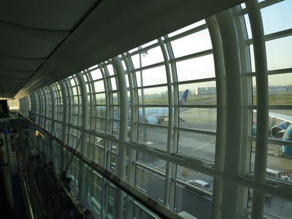
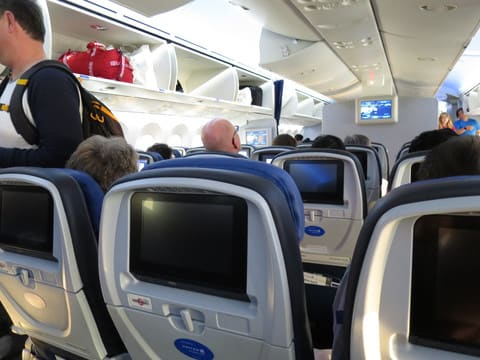
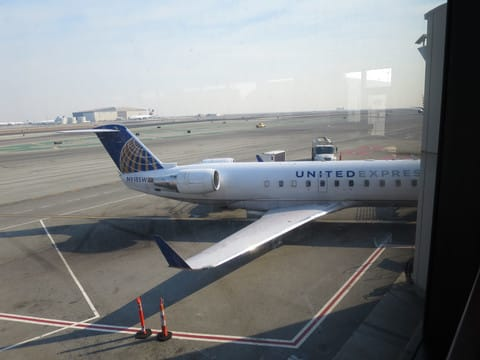

# 某国へ出張中

📅 投稿日時: 2018-11-13 00:27:18

昨日日曜昼過ぎに家を出て．

羽田空港にやってきて…

そこから飛行機に乗り9時間．

さらに乗り継ぎ便で約4時間のフライトで．

計13時間のフライトで，某国某所へ

来ています．

…はっきり言って．

土曜の夜，ナイター最終まで滑ってる

場合だったんだろうか…

という状態なのですが．

こちらはただ今，月曜日の朝．

これから一週間の現地滞在です．

もしかしたら今週は更新が滞るかも

しれませんが．

ぼちぼち更新していきます…

## 💬 コメント一覧

### 💬 コメント by (yumi)
**タイトル**: お米の国カナ⁉️
**投稿日**: 2018-11-13 16:12:41

Ｓさぁ～ん🌠✈️🎊

TEDくんに乗って、9時間+4時間って、あの国のあの辺りでしょうか❓

今週から軽井沢で滑ってますが、今日、シルバーステッカーを見て、声を掛けてもらいました。

｢どなたからシルバーステッカーを貰ったのですか？｣

って聞かれました🎵

｢Ｓさんです｣

と、お返事して、

｢貴方はどなたのグループですか❓｣

って、お聞きすると、

｢Ｓさんです｣と答えてくださいました。

ちょっと、嬉しかったでぇ～す✨✨✨

### 💬 コメント by (Skier_S)
**タイトル**: yumiさま
**投稿日**: 2018-11-13 17:23:19

はい．

米どころ新潟じゃない某国です．

今週末に無事戻れればいいのですが…

また，昨年みたいに機体故障で遅れないことを

### 💬 コメント by (Goku)
**タイトル**: 今年も・・・
**投稿日**: 2018-11-13 18:48:45

今年も帰国したら速攻でイエティーですか（笑）

それにしても、20000ｍ倶楽部布教活動の成果が凄いですね。

いったい今何人の方がシルバーステッカーを持っているのやら？

### 💬 コメント by (まうちゅう)
**タイトル**: Unknown
**投稿日**: 2018-11-13 21:14:42

搭乗中は貴重な爆睡タイムですね。

### 💬 コメント by (しんちゃん)
**タイトル**: お気をつけて
**投稿日**: 2018-11-14 00:01:30

お勤めご苦労様です。

お体とトラブルに注意して、無事の帰国をお祈りしております(笑)

### 💬 コメント by (Skier_S)
**タイトル**: 某国にて
**投稿日**: 2018-11-14 01:23:17

＞Gokuさま

今年も予定だと土曜夕方帰着，

日曜に滑りに行く予定なのですが…

また飛行機が遅れないことを祈るばかりです(笑)

＞まうちゅうさま

そうなんです．

飛行機の中は貴重な睡眠タイムです．

でも，映画2本見ちゃいましたが…

＞しんちゃんさま

無事こちらでの仕事をやり遂げないと帰れません…(笑)．

なんとか頑張って，今回こそ予定通り帰国します！

### 💬 コメント by (若杉勲71)
**タイトル**: Unknown
**投稿日**: 2018-11-16 00:58:09

お仕事お疲れさまです。12月01日の焼額のスキー場開きに照準を合わせているのですが、このままだと心配です。予報士さんの展望はいかがでしょうか。

明日から湯田中の借家に荷物をはこびます。yumilinさんはもう滑っておられるようですし、皆さん凄い。gokuさんも見かけたらお声かけくださいね。

### 💬 コメント by (Skier_S)
**タイトル**: 若杉さま
**投稿日**: 2018-11-16 17:25:16

うーん．

23日前後にいったん冷えますが，

そのあとはあんまり冷えなさそうです…

12月1日は，人工雪でぎりぎり4ロマ営業…，

というところかと．

第1週は2高は厳しい気がします…

明日から湯田中ですか…

今回は借家なんですね．

私も第1週から焼額の予定ですので，

またお会いしましょう！

