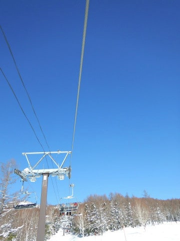
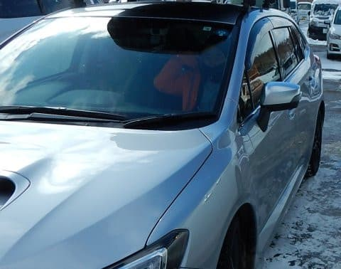
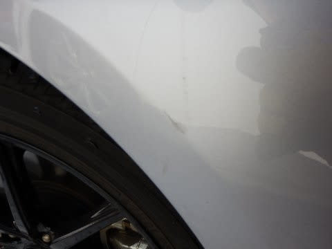
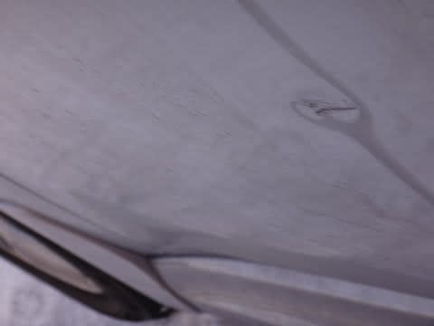
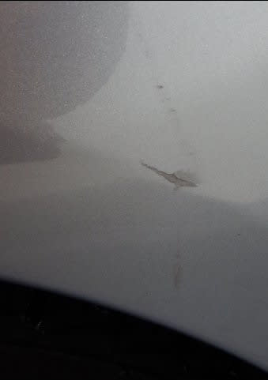
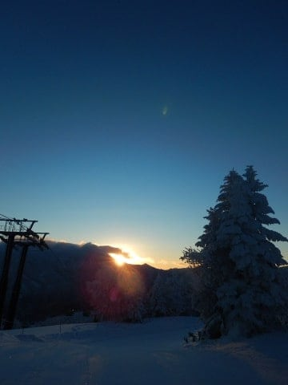
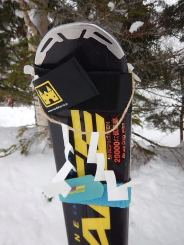

# なんてこった～！！！まだ新車のLEVORG君，ドアガッツンされる（涙）．ダメだ…徹底的についてない．

📅 投稿日時: 2019-02-08 01:10:46

とりあえず．

明日金曜の朝から，志賀高原は多少雪が積もって

くれそうなものの．

…残念ながら，ドサドサパウダーにはならず．

週末までに，硬くなった下地の雪が隠れきって

くれるほどは積もらなさそうですね…（ちょい涙）．

でも，気温はかなり冷え冷えで．

概ね曇り～小雪がぱらつく3連休になりそうで．

雨になったり，吹雪いたりもしないので．

パフパフパウダーや，終日晴天には恵まれなさそう

ではあるけど．

まぁ，志賀のトップシーズンらしい，

穏やかな週末を過ごせるのかな…

とりあえず．

1月に入ってから．

成人の日の3連休は風邪をひき

次の晴天の週末には法事でスキーに行けず

2週間ぶりのスキーは悪天候で短縮営業＆ナイター無し

…という呪われた週末が3週連続で続いていたわけですが．

先週末は，天気もよく．

そして，営業終了までギリギリ雨にならず．

ついに呪いは解けたのか！？？？

…と，思ったわけですが．

…しかし．

先週末．

いつも通り，第1ゴンドラの駐車場に止めておいた，

我が愛車LEVORG君が…

…なんてことだ～っ！！！

フロントフェンダーにドアガッツンされてる

じゃないか～っ！！！！

…それも．

塗装が剥げてるだけじゃなく．

ちょっと凹んでるんですが…！！（涙）

うがーーー！！

まだ納車から半年しか経ってない，ピカピカの新車なのに…っ！！←でも，もう1万5000km超えてるけど

なんてこった…

前のBRレガシィ君も．

購入後わずか半年でドアガッツンされたけど…

（ドアガッツンされたレガシィ君）

まさか．

まさか，2台続けて．

購入後半年の新車をドアガッツンされるとは…（激涙）

私が新車を買うと，半年でドアガッツンされる

宿命にあるのか…？

ダメだ．

ここ4週連続，ダメだ．

何かの呪いは解けていないようです…（泣）．

今年，2019年は．

元日に，見事な初日の出を見ることができて．

「今年はいい年になるに違いない！」

…と，思ったのに…

…ダメだ．

今年はダメだ（泣）．

「きれいな初日の出を見ることで，

　この一年の運を使い果たしたんじゃない？」

という指摘をする方もいますが．

初日の出を見たらその年は不運になるという，

そんな話は聞いたことが無い．

しかし．

実は今年は．

もしかしたらインフルエンザでスキーに行けなくなるはずが，

風邪程度で済んだのかもしれないし．

猛吹雪で遭難して凍死するところが，リフト営業短縮＆

ナイター営業無しで済んでいたのかもしれないし．

私の命を狙うテロリストに車を爆破されるところが，

ドアガッツン程度で済んだのかもしれないし←そんなわけないから

初日の出を見れたから，この程度で済んだ

という，謎のポジティブシンキングで

自分をごまかして乗り越えよう…（涙）

とりあえず．

この悲しい出来事のあと．

どなたか気の利いた方が，私の板に

厄避けの注連縄を着けて行ってくれたので…

この注連縄効果で呪いが解けて．

今週末こそ何も悪いことが起きない，

平和な週末を過ごせることを

祈る，Skier_Sなのだった…

## 💬 コメント一覧

### 💬 コメント by (若杉勲71)
**タイトル**: Unknown
**投稿日**: 2019-02-08 11:24:37

書きこめない。やっと一人の書き込み発見。治ったのかなあ。

やっぱり書きこめない。

### 💬 コメント by (若杉勲71)
**タイトル**: Unknown
**投稿日**: 2019-02-08 11:29:17

やっと書き込めました。

私はロボットではありません　という怪しげなボタンを押して、不安だけど指示通りにしたら、、、

やっと書きこめました。皆さん困っておられるのでは？

### 💬 コメント by (若杉勲71)
**タイトル**: Unknown
**投稿日**: 2019-02-08 11:49:44

志賀高原情報をたくさん書いたのに、またもや消えてしまった。仏滅仏滅。

ストレスのたまる変更ですね。

### 💬 コメント by (はなげ親分)
**タイトル**: Unknown
**投稿日**: 2019-02-08 11:50:16

お祓いをしましょう‼️

メンバーに神主さんいませんか？

### 💬 コメント by (若杉勲71)
**タイトル**: Unknown
**投稿日**: 2019-02-08 12:01:14

志賀高原情報

積雪3-5センチ。少なすぎてがっかり。だけど気持ちよく滑れます。オリンピックでは前日109キロだったのに今日は82キロ。前日GSで114キロ出した相方のひろさんは今日はオリンピックをちょっかりましたよ。信じられない。

しばらくは冷えそうです。気をつけてウエルカム志賀。

### 💬 コメント by (naoちゃんねる)
**タイトル**: Unknown
**投稿日**: 2019-02-08 13:03:19

うわー、これはヒドイですね(涙)心中お察しいたします…

私はショッピングモールとかは入り口からかなり遠くの端っこに止めたりかなりドアパンチを警戒してるのですが、スキー場だけはどうしようもありませんよね。しかもドアパンチ以外にもスキー、スノボ板といった凶器もありますし(汗)

きっと、これから良いことありますよ！毎週末がスキー日和の快晴だとか、GWまで平年以下の冷え込みが続くとか、志賀高原のご神体であるsさんのX-RACEに高額のお賽銭が納められているとか！

### 💬 コメント by (タカ)
**タイトル**: Unknown
**投稿日**: 2019-02-08 20:46:34

久しぶりのコメです。現在北海道にて仕事しており、パフパフパウダーを満喫中でござる。今年は雪少ないみたいですが。三連休、関東大雪予報ですね。志賀高原から帰れない過去の地獄が再現されないように祈っております

### 💬 コメント by (なるなる)
**タイトル**: Unknown
**投稿日**: 2019-02-08 21:05:34

私のLEVORG君も、納車2ヶ月経ってないのに、キズが2ヶ所も…

自分でやってしまったのか、やられてしまったのかわかりません。

もう、スキーに行く車だから仕方ないと思っています。

1ヶ所はコンパウンドで磨いても凹んでるし乗り降りする度に目に付くので、新車だし

直そうかとは思っているのですが、スキー優先で時間が無くて直しに行けないです。

今週末、良い事が起きる事を祈ってます。私は行けないのでレポート楽しみにしています。

### 💬 コメント by (Goku)
**タイトル**: Unknown
**投稿日**: 2019-02-08 21:55:39

これは泣くに泣けない事故ですね(>_<)

おなじ先週の日曜日、板を担いで歩いてきた人が私のクルマの横で転んで、危うく板がクルマにぶつかるところでした。

止める場所も考えた方が良いかもしれませんね。

### 💬 コメント by (Skier_S)
**タイトル**: 3連休は太陽拝めず（涙）
**投稿日**: 2019-02-08 23:03:19

＞若杉さま

無事コメント投稿できたようで良かったです…

ご指摘の「私はロボットでは…」ボタン，さっそく

ネタにして書かせてもらいました．

志賀のアイスバーンはまともになったんでしょうか？

しかし，オリンピックチョッカリとは…

また今週末お会いしましょう！

＞はなげ親分さま

だれか，お祓いしてください…（懇願）

どうやらまた風邪をひいたようです．

今年はダメです…（涙）

＞naoちゃんねるさま

私は車は道具だと割り切って，結構無造作に扱うのですが…

でも，あんまりぶつけたりこすったりしないんですが．

駐車場所に頓着しないからか，人にぶつけられること多数…（涙）

確かに，板の前に賽銭箱を置いて，賽銭でも集めたい気分です(笑)．

＞タカさま

をを！

お久しぶりのコメントですね…

北海道で仕事って…まさか転勤ですか？？

3連休，関東はそんなに降らないと踏んでいます．

少なくとも私が帰る最終日までには，関東の道路は雪が消えているはず…！（その楽観が死を招く）

＞なるなるさま

あら．

2か月の新車，もうそんなに傷が…

私もドアガッツンを修理に出す時間が無くて困ってます．

平日は夜中まで仕事だし，休日は全てスキーだし…

＞Gokuさま

もう，泣くに泣けない…というより，泣くしかない

出来事でした．

スキー場の駐車場は危険がいっぱいですね…

止める場所も考えないといけませんが，

やはり板を2セット持って，あまり遠くまで歩きたく

無いという個人的事情が…

