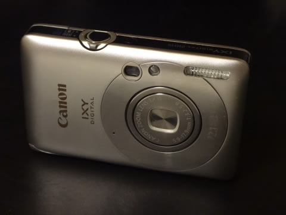
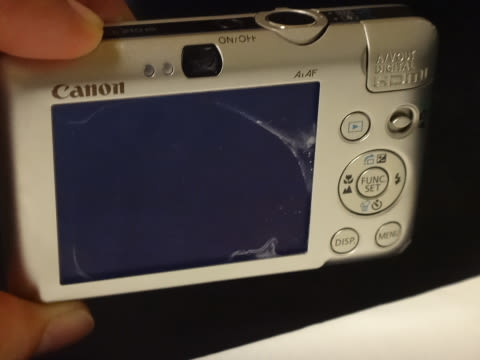
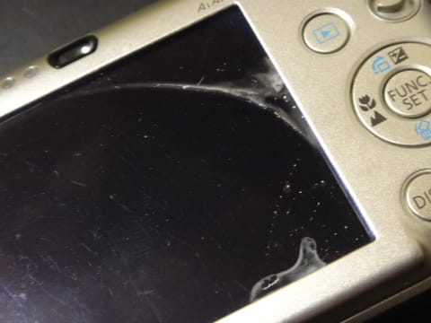

# そーいや，去年のパラオでカメラ水没させてたんだっけ…（涙）

📅 投稿日時: 2015-07-30 02:11:39

えー．

去年のパラオ日記が続いてますが．

なんと．

[この夏休みのダイビング旅行](e68444e8a19ee4ce4aa424a8dc5d1f2a4.md)が，もう一週間後に迫っているではないですかっ！！

＃ホントに来週夏休み取れるのかなぁ…

ってことで．

そろそろ準備をせねば…

と，思い立ったところ．

肝心なことを忘れていたではないか．

昨年のパラオで．

うちの妻．

カメラを水没させてたんだった…（泣）．

…妻が使っていたのは，5年物のIXY210という，かな～り古いカメラ．

水没って言っても，カメラが水浸しになってしまうような水没じゃなく，

気づいたら，ハウジングの中にわずかに水が溜まっていて．

しばらくは動いていたけど．ついに最後，エラーで起動しなくなった…

という感じのパターン．

あとで見てみると…

ちょっと本体内部に，水が入った跡が…（悲）．

水没してお亡くなりになったのが，

パラオ最終日の最終ダイブ完了後，

浮上してから…というのが，せめてもの

救いだったのかな…

この，妻ダイビング用のカメラ．

水没したとはいえ．

5年間，約2万枚を撮影したわけで．

まぁ，これだけ酷使されれば十分使い切った，と言えるか…

私「…今度のフィリピン，水中カメラなしでもいいよね…」

妻「いや．カメラ，欲しい」

私「でも，水没させたよね…」

妻「安いのでいいから，カメラほしい」

私「…」

ということで．

我が家の力関係の反映の結果．

妻用のカメラを買うことに決まったのだが．

…なんだか，最近．

毎年デジカメを1-2台ずつ買ってるような気がするのは，

気のせい？？

とりあえず．

カメラ買い替えプロジェクト，始動…っ！

（続く）

## 💬 コメント一覧

### 💬 コメント by (piyo@太田市)
**タイトル**: あれ？
**投稿日**: 2015-07-30 09:28:07

この流れからは、sさんなら当然分解して直すのでは？？

### 💬 コメント by (Skier_S)
**タイトル**: piyoさま
**投稿日**: 2015-07-31 01:53:13

…他の故障ならまだしも，

塩水水没は，内部腐食しまくりなので

修理は不可能かと…（涙）．

＃これまで塩水水没で分解したカメラ

＃3台の経験から語る

当然，分解はすると思いますが（笑）．

