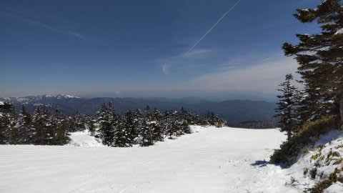
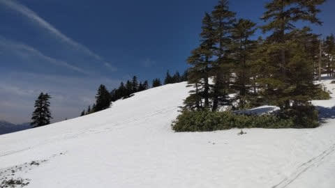
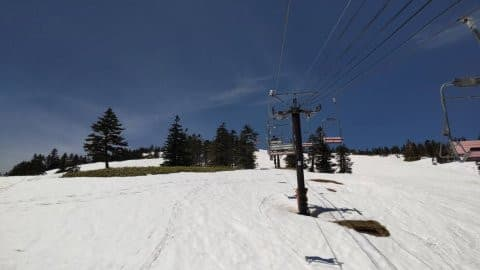
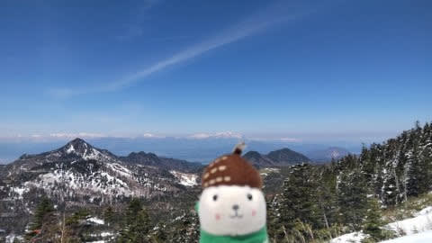

# 5月13，14日の週末の志賀高原・かぐらスキー場の天気は…土曜は午前中雨，日曜は曇り～晴れかな

📅 投稿日時: 2022-05-12 00:58:12

ってなことで．

昨晩は記事を更新する時間が取れず，

朝更新となりましたが…

今日ものんびり記事を書いている時間がない（涙）

とりあえず，そんな中でも何とか更新っ！！←ここまでくると何かの根性

まず，いつものおこみん特派員からの

情報によれば…

5月10日の火曜の朝，5cmほど雪が

積もったようです！！

渋峠のゲレンデ，真っ白になって

ますね…！

朝は晴れたのに気温も低めで，

楽しめたみたいです…

すっきり晴れて，北アルプスも見事に

見えてたようですね～…

ってな感じで，火曜は良かったようですが．

本日11日の水曜は…

今日も晴れていたようで，気温はまぁまぁ

低めだったようですが．

でも，雪が積もるほど冷えた火曜に

比べると，朝の早いうちに雪が

緩んじゃったようです…

でも，横手はまだ山頂から第1ペア，

そして海和ゲレンデも滑れるみたいですし．

渋峠もゲミュート・ウェイバーの2コースが

まだ幅いっぱいに滑れるみたいだし．

意外と雪がもってますね…

ってなことで．

今週末にかけてのスキー場の天気ですが…

12日(木)：天気はもってくれそう．

　かぐら・志賀共にギリギリ雨は降らず，

　曇り空．

　気温は平年並み

13日(金)：午前中から雨．

　夜まで雨．

　どしゃ降りにはならなさそうだけど，

　シトシトと降り続ける．

14日(土)：この日の朝まで降り続ける．

　運が悪ければ昼過ぎまで雨かも…

　雨が止むタイミングはまだ読めない

　けど，午後に向かって回復する．

　気温は高いが日が射さないと肌寒く

　感じるかも．

15日(日)：微妙．終日曇りかな…

　気温は平年並み．

　志賀でも最高気温は10℃は

　超えそう．

ってな感じでしょうか．

まぁ，この時期．

晴れるより雨になった方が雪の

滑りがよかったりするけど…

うーん．

私がこの週末滑りに行けるかどうか，

微妙な感じです（涙）
