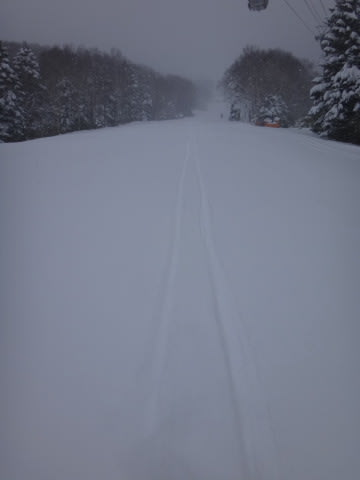

# 12月15日の志賀高原詳細…ほぼトップシーズン並みの冷え込みだった…

📅 投稿日時: 2013-12-17 00:36:16

えー．

昨日は帰宅が遅くて速報モードだったので．

本日は日曜日の志賀高原の状況の詳細をば…

日曜の朝．目が覚めると．

…吹雪いてます．

リフト動くのかいな？？？

って心配なくらい…

…でも，昨晩からの積雪は，ふもとでは20cm程度かな．

それほどでもないなぁ…

朝一から，当然焼額へ行くわけですが．

うーむ．荒天のため，リフト運転開始は予定より遅れました…

(運転開始を待つ人々)

でも，20分ほど遅れたものの，無事営業開始！

結構降ってますね～．

んで．

一番にゴンドラコースへ飛びこむと…

圧雪の上に，10cmほど新雪が乗っていますね～！

むふふふふっ．

自分のシュプール以外何もついていない，きれいな新雪をいただいたのだ！！

…でも．

本日も．

某都道府県連の指導員研修会があり．

2本目以降はこんな感じになっちゃって．

んで．

午前中はゴンドラに待ち時間も…

団体さんが並んでいるかどうかで，最大待ち7-8分，

最低0という，待ち時間にすごいムラがあるんですけど…

んで．

山頂の気温は…予想通り，マイナス10度近いよ．

ぶるるる．

午前中は結構風もあり，雪も降り続き…

ゲレンデはこんな感じで．

圧雪の上に新雪が乗っている状況．

でも，雪質はこんな感じで…

真冬の良く冷えた軽い雪なので，快適！

そして，午後になると，雪が時々止むようになり…

さらに，指導員研修会も終了したようで．

ゲレンデはがらがら！

滑りたい放題！

視界も回復っ！

むほほほほ！

これから，ゲレンデ貸切状態の，エンジョイタイム開始だっ！

…と，思っていたところ．

がががががーーーんっ！！！！！！

な…なんということだっ！！！！

雪は止んだというのに．

人も減ったというのに．

風が強くなり，午後からゴンドラ運休…(涙)(涙)(涙)．

うがーー！

何かに呪われてるのかな～←いろんな人から呪いがかけられていると思うけど

[天気予想](e637ebc2b81ec9bb31eb6d54b2ed67de3.md)に，

…でも．風も強そうなので．

吹雪っぽいなぁ…

ゴンドラが運休にならないことを祈るばかり．

って書いた，当たって欲しくない予想がどんぴしゃ当たってしまうとは…(大泣）．

ってことで．

午後は一の瀬も滑ってみたりしましたが．

下半分は，もう完全全面OKですね～．

＃上はまだ天狗コースしかオープンしてないけど．

向かいのダイヤモンドも，もう問題なく全面OK！

って感じで．

予想ほど，ドサドサと積もったわけではない日曜でしたが．

そこそこの積雪があり．

焼額ゴンドラコースも，一の瀬もブッシュなどの心配は全くなくなり．

いやー．

冷え込みといい，雪質といい．

もうトップシーズンって感じですね！

(土曜夕方の一の瀬ファミリー)

## 💬 コメント一覧

### 💬 コメント by (Goku)
**タイトル**: Unknown
**投稿日**: 2013-12-17 19:43:08

志賀は思ったほど積もらなかったんですね（涙）

明日からの寒気に頑張ってもらって、３連休は絶対１ゴンが動くことを願いましょう！

### 💬 コメント by (Skier_S)
**タイトル**: Gokuさま
**投稿日**: 2013-12-18 00:27:42

そこそこ降ったんですが，

土日でトータル30cm程度の積雪でしょうか…

18日は微妙な天気ですが，

20日からは冷え冷えでまた降りそうですね～．

3連休，1ゴンが動きそうなので，超楽しみです！

