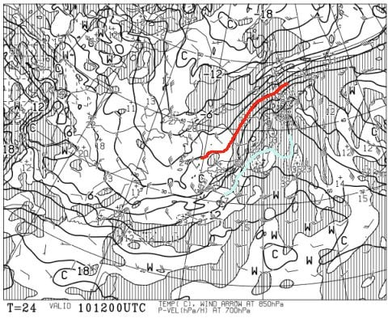
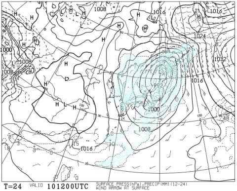
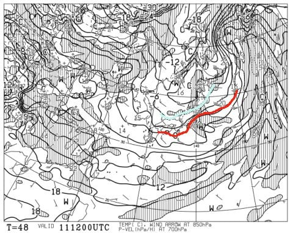
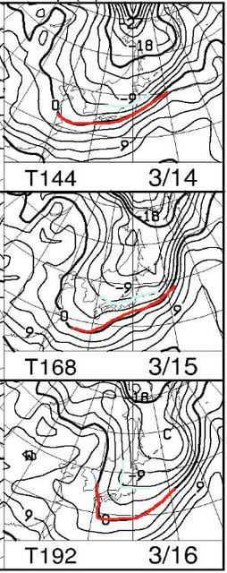

# 9日（月）の志賀高原は超高温のストップ雪（涙）．10日の天気は超高温の雨（泣）．でも，11日は雪が降る！14日からは冷えるっ！！

📅 投稿日時: 2020-03-10 09:16:27

昨日も深夜帰宅後．

Blogを書きかけ途中で，

倒れたように寝てました…（涙）

だもんで，朝に更新！

えー．

全国的に，とても3月上旬と思えない

高温になってしまった本日．

いつも通り，志賀高原特派員から

レポートが入っているわけで．

あさイチは何とかいい雪をキープして

いたようなのですが…

あまりにもの晴天＆高温のため．

午前10時ごろには焼額では妖怪板つかみが発生し．

11時ごろには，一の瀬ファミリーも

板の滑りが悪い，強烈なストップ雪に

なってしまったようです…（涙）

あぁ…ダメだ…

また雪がダメになっていく…（泣）

そして．

明日，10日の火曜日は．

赤い0℃線は北海道の北．

そして．

志賀高原には水色の+9℃線が！！

…ありえない．

3月上旬にありえない！！

これは．

志賀高原でも余裕で+10℃を超える

感じですよ！！？？

で．10日の地上予想図は…

どーん．

ダメだ…

降水域が日本全国を覆ってます．

ダメです．

志賀高原も，空から無慈悲に

一日中液体が降ってきます．

それも，時折強く．

かなり本格的に降りそうです…

そして．風も強いので．

ゴンドラはヤバそう．

…明日10日は，

高温

雨

強風

の3連コンボで，雪がかなりやられます…（激涙）

でも．

その先には光明が！！

11日(水)の850hpa図を見ると．

うむ！！

赤い0℃線は本州太平洋側まで下がり．

そして，志賀高原には水色の-6℃線が

近づいてますよ！？？

これなら，降れば絶対雪！！

と，期待してみると…

地上天気図でも，日本海側に降水域が

かかる，冬型の気圧配置．

…これは，降る．

11日は日付が変わったばかりのころはまだ雨か

もしれないけど．早朝から雪に変わり，

一日中雪降りの一日！

そして，12日も．

雪は降らないもの，結構冷えてくれそう．

その後の850hpa図を見ると．

3月14日から16日まで，

週末を含む期間．

0℃線は日本より南側…

というより．水色の-6℃線が

ほぼ志賀高原にかかっている感じ！

…これなら，この週末に雪が降ってくれそうな

ことを期待するばかり…

## 💬 コメント一覧

### 💬 コメント by (レインボー)
**タイトル**: Unknown
**投稿日**: 2020-03-10 13:06:42

変な予報をするもんだから、今日火曜日は全ゴンドラ休止になりましたよ。奥志賀はいわんやです。

ヤケビのニ高でファーストGET。雨降りのびしょびしょ雪でファーストなんてと思われるでしょうが、昨日の超、足つかみを体験したつわ者にとっては、雨なんて、風なんてで、水滴で見にくい環境をものともせず、昨日よりずっとよく滑ってくれる雪に感動しながら、２時間びっしりと滑りきりました。

雨が嫌で待機している隊員もいるし、ニ高の下部の強烈な向かい風で、定刻までできなかった自分が情けなか。

でも、そのあとほぼぜーんぶとまったから、ひと安心してます。明日も当たり？

### 💬 コメント by (つーちゃん)
**タイトル**: Unknown
**投稿日**: 2020-03-10 18:12:34

風向きが西寄りなのが気になります

２０センチくらい降ってくれたらなぁ…

そして１３日金曜が高温ぎみなのが残念ですが

週末が冷えてくれるのは週末族には嬉しい限りですね

厳しい気候ながら何かと週末は恵まれてる気がします‼︎

### 💬 コメント by (かず)
**タイトル**: Unknown
**投稿日**: 2020-03-10 19:54:29

おかりします  先週はたいへんいい情報ありがとうございました  聞き忘れてしまったのですがレインボーさんいつまでですか？僕はおそらく2週連続パスなので…28日の週までいますか？

### 💬 コメント by (レインボー)
**タイトル**: Unknown
**投稿日**: 2020-03-10 20:03:32

つーちゃん、ホント、今年は週末族にはいい年ですよね。

嫌われそうだけど、エブリデイ族としては、昨シーズンのように、平日快適の優越をかんじたいのですが。

土曜日には、またまた凄い人を、皆さんに紹介できそうです。楽しみにしていてくださいね。

### 💬 コメント by (レインボー)
**タイトル**: Unknown
**投稿日**: 2020-03-10 20:11:44

お借りします。

かずさん、先週の動きは完璧でしたね。何本か滑ってはワックスぬって、ただひたすら休まず滑り続けるかずさんを見て、ボードの２万ならこの人だと、思いました。

私の滞在は、山菜や渓流釣りとの兼ね合いがあるので確定できませんが、今年は月末前に帰りそうかなと思っています。

それまでは、この無償提供のブログを借りて、連絡を取り合いましょうね。

### 💬 コメント by (Skier_S)
**タイトル**: 高温・強風・雨の最凶コンボの一日（涙）
**投稿日**: 2020-03-11 00:53:28

＞レインボーさま

なぜか悪い予想は外れないんですよね…（涙）

しかし，今日は大変だったようですね．

それでも2時間びっしり滑るとは！！

＞つーちゃんさま

鋭い．11日は結構西風になりそうで，積もって10cmかな…

それでも，積もらないよりはずっといいと思います～！

土曜も寒そうですが，雪が降ってくれる分だけマシかな～．

＞かずさま

あら．

これから2週連続パスですか！

今週土曜も，ちょっとは積もりそうですが…

