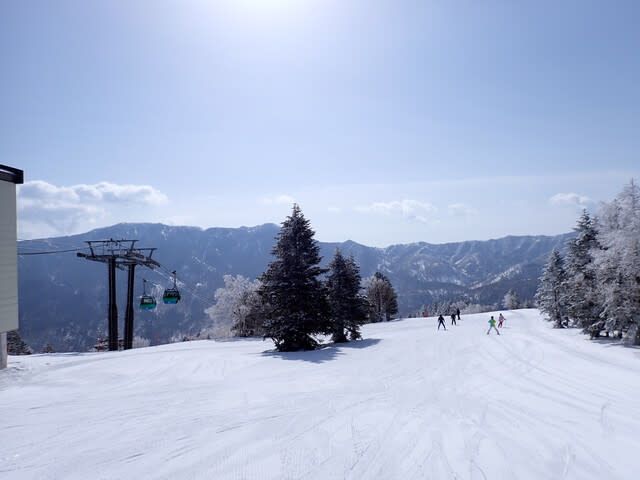
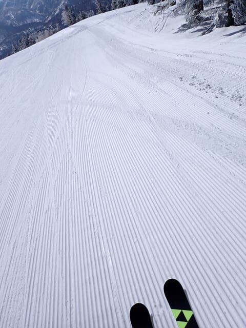
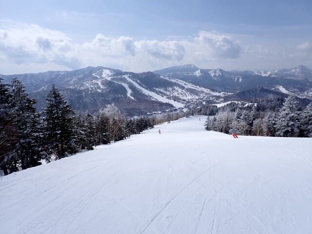
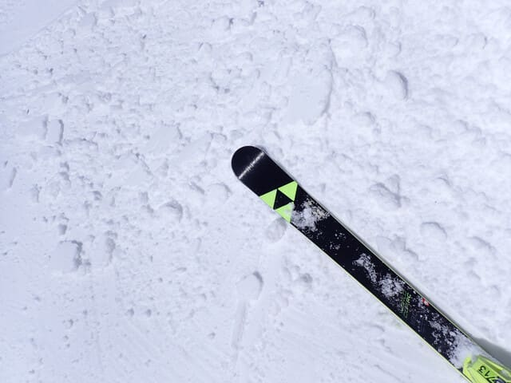
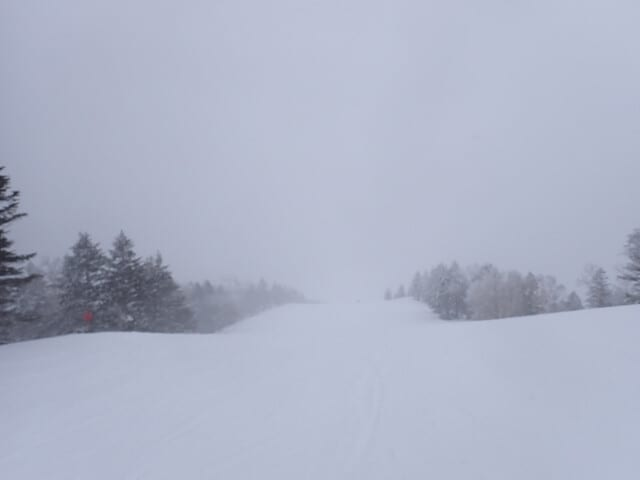
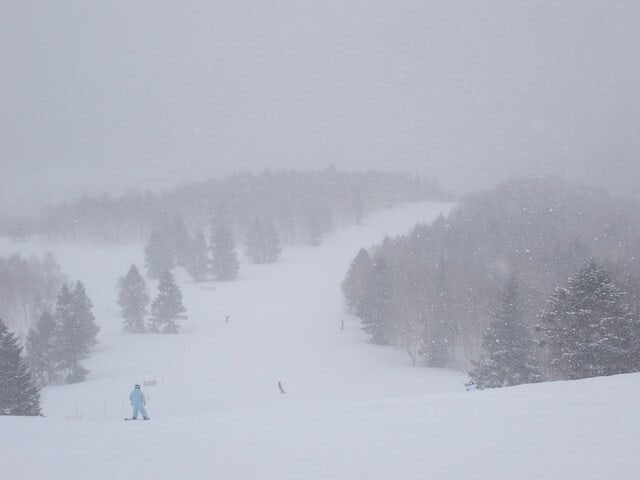
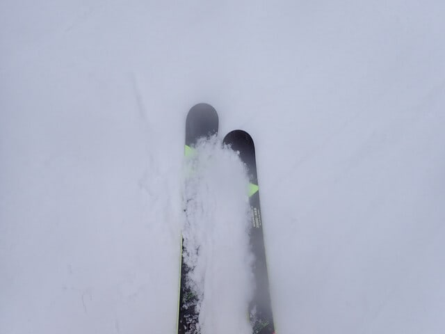

# 2025/3/30(日)の志賀高原スキー場，速報レポート…朝は晴天，最高のシマシマ圧雪！昼から曇りだし，午後遅くから雪．

📅 投稿日時: 2025-03-31 02:23:43

🏷️ カテゴリ: [2025スキー滑走日記](cacd3fbf84d4a679ee61a5894c3f95e14.md)

えー．

実は家族スキーだった今回．

昨日も睡眠2時間半でスキーに出かけた

というのに．また宿で夜23時まで娘と

卓球をするという，不思議な夜更かし（？）

をしてしまい．

今日は帰り道に小布施に立ち寄り，

その後買い物やら温泉やら，

家族旅行らしいことをしていると…

今日の帰宅は0時過ぎ（涙）

いやーーー．

睡眠不足状態なのに，ご飯を食べて

温泉に入ってから，帰り道を300km

運転するこの辛さ…

眠かった…

ということで．

家族サービスしたおかげで帰宅は深夜

だし．

死ぬほど眠いので，今日の志賀高原レポートは

帰宅日恒例の速報モードにて…

えー．

まず．

今日の朝は…

午前中は晴れるかも…という，良い方の

予想が当たって，朝はすっきり晴れで

スタート！！

昨晩からの積雪はほとんどなかったけど…

昨日積もった，この時期としては冷えた

いい感じの雪がきれいに圧雪されて…

いい感じに締まっているのに硬くない，

シーズンでも1，2を争う最高級シマシマ

バーンでスタート！！

うおおおおお！！

これはいいよ！！！

この時期に，ここまでいいバーンを滑れる

志賀高原，やっぱりすごい…！！！

で．

これだけ雪が良いのに，3月末という

こともあり，ゲレンデはガラガラで．

今日の朝は，かなり気持ちいい雪の

ガラガラバーンを2時間ほどかっ飛ばし

続けることができましたよ…！！

しかし．

気温が昼間でもマイナスキープした

この日でも．さすがに昼前には春の

強い日差しで，日当たりの良いバーンは

雪がちょっとしっとりしてきたな…

と思っていたら．

ここも予想通り，昼前には太陽が隠れて

曇り空になってきて…

雪のゆるみは止まり，日当たりの良い一部の

バーンでちょっと雪がしっとりした程度で

済みましたよ！！

素晴らしい絶妙なタイミング…！！

…と，思っていたら．

あれれれ？？

午後3時ごろには，結構な雪になって

きましたよ…！？

ちょっとうっすら下地の硬い氷が出始めていた

ところもごく一部にあったので，

これからツルツルバーンになっていくのか？？

と思っていたところ．ゲレンデに雪が

積もりだして，ツルツルを隠していって

くれましたよ…！

ってな感じで．

今日は朝は晴天最高シマシマで．

昼前に緩み始めたころに日が隠れて

ひどく緩んだバーンにならずに済み．

午後は柔らかい雪がはがされて

表面に硬いバーンが出てきたものの，

その上にうっすら雪が積もって

硬いバーンを隠していってくれる

という．

なんだか，ちょうどいい感じの天気が

続くという，天気に恵まれた感じの

一日でした…

気温も今日は一日低かったし．

ガラガラだったし．

いい感じにまた冬が戻ってきたような

一日でしたよ～！！

また明日，元気があれば詳細レポート

やります…

…でも，最近は月曜夜は週末の睡眠不足で

死んでることが多いので，詳細レポート

書けずに死んでたらゴメンナサイ←このレポート

だけで結構詳細だから，これ以上の詳細レポートはいらない

のでは…？という意見多数

## 💬 コメント一覧

### 💬 コメント by (モイストシルバー)
**タイトル**: Unknown
**投稿日**: 2025-03-31 06:53:34

日曜日は苗場に行ってきました。苗場はお昼前から雪でしたが、ほとんど積もらず、下部はザラメ雪でした。上部大斜面はアイスバーン＋新雪で良かったんですけどね。志賀はかなり回復したようで、苗場と地理的には近いようで、コンデションは違いますね。今年は雪が多いので、志賀もまた行きたいところです。

### 💬 コメント by (Skier_S)
**タイトル**: ＞モイストシルバーさま
**投稿日**: 2025-04-01 00:39:32

苗場はそんなに積もらなかったんですね…

志賀は日曜はかなり良かったですよ！

距離は近いですが，やっぱり標高が違いますから，これからの時期は

やっぱり志賀高原が一番いい気がします…

