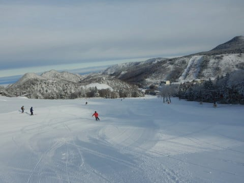

# 2020/11/29(日)志賀高原熊の湯スキー場速報レポート！…午前は冷え冷え雪，コース全面滑れたよ！でもリフト最高25分待ち(涙）

📅 投稿日時: 2020-11-30 00:39:13

🏷️ カテゴリ: [2021スキー滑走日記](c2b0fc073d6357d3b786f6ca655147f7d.md)

えー．

本来なら，11月14日にオープンだった

はずの熊の湯．

24日にやっとオープンし，初の週末を

迎えたので，本日は予告通り，志賀高原の

熊の湯まで滑りに行ってきました～！

…ってなことで．

予想外に雪不足のスタートとなった今シーズン．

かろうじて本日鹿沢がオープンできたよう

ですが…

([鹿沢スノーエリアホームページ](http://www.kazawa.com/snow/)より）

それ以外の，本来ならとっくにオープン

しているはずの，かぐらもアサマ2000も

丸沼もこの週末はオープンできず．

…これは，熊の湯と横手に人が集中

するだろうなぁ…

と，予想はしていたものの．

予想以上に混みました

ここまで混んだのは史上初じゃないか？？

という混雑でした…（涙）

まず．

あさイチの志賀高原への登りは，

　明日の朝の志賀高原への道，

　積雪＆ツルツルだと思うので，

　明日志賀に行く方はご注意を

と予告した通りの，デンジャラス積雪路．

今シーズン初の本格積雪路です！

そして…

熊の湯営業開始までまだ1時間はある

朝7時半過ぎというのに．

国道から熊の湯への分岐のかなり手前から

車が詰まってました…（涙）

で．

リフト券売り場も列がついてるし．

リフトは，ペアが2本とも動いていたにも

関わらず．朝9時から午後3時ごろまで

10分以上の待ちがあり．

9時過ぎから12時ごろまでは，20分待ちを

超えるという，おそらく

熊の湯史上最高レベルの混雑

でした…（涙）

…とはいえ．

あさイチは，ゲレンデ全面を覆う

15cm程度の天然雪のおかげで，

ゲレンデ全面に圧雪がかかっていて．

予想外に，人工降雪が無い部分も含め，

コース幅いっぱい滑ることができたのが

ラッキー！！

久しぶりの天然雪の感触…っ！！

あぁ…シアワセ…(鬼リフト待ちさえなければ)

そして，リフト待ちはすごかったものの．

コース幅が広かったので，イエティほど

どうしようもない人口密度じゃなく…

イエティに比べれば，1億倍くらい

楽しく滑れました！

とはいえ…

いつもなら人が減り始める午後になっても，

リフト待ちは10分以上待ちが続き．

そして夕方にはガスが出るタイミングもあり．

さらに人工降雪が無いところには

ちょっとブッシュが出始めてました…(涙）

ガスで見えないところにブッシュがあると

ちょっと怖かった…

ってな感じで．

リフト待ちは予想を超えるすごさでしたが．

軽井沢に比べればマシだし．

天然雪のおかげで，コース幅いっぱい滑れたし．

久しぶりの冷え冷え天然雪で滑れたし．

…満足度は高かった，熊の湯でした…

また明日，詳細レポートやります…！

（仕事で死んでなければ）

## 💬 コメント一覧

### 💬 コメント by (西舘)
**タイトル**: Unknown
**投稿日**: 2020-11-30 01:10:10

良かったね、あぁほんとに良かったね〜、しかもそれなりの時間の記事アップで更に良かった、来週も大丈夫そうだし、いよいよ本格的にシーズンインてすね\(°∀°)/

### 💬 コメント by (Northfox)
**タイトル**: 昨日は．．．
**投稿日**: 2020-11-30 07:42:07

昨日は焼額メンバーの方々含めご一緒させて頂きありがとうございました。

混雑は凄かったですが楽しく滑れました。行ってよかったです。

しかも終礼まで参加できて！！。

来週は志賀行きは休みますが再来週から行きますのでまた宜しくお願いします（笑）

### 💬 コメント by (Hide)
**タイトル**: いよいよ・・・
**投稿日**: 2020-11-30 13:12:28

S 様

お久しぶりです。

いよいよシーズンインですね。

コロナ野郎のおかげでスケジュールが大幅に遅れ、今シーズンも○浜に帰任できなかった私です（泣）

悲しくもこちらから通いますので、12/26or27辺りでやっとシーズンイン予定です。

回数は少なくなりますが、今シーズンもよろしくお願いします。

### 💬 コメント by (FCAMEL)
**タイトル**: 一足遅れ
**投稿日**: 2020-11-30 19:11:10

本日休暇を取ってようやく横手山でシーズンイン。

今シーズンもよろしくお願いします。

横手山に11時過ぎにのこのこ到着した割には

コースは中盤にやや小石が散らばっていたものの

上から下まで十分楽しめる状況でした。

横手山の人工雪コース斜度も適度にあって思ったより全然いいですね！

しかもさすが平日、朝一の人が帰ったのか車はリフトのそばに止められるし、

リフト待ちもなく飛び乗り状態だったので、

そんなつもりはなかったのに昼過ぎまでに14、5本も滑ってしまいました。

その後熊の湯に移動。

熊の湯のほうがやや混んでいましたがそれでも5分待たない程度で、

途中雲間から日が差してきて幻想的な雰囲気に。

数本滑って様子を確認し、本日は終了しました。

ここでも大勝軒の話題が出ていたので（？？）、

場所だけ確認してみようと一の瀬に立ち寄ると

明日正式オープンとのことでしたが、

プレオープンで味見をさせてくれました。

あまりラーメン食べ歩く方ではないのでうまく評価できませんが、

あつもりチャーシューと粽（ちまき）をどちらもおいしくいただきました。

今回は現地でスープも作っているとのことで、

ややマイルドなスープの仕上がりになっています。

（地元のリンゴ等も材料として使用しているそうです）

ここの皆さんとはやや方向性の違う、呑みスキーヤーの私としては、

おつまみが充実していること、

平日11:00-18:00、金、土、祝前日11:00-22:00と気合の入った通し営業であること

がなによりうれしいです。

前回はフランチャイズでの出店でしたが、

今回は、かつて東池袋にあった超人気店「大勝軒」

（昔近所に勤めていた時期に、一度昼に並んで昼休み終了に間に合わなかったことがありました。上司も一緒だったのでセーフ）

の味を最も正当に継承していると自負する、

「お茶の水大勝軒」の満を持しての出店、期待しましょう！

（思いがけずタダ飯食べさせてもらってしまったので、宣伝しています）

### 💬 コメント by (ノーザンレインボー)
**タイトル**: Unknown
**投稿日**: 2020-11-30 19:13:46

sさん

昨日は名無し、失礼しました。初滑りに浮かれすぎて名前忘れました。

シーズン券の件、アドバイスありがとうございます。さっそく買ってきましたので、来週末はゲートストップ喰らわないといいなあ。

### 💬 コメント by (まうちゅう)
**タイトル**: Unknown
**投稿日**: 2020-11-30 21:30:30

物凄い程の大盛況ですね。お疲れ様でした。

私も日曜日は志賀高原に行こうかとほんの少しだけ

頭をよぎりましたがやめて良かったです。

この時期の熊の湯のリフト待ちはビックリするほど凄かったり、

拍子抜けするほど少なかったり落差が大きいですね。

まるで最近の気候変動のようです。

貴重な体験ができて、いいブログのネタになったと

少しはプラスに考えるしかないですね。

### 💬 コメント by (ikkun)
**タイトル**: Unknown
**投稿日**: 2020-12-01 20:07:22

ぇ～(・・;)凄い混みかた？まさに密密密(笑)  てか要らしたんですね😆すご( *´艸｀)お疲れ様でした✨

私しは地元ゲレンデを待ちます(笑)

### 💬 コメント by (Skier_S)
**タイトル**: コメント回答遅れました
**投稿日**: 2020-12-02 01:06:14

＞西舘さま

なんだか，やっとホントにシーズンインした感じです…

まさかイエティに6日も通うとは思わなかったです…

＞Northfoxさま

日曜はお世話になりました～！

終礼まで参加，お疲れ様でした．

今後は，焼額での朝礼にもご参加ください（笑）．

こうやって焼額メンバーに組み込まれていきますから…

＞Hideさま

ええ！

このシーズン，戻って来れなかったんですか！

志賀高原，遠いですが頑張って通ってください…

また焼額でお会いできるのをお待ちしています…！

＞FCAMELさま

大勝軒ですが，私も金、土、祝前日11:00-22:00というのをみて「気合入ってるなぁ…」

と思っていました．

今日，某特派員が立ち寄ったようです（笑）．

今後，焼額ナイターに行くときは宿の夕食キャンセルしてここで夕食かな…

と思っています

＞ノーザンレインボーさま

100円ショップのパスケース使って，私は1シーズン問題なく

過ごしました…

これでゲートストップ食らわないはずです！

＞まうちゅうさま

いや…ホントにすごかったです．

史上最高の混み具合でした．

良いネタになりました（笑）

### 💬 コメント by (ikkun)
**タイトル**: Unknown
**投稿日**: 2020-12-07 18:50:01

ありがとうございますm(__)m実は……２日「熊の湯いかが？」とスキー学校先輩に誘われましたが健康診断の呼び出し日にて(泣)  しかしその彼の動画にて金も無いのに…行って来ました( *´艸｀)８ヶ月ぶりのダルベロは重かったでした(笑)

