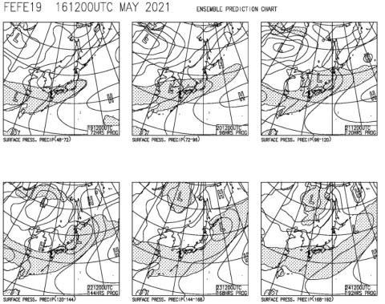
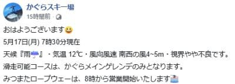
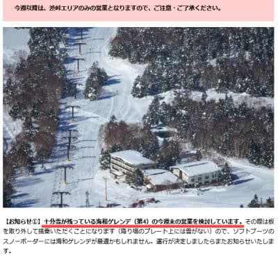
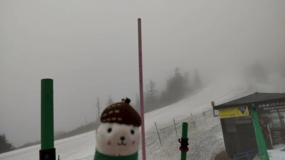
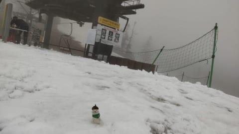
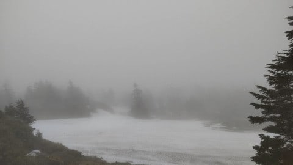
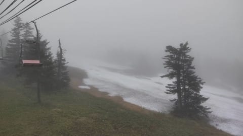
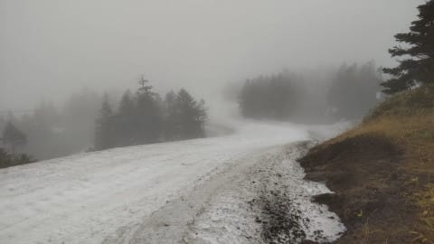
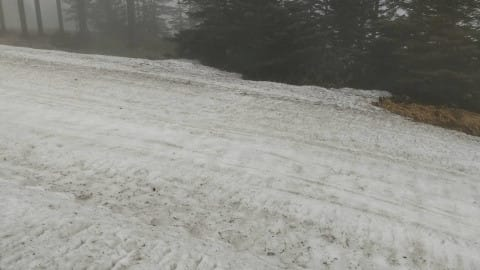
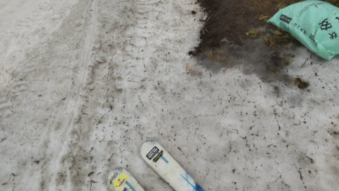

# 今週末，横手山海和ゲレンデ営業かも？…そして，今日からかぐらはついにメインゲレンデのみ（涙）

📅 投稿日時: 2021-05-18 01:06:28

どう考えても．

これから22日まで，ひたすら雨が

降り続けそうな天気図を見て．

今週末のかぐらは大丈夫か…

と，めちゃくちゃ心配になっている

Skier_Sです．

いや…ホントに19日から22日まで，

降水域の網掛けが本州をすっぽり

覆い続けていて．

なんとか23，24日，ギリギリ志賀・かぐらに

降水域がかかってない程度ですね…

で．

かぐらは昨日の雨にやられて．

土曜に滑れたゴンドラコースと

ジャイアントコースが終わってしまい．

ついに，メインゲレンデのみに

なってしまったようです（涙）

（[かぐらスキー場Facebook](https://www.facebook.com/login/?next=https%3A%2F%2Fwww.facebook.com%2Fsnowkagura%2Fposts%2F3784339361693356%3F__xts__%255B0%255D%3D68.ARCcOLypFbR1kpCnjw_QC7RLuoyhhCh5s4LqMvQdwHGZPokdEbXM9b1rptlIXZNg3CbMvd2KWXuc5s-5ujhs-E2jimpuy7KACSTShRQCSJRVelFiWcZ68AORM5JOJzq1-R9eErVcbj2x06Olmd5R299cawj_us2PwSAHdR5tnAa5rRaTO9k6EI1bdmSbr-KNo6eCrC6M-IHLYBdP8zZhly-e5Wm3KvMKrjXcEr5mAZSGqQ7F8e5EElEAMGVhSwYLCE1_f-1LMgjHI27jKieKVnD-XTM0kITbADnbdvixC0RqqimbyQ%26__tn__%3D-R)より）

だのに．

あくまで強気（？）な，横手・渋．

なんと．

今週末は第4リフトを動かして，

海和ゲレンデが滑れるかも…

とのアナウンス！

敵がバタバタ倒れていく中．

「ふはははは．日本一の標高は伊達じゃ

　ないんだよ！」

というアピールですね…

（[横手山スキー場ホームページ](https://yokoteyama2307.com/news/14507/)より）

ふむ．

この週末のかぐらの混雑を考えると．

早朝営業をやっている横手・渋は

結構魅力的かも…

ってなことで．

本日5月17日の渋峠がどんなだったか，

いつものおこみん特派員にお出まし

願いましょう！

（このおこみん人形が実は特派員だった…

　という衝撃の事実ではないので誤解なきよう）

本日の渋峠．

曇~霧雨の天気だったようですが…

ガスってはいるものの，意外と

本降りの雨にはならず．

少なくとも特派員がいた午前10:30までは，

そんなに濡れずに済んだようです…！

今日は，山に向かって右側のウェーバー

コースは，コース整備のためか，

滑れなかったみたいで…

山に向かって左側の

ゲミュート―コースのみが

滑れたようです．

でも，コースはキャタピラ跡の

ガタガタが残って，滑りにくかった

ようなのが，ちと残念…

まぁ．

でも．

毎週末雨になった3月の頃には，

「GWまで滑れるのかな…」と

思っていたことを考えると．

この時期に滑れるだけまだ恵まれて

ますね…！

ってなことで．

今日も志賀高原からの特派員情報を

お送りしたのですが．

…シーズン券が使えなくなった5/6以降，

毎日リフト券を買って滑っている，

おこみん特派員．

GW以降のリフト代だけで，志賀の全山

シーズン券を超える出費になるのでは…？

と，ちょっと（かなり）心配．

ある意味すごいお金がかかったスキー場

レポートを，取材費無しに送ってもらって

いることに，うしろめたさを感じている

Skier_Sだったのでした…

おこみん特派員に，感謝！！

## 💬 コメント一覧

### 💬 コメント by (ikkun)
**タイトル**: Unknown
**投稿日**: 2021-05-18 12:38:10

お疲れ様です と……確かにseasonチケット使えないって痛いですね？ しかしやはり減りましたね？(  -_・)?海和ゲレンデってあるんですか？( *´艸｀)……ま行かないですが(笑)

### 💬 コメント by (Skier_S)
**タイトル**: ＞ikkunさま
**投稿日**: 2021-05-19 04:12:00

今は，横手山第4リフト沿いのコースが

「海和ゲレンデ」って名前になりました~！

