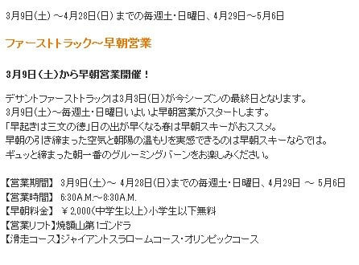

# 焼額早朝営業は3/9(土)から！そして，春営業は今シーズンも第1ゴンドラが動くよ！

📅 投稿日時: 2019-02-22 03:00:47

えー．

22日から23日にかけては．

まったく雪が降らなさそうな予想になりました．

昨日の予想で

　23日土曜：朝は小雪がぱらついてるかも…

と，書きましたが．

ぱらつくことすらなさそうで．

まったく雪が降らなさそうな感じ…

…すなわち．

土曜までに，アイスバーンが新雪に隠れる

ということは，1ミクロンも期待できません（涙）

土曜はしっかり硬いアイスバーンを覚悟して

ください…（泣）

って悲しい通知のあとは．

ちょっといいニュース．

先日，焼額山スキー場のホームページを見ていると．

こんな告知が…

をを！

なんと．

今シーズン，早朝営業は3/9からのようです！

…昨シーズンに，例年より早い，

3/10から早朝営業が始まったなぁ…

と，喜んでいたら．

今シーズンも3/9という早い時期から，

早朝営業スタートです！！

…それも．

営業は第1ゴンドラ．

GSコースとオリンピックコースの2コースが

滑れますよ～！

GW最終日の5/6まで，第1ゴンドラでの早朝営業が

予定されているので．

やはり，今シーズンも．

昨シーズンに引き続き，春営業は第1ゴンドラに

なるようですね…

春営業が第1ゴンドラ＆第2高速なら．

雪がある限り，焼額の全コースが滑れるので．

GSコースやオリンピックコース，

SGSコースが滑れなかった，

第2ゴンドラ＆第2高速の組み合わせより，

よっぽどいいよ！

そして，奥志賀への行き来もしやすくなるし．

GWまで，第1ゴンドラが滑れるのは

嬉しいこと…

願わくば．

昨シーズンのように．

雪不足で焼額スキー場が4月中に息絶える

ということが起きないように願うばかり…

## 💬 コメント一覧

### 💬 コメント by (ベー)
**タイトル**: Unknown
**投稿日**: 2019-02-22 20:04:58

今日から滑っています。

朝イチはアイスバーン祭りでしたが天気も良く、午後は緩んだ斜面もありましたよ。

人も少なくて飛ばし放題でした。

明日も晴れるといいのですが…

### 💬 コメント by (Skier_S)
**タイトル**: ＞べーさま
**投稿日**: 2019-02-22 23:38:28

あら．

今日は意外と雪が緩んだのですね…

でも，明日はまた冷えてカチカチになりそうです（涙）

明日は曇り空，午後は太陽がのぞくタイミングもありそうですが，

終日冷えて雪は緩まないと思います…（泣）．

