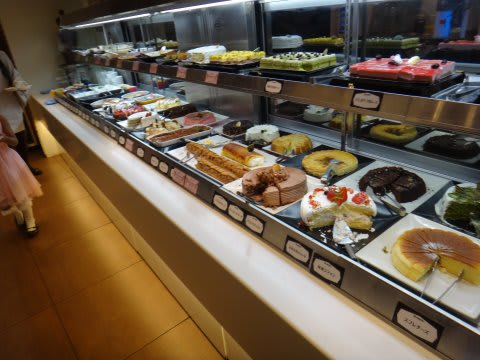
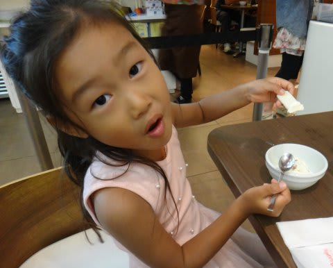
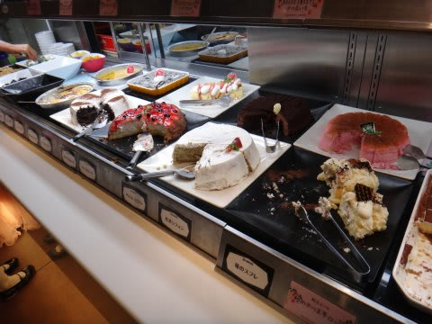
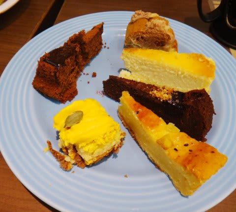
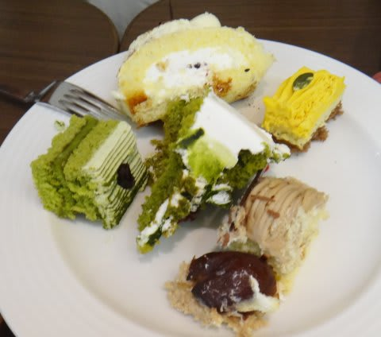

# 子供がいて良かった…と思うとき

📅 投稿日時: 2013-10-03 01:09:36

🏷️ カテゴリ: [日記](cc4b5682fb7b8b144980957a978653fb0.md)

えー．

あれです．

先週の日曜日．

久しぶりの，どこにも行く予定がないお休みだし．

子供をつれてですね．

「デザートバイキング」

…ってものに行ってきたわけですよ．

こーんな感じで，並んでいるケーキが食べ放題．

で．

やっぱり，お客さんは高校生や大学生くらいの女性ばっかりで．

ちょっと，おぢさんとしては中に踏み込みにくい，

「おぢさん排除バリアー」

があるわけですね．

…まぁ，そこは小さな子供連れ．

「いやー．子供にせがまれて，仕方なく…」

…って空気をまわりに振りまきながら，お店に入ったわけですけど．

…実は．

うちの娘はケーキがそんなに好きじゃないのだ．

(ケーキじゃなく，アイスとウエハースばっかり食べている娘)

娘ではなく．

私がこーゆー甘いものが大好きなのだ．

こーゆーのが，私にとってシアワセの一皿なのだ…

デザートバイキング，おぢさんだけでは入りにくいけど．

子供連れなら堂々と入れるのだ！

…ああ，シアワセ…

…子供がいて，良かった…(この言葉の用法を，何か根底から間違っている気が…)
